# Références

## Description

Le menu `Références` se trouve dans la `barre de navigation > Références`. Dans ce menu, vous trouverez plusieurs tables système telles que le journal des messages, les e-mails ou encore les paramètres des modèles d'impression, etc.

## Journal

### Email

Sur cette vue, vous retrouvez les emails que vous avez créés.

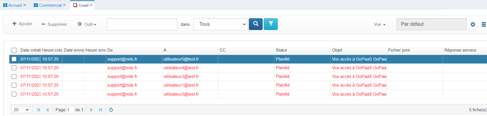

Si vous avez un profil `Admin`, vous pouvez accéder à la vue `Tous les emails`, pour voir tous les mails envoyés de GoPaaS.
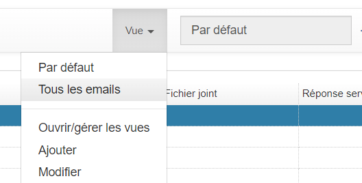

**Fiche Email**

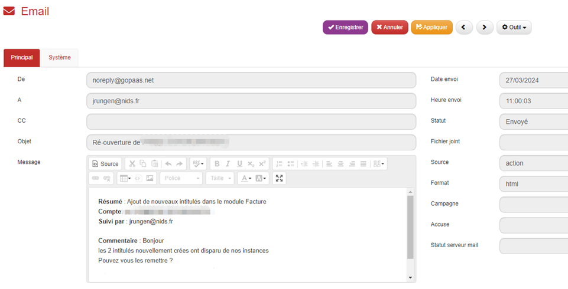

| Champ            | Description                                     |
|------------------|-------------------------------------------------|
| De               | Expéditeur de l'email                          |
| A                | Destinataire(s)                                 |
| CC               | Autre(s) destinataire(s)                        |
| Objet            | Objet du mail                                   |
| Message          | Message qui sera envoyé                         |
| Date envoi       | Date de l'envoi d'email                         |
| Heure envoi      | Heure de l'envoi d'email                        |
| Statut           | Statut de l'email : Planifié, Envoyé ou Erreur |
| Fichier joint    | Pièce(s) jointe(s)                              |
| source           | Table connectée à cet email                     |
| Format           | HTML ou Texte                                   |
| Campagne         | Si connecté à une campagne email dans GoPaaS    |
| Accusé           | Accusé de réception                             |
| Statut serveur   | Code retour du serveur d'email                  |

### Messages (logs)

Sur cette vue, vous retrouvez les messages que vous avez générés.

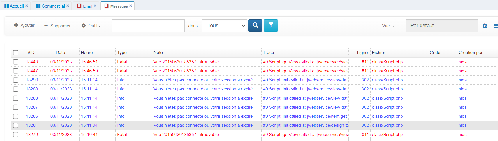

Si vous avez un profil `Admin`, vous pouvez accéder à la vue `Tous les messages`, pour voir tous les messages de GoPaaS.
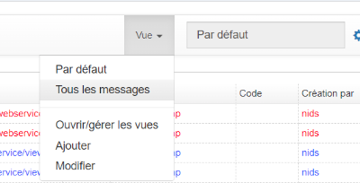

**Fiche message**

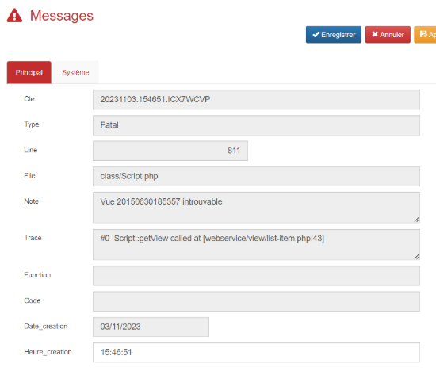

| Champ          | Description                               |
|----------------|-------------------------------------------|
| Cle            | Clé de la fiche                           |
| Type           | Type d'erreur : Fatal, Warning ou Info   |
| Line           | Ligne du message dans le fichier         |
| Note           | Message ou Erreur                        |
| Trace          | Fichier ayant été appelé pour mener au message |
| Function       | Fonction associée au message             |
| Code           | Code erreur                               |
| Date création  | Date de création du message               |
| Heure création | Heure de création du message              |

## Modèle

### Modèle email

Cette table est utilisée pour les campagnes GoPaaS ou peut être utilisée sur une fiche avec un développement spécifique.

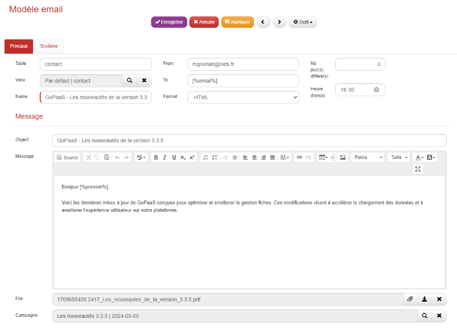

| Champ                   | Description                                         |
|-------------------------|-----------------------------------------------------|
| Table                   | Table connectée                                     |
| View                    | Vue utilisée pour la fusion des champs              |
| Name                    | Nom du modèle                                       |
| From                    | Expéditeur de l'email                               |
| To                      | Destinataire(s) (accepte un champ de fusion)        |
| Nb jour(s) différé(s)   | Différer l'envoi de l'email de x nombre(s) de jours |
| Object                  | Objet du message (accepte des champs de fusion)     |
| Message                 | Le message (accepte des champs de fusion)           |
| File                    | Fichier(s) joint(s)                                 |
| Campagne                | Campagne connectée                                  |

### Modèle PDF

Les modèles PDF permette de positionner des champs GoPaaS sur une document PDF.

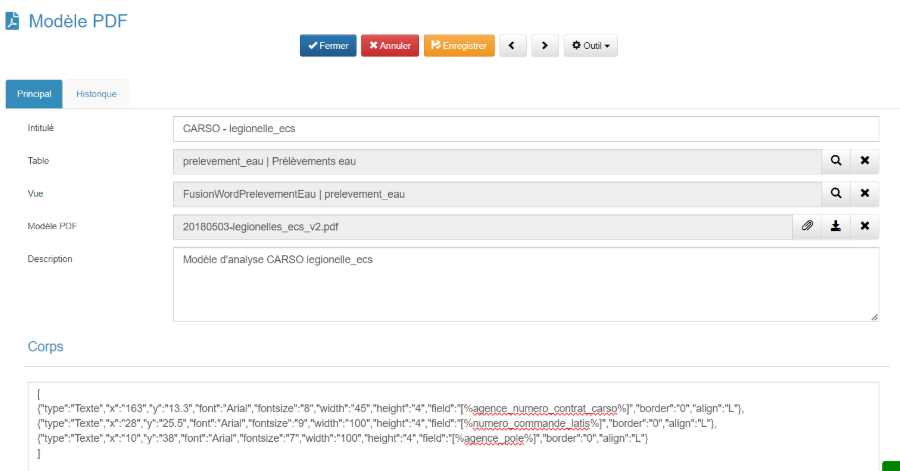

| Champ                   | Description                                         |
|-------------------------|-----------------------------------------------------|
| Intitulé                | Nom du modèle                                       |
| Table                   | Table connectée                                     |
| Vue                     | Vue utilisée pour la fusion des champs              |
| Modèle PDF              | Document au format PDF sur lequel nous allons positionner nos champs |
| Description             | Description du modèle                         |

**Champs personnalisés**

Ajouter des champs personnalisés dans un format JSON dans le champs `Corps`.

| field                   | Value                                         |
|-------------------------|-----------------------------------------------------|
| type     | Texte ou Signature                                      |
| x & y    | les coordonnées "x" et "y" définissent la position du champ sur le document PDF |
| Font     |- Courier (fixed-width) - Helvetica or Arial (synonymous; sans serif) - Times (serif) - Symbol (symbolic) - ZapfDingbats (symbolic)             |
| fontsize    | Taille de police en points. La valeur par défaut est la taille actuelle. Si aucune taille n'a été spécifiée depuis le début du document, la valeur est de 12. |
| width    | Largeur des cellules. Si elle vaut 0, elles s'étendent jusqu'à la marge droite de la page. |
| height    | height : Hauteur des cellules. |
| field    | Champ de fusion, exemple `[%nom_du_champ%]`. On peut ajouter une option sur certain type de champ, voici la liste des options possibles :  - Date : `[%mon_champ_date\|date%]` - Memo : `[%nom_du_champ\|longtext%]` - Majuscule - `[%nom_du_champ\|ucase%]` - Minuscule : `[%nom_du_champ\|lcase%]` - Première lettre majuscule - `[%nom_du_champ\|ucfirst%]` - Première lettre minuscule - `[%nom_du_champ\|lcfirst%]`|
| border     | Indique si des bords doivent être tracés autour du bloc de cellules. La valeur peut être soit un nombre : 0 : aucun bord 1 : cadre |
| align     | Contrôle l'alignement du texte. Les valeurs possibles sont : L : alignement à gauche C : centrage R : alignement à droite J : justification (valeur par défaut) |

### Modèle de lettre

​​​​​​​Cliquer sur le bouton `Ajouter` pour créer un nouveau modèle.
Afin d'enregistrer le modèle de lettre, il faut obligatoirement renseigner les champs suivants :

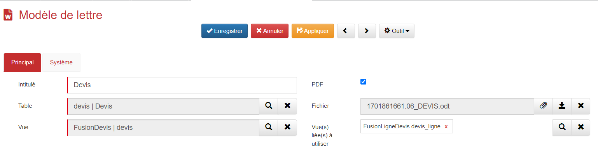

| Champ                        | Valeur                                             |
|------------------------------|------------------------------------------------------------------------------------|
| Intitulé                     | Le nom du modèle dans l'application.               |
| Table                        | Sélectionner la table dans laquelle le modèle doit apparaître.  |
| Vue                          | Choisir la vue créée pour le modèle de lettre.     |
| PDF                          | Possibilité de générer le document au format PDF.  |
| Fichier                      | Ajoutez votre fichier au format .docx ou .odt      |
| Vue(s) liée(s) à utiliser    | Choisir la ou les vues liées de fusion.            |

## Paramètre

### Assistant

L'assistant GoPaaS permet de créer des modes opératoire étape par étape pour effectuer une tache sur votre application.

**Fiche Assistant**

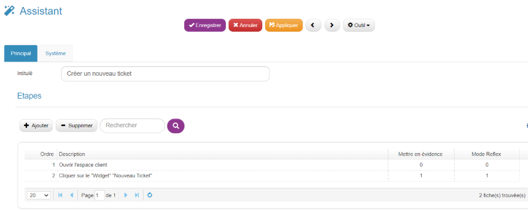

| Champ                        | Valeur                                             |
|------------------------------|----------------------------------------------------|
| Intitulé                     | Le nom de l'assistant.                             |
| Vue étapes                   | Liste des étapes a effectuer                       |

**Fiche Etape**

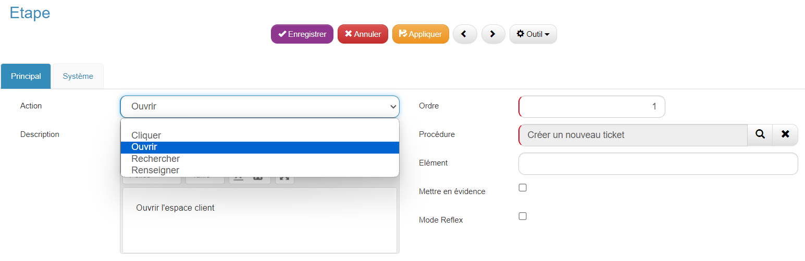

| Champ               | Valeur                                                                                     |
|---------------------|--------------------------------------------------------------------------------------------|
| Action              | Cliquer, Ouvrir, Rechercher ou Renseigner                                                  |
| Description         | Description de l'étape                                                                     |
| Ordre               | Ordre d'exécution de l'étape                                                               |
| Élément             | Classe ou ID de l'élément à mettre en évidence                                              |
| Mettre en évidence | Crée un effet visuel pour griser toute l'application sauf l'élément spécifié               |
| Mode Reflex         | Effet visuel sur l'action                                                                   |

**Exécution de l'assistant**

Cliquez sur l'icone  pour déclencher l'assistant.

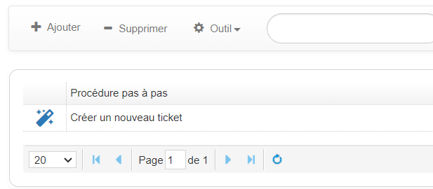

### Dashboard

Pour créer un nouveau dashboard, rendez vous dans la barre de navigation > Références > Dashboard.

Cliquer sur le bouton Ajouter.

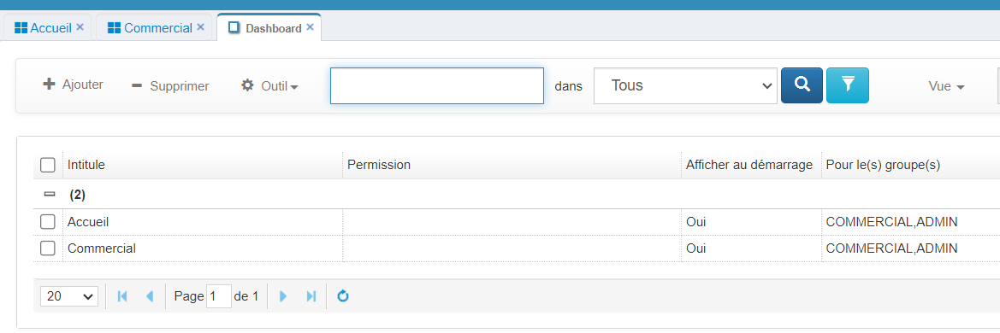

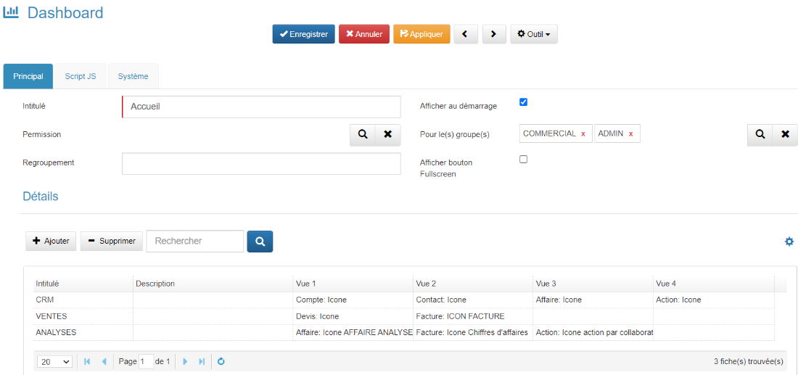

Ci-dessous, la description des champs de l’onglet principal.

| Champ                   | Valeur                                                                                   |
|-------------------------|------------------------------------------------------------------------------------------|
| Intitulé                | Nom du dashboard                                                                         |
| Permission              | Sélection des groupes d’utilisateurs autorisés à accéder au dashboard                   |
| Regroupement            | Regroupement du dashboard                                                                |
| Afficher au démarrage   | Cocher l’option pour activer l’ouverture automatique à la connexion à l’application     |
| Pour le(s) groupe(s)   | Sélection des groupes pour lesquels le dashboard s'affiche à la connexion                |
| Afficher bouton Fullscreen | Permet l’affichage du bouton plein écran sur le dashboard                               |
| Détails | Vue liée des lignes de dashboard                               |

### Vue

Accessible via la barre de navigation > Paramètres > Vue, cette fonctionnalité regroupe l'ensemble des vues de votre application et vous permet de les ouvrir directement à partir d'ici.

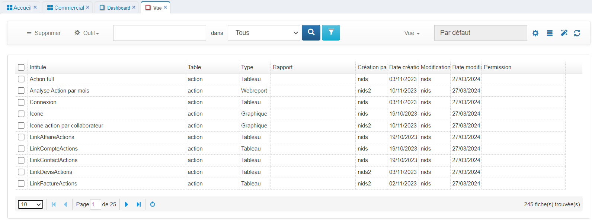
