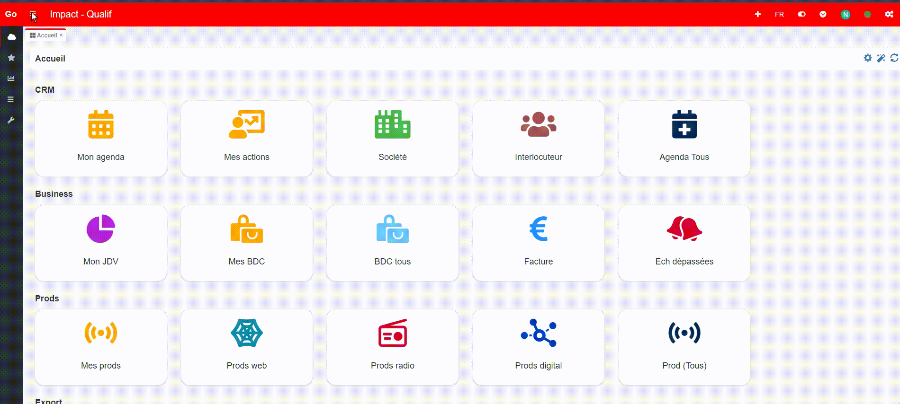

- **Rendre la barre de navigation de Gauche Fixe** `📁index.php` ✔
    Fixation de la barre de navigation de gauche pour qu'elle reste fixe, quel que soit le déplacement de l'application.
    ```html
        <!-- Avant -->
        <aside class="main-sidebar">...</aside>

        <!-- Après -->
        <aside class="main-sidebar" style="position:fixed">...</aside>
    ```
     


- **Afficher la barre de navigation de gauche au dessus des éléments** (Mode réduit `Activé`)
    Pour faire passer la barre de navigation au dessus des éléments :
    ```js
        // Disponible en PreProd 'Impact'
    ```
     
    
- **Afficher la barre de navigation de gauche de façon proportionnelle aux éléments** (Mode réduit `désactivé`)
    
- **Rangement automatique de la barre de navigation de gauche au clic d'un élément** (Mode reduit `Activé`)
    Pour le rangement automatique de la barre de navigation

    ```javaScript
        // Rangement automatique lors du clic d'un élément
        $('.sidebar-menu .treeview-menu li').each(function () {
            var lastAnchor = $(this).find('a').last();
            lastAnchor.on('click', function (e) {
                if (!$('body').hasClass('sidebar-collapse')) {
                    e.stopPropagation();
                    $('.gopaas-toggle-left-sidebar').click();
                }
            });
        });

        // Rangement automatique lorsque l'on clique dans le .content-wrapper
        $('.content-wrapper').on('click', function (event) {
            // Vérifie si le body n'a pas la classe sidebar-collapse
            if (!$('body').hasClass('sidebar-collapse')) {
                // Vérifie si le clic n'est pas dans un élément avec la classe main-sidebar
                if (!$(event.target).closest('.main-sidebar').length) {
                    $('.gopaas-toggle-left-sidebar').click();
                }
            }
        });

        // Ajustement par rapport au mobile
        if(IS_MOBILE){  
            $('.content-wrapper').css({
                'all': 'unset'
            });
            $('.tabs-panels').css({
                'background-color': '#ecf0f5 !important',
            });
        }
    ```