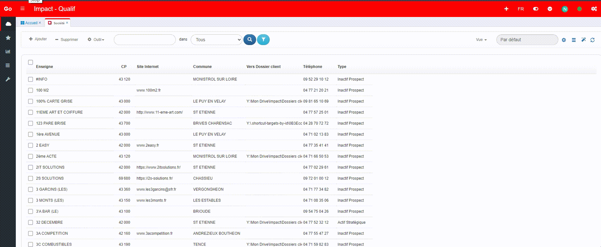

- **Supprimer les onglets de navigation**
Pour supprimer les onglets de navigation, il faudrai chercher le script de dans le `CRM Qualif` de Nids.
Sinon on peut se baser sur cette class : `tabs-header tabs-header-plain tabs-header-noborder`.

```javaScript
    // Il faudrai juste hide() la div qui contient cette class 'tabs-header tabs-header-plain tabs-header-noborder'
```

- **Fixer les onglets sur PC et les faire apparaitre de façon automatique**

 

```javaScript
        if (!IS_MOBILE) { // SI c'est PC
            $('.tabs-wrap > .tabs').css({
                'position': 'fixed',
                'background-color': 'rgb(234, 236, 242)',
                'z-index': '500',
                'padding-top': '5px',
                'top': '49px',
                'transition': 'top 0.5s ease'
            });

            $('.tabs-panels').css({
                'padding-top': '28px'
            });

            let lastScrollTop = 0;
            const tabs = document.querySelector('.tabs');
            const tabsHeight = tabs.offsetHeight;

            window.addEventListener('scroll', function () {
                const scrollTop = window.pageYOffset || document.documentElement.scrollTop;
                if (scrollTop > lastScrollTop) {
                    // Scroll vers le bas
                    tabs.style.top = `-${tabsHeight}px`;
                } else {
                    // Scroll vers le haut
                    tabs.style.top = '49px';
                }
                lastScrollTop = scrollTop <= 0 ? 0 : scrollTop;
            });
        } 
```