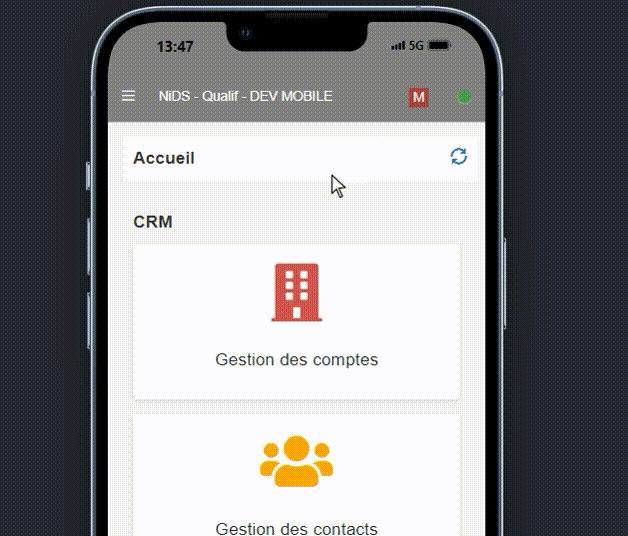
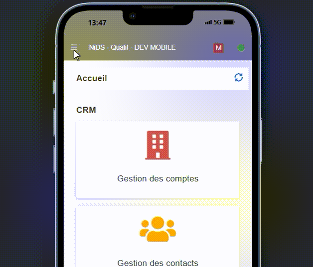
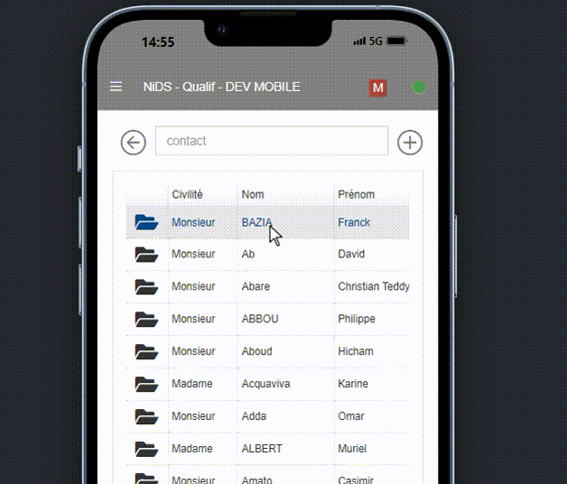
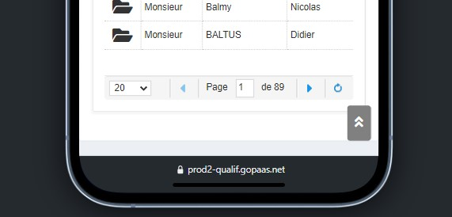
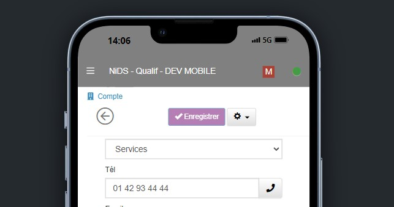
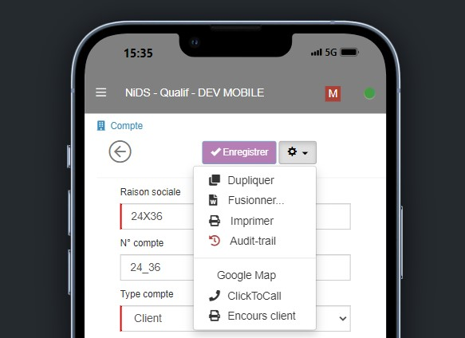
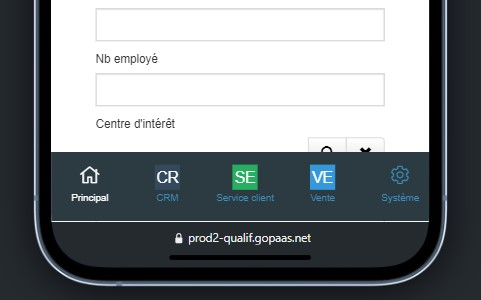

# RoadMap GoPaaS

Liste des améliorations de GoPaaS qui arriveront dans les prochaines version.

## Vue - Multiview

Une **Multiview** permet de diviser l'écran en deux parties avec une vue principale et des vues secondaires dans des onglets.
* Dans la première partie on a la possibilité de sélectionner une autre vue principale de la même table depuis le menu des vues

* Les vues secondaires sont filtrées sur la fiche active sélectionnée avec le mot-clé (-TrigItemName-) ce qui permet d'afficher les fiches liées à la fiche sélectionnée de la vue principale.

Pour paramétrer une **Multiview** :
* Ajouter une nouvelle ou dupliquer une vue existante pour une table.
* Sélectionner le type de vue **"Multiview"**
* Dans l'onglet "Vue secondaire(s)" sélectionner les vues secondaire à afficher puis cliquer sur le bouton ** > ** pour les ajouter à la liste des vues secondaires. 
> La liste des vues qui s'affiche est filtrée sur les vue dont il existe une condition qui connecte la vue à la table principale.
* Ouvrir les vues secondaires pour les paramétrer en changeant
   * le nom de l'onglet
   * La couleur de l'onglet
   * L'ordre d'affichage de l'onglet
   * En ajoutant une icône font-awesome sur les onglets

## Vue - Volet de modification

Une nouvelle option permet d'afficher un fiche dans une vue en mode modification. Au clic sur une fiche de la vue, une fiche s'ouvre à droite de la vue pour pouvoir la modifier.

### Modification

La fiche peut être modifiée et tous les scripts JS initiales sont exécutée au chargement de la fiche. Les boutons "Enregister" et "Appliquer" permettent d'enregistrer les modifications de la fiche.
Le bouton "Enregistrer" ferme quant à lui la fiche en mode modification.

### Paramétrage
Pour afficher le volet de modification dans une vue: 
* cocher la case à cocher **"Afficher volet de modification"**.
* Le champ **"Taille de la fenêtre"** apparaît pour définir la largeur de la vue en pourcentage allant de 10% à 80%.

## Application mobile GoPaaS

GoPaaS mobile est une application mobile embarquée disponible sur les stores. 
Cette appication est développé en **ReactJS native**.
Elle permet d'ouvrir les applications GoPaaS en mode connecté en renseignant l'URL de l'application, le login et le mot de passe de l'utilisateur.

### Page de connexion
Sur la page de connexion, renseigner :
* L'URL de l'application GoPaaS
* Login
* Password

A la connexion toutes la configuration de l'application est télécharger en local sur le mobile.

> Si une modification de structure a lieu dans l'application principale, il faudra se déconnecter pour télécharger la nouvelle version de l'application

### Environnement
* Dashboard
  * Tous les Dashboards "Affichage au démarrage"
  * Ordre affichage

* Les vues
   * Moteur de recherche "Plain text"
   * Colonnes standard sous forme d'étiquette

* Les fiches
   * Tous les types de champs sont disponibles
> Renseigner les types et mettre leur caratéristique spécifique au Mobile
> Ordre des onglets à vérifier
> Masquer titre section si "Ne pas afficher" 

* Barre de menu
   * Bouton **Enregistrer** et bouton **Retour**

### ScriptJS
* Comment faire avec les scriptJS existant ?
* Peut on es interprété en ReactJS native ?

## Mobile v2
Une Nouvelle interface mobile responsive pour une meilleure expérience utlisateur.
Dans cette version quelques modifications d'ergonomie: 
* Les onglets de navigation disparaissent pour plus de fluidité.
* Les onglets dans les fiches sont maintenant sous forme d'icône en base de la fiche et reste fixe tout au long de la navigation sur la fiche
* La barre de navigation et la barre d'outils reste fixe durant la navigation
*  Dans les vues les informations dans le pied page sont simplifiées pour plus de lisibilité


### Eléments du mode mobile (Code de recherche `3.4.0`)
- **Rendre la barre de navigation fix** `📁index.php` ✔ 
    Fixation du header de l'application afin qu'il reste toujours visible en haut de la page, peu importe le défilement de la page.
    ```html
        <!-- Avant -->
        <header class="main-header">...</header>
        <div class="content-wrapper" style="min-height: 706px;">...</div>


        <!-- Après -->
        <header class="main-header" style="position: fixed; width: 100%; top:-1px">...</header>
        <!-- Juste après le Header on crèe une div Personnalisée -->
        <div style="width:100%;height:50px;"></div>
        <div class="content-wrapper" style="margin-left: 0px;">...</div>

    ```
     
    
- **Afficher groupe et profil de l'utilisateur** `📁index.php` ✔
  
     ```html
        <!-- Avant -->
		<p class="hidden-md hidden-xs">
		      <?php echo Script::$user["prenom"]; ?> <?php echo Script::$user["nom"]; ?><br /><?php echo Script::$user["profil"]; ?>/<?php echo Script::$user["groupe"]; ?>
		    <small><?php echo Script::$user["email"]; ?></small>
		</p>

        <!-- Après -->
        <p>
            <?php echo Script::$user["prenom"]; ?> <?php echo Script::$user["nom"]; ?><br /><?php echo Script::$user["profil"]; ?>/<?php echo Script::$user["groupe"]; ?>
            <small><?php echo Script::$user["email"]; ?></small>
		</p>
    ```          

- **Rendre la La barre d'outils de Gauche Fixe** `📁index.php` ✔
    Fixation de la barre de navigation de gauche pour qu'elle reste fixe, quel que soit le déplacement de l'application.
    ```html
        <!-- Avant -->
        <aside class="main-sidebar">...</aside>

        <!-- Après -->
        <aside class="main-sidebar" style="position:fixed">...</aside>
    ```
     

- **Ajouter la fermeture automatique de La barre de personnalisation de droite** `📁include/onload.php` ✔
  Au click d'un élément sur la barre de de personnalisation de droite, le menu se range automatiquement.

  ```javaScript
        // Le script est faut en JS
  ```
-  **Ajouter la fermeture automatique de La barre de navigation de gauche** `📁include/onload.php` ❌
    Il ne ferme pas automatiquement lorsque par exemple on clique juste dans les éléments de Admin.
    ```javaScript
            $('.sidebar > .sidebar-menu > .treeview > .treeview-menu > li > ul').find('a').on('click', function() {
        if (!$('body').hasClass('sidebar-collapse')) {
            $('.gopaas-toggle-left-sidebar').click();
        }
    });
    ```


##### Sur les Vues GoPaaS 📁
- **Rendre de la section de recherche fixe** `📁../ViewDatagrid.js` ❌
    Rechercher dans le le fichier correspondant, pour mettre les classes le style en `JavaScript`.
    Il faudrais juste prendre les `styles`des fichiers html pour les ajouter en en `JavaScript`.

    ```html
        <!-- AVANT -->
        <div class="Viewbar_mobile gopaas-component Viewbar" style="padding-bottom:15px;">
            <div class="container-fluid">
            <!-- recherche simple et recherche par champ -->
                <form class="Searchbar_mobile  gopaas-component Searchbar" action="#" method="post" style="display:flex;width: 100%">
                

                </form>
            </div>
        </div>

        <!-- APRES -->
        <div class="Viewbar_mobile gopaas-component Viewbar" style="padding-bottom:15px;">
            <div class="container-fluid" style="position: fixed; width: 94%; background-color: rgb(255, 255, 255); z-index: 500; padding-top: 20px; top: 48px; padding-left: 10px; padding-right: 10px;">
                <!-- recherche simple et recherche par champ -->
                <form class="Searchbar_mobile gopaas-component Searchbar" action="#" method="post" style="display:flex;width: 100%">
                    .........
                </form>
            </div>
        </div>
    ```

     

- **Supprimer les informations qui se trouvent dans le footer de la vue** `📁../ViewDatagrid.js` ❌
  - Suppression du texte : `6515 fiche(s) trouvée(s)`.
  - Suppression des boutons : `Next` & `Back`.
  
    

   
##### Dans la Fiche GoPaaS 📇
- **Entêtes fiche GoPaaS (Bouton Save, Menu Outil, etc.)** ❌
    Nous avons supprimé le bouton `Annuler` et `Appliquer`, apporté des modifications à la section qui gère les actions possibles sur la fiche.
    ```html
        <!-- Avant -->
        <form action="#" method="post" id="form44" class="form-horizontal">
            <h3 style="margin-top:0px;margin-bottom:5px;color:#3c8dbc;">
                <!---->
                <i class="fa fa-building" style="color:#3c8dbc;"></i>
                &nbsp;<span class="trn">Account</span>
            </h3>
            <div class="row" style="margin-left:0px;margin-bottom:10px;text-align:center;">
                <div class="col-xs-12 col-sm-12 col-lg-12" style="display: flex;">
                    <!-- Liste des Boutons PAr default -->
                </div>
            </div>
        </form>

        
        <!-- Après -->
        <form action="#" method="post" id="form44" class="form-horizontal">
        
        <!-- Ajuster le titre de la fiche à la taille qu'il faut -->
        <h3 style="margin-top: 0px; margin-bottom: 5px; color: rgb(60, 141, 188); font-size: 1.2rem; position: fixed; width: 100%; top: 51px; padding-top: 10px; padding-bottom: 10px; z-index: 1000; background-color: rgb(255, 255, 255);">...</h3>
        
        <!-- Ajustemente des bouton  -->
        <div class="row" style="margin-left: 0px; margin-bottom: 10px; text-align: center; position: fixed; width: 100%; top: 80px; padding-bottom: 10px; z-index: 1000; background-color: rgb(255, 255, 255); border-bottom: 1px solid rgb(242, 242, 242);">
            <div class="col-xs-12 col-sm-12 col-lg-12" style="display: flex;">
                    <!-- Bouton Retour -->
                    <span style="font-size: 3rem;margin-right: auto;color:#777;" onclick="gopaas.ui.closeActiveTab()"><i class="fal fa-arrow-circle-left gopaas-button-close"></i></span>

                    <!-- Bouton Enregistré -->
                    <button type="button" id="gopaas-button-save-and-close-compte" class="btn btn-primary btn-sm gopaas-button-save-and-close trn-title gopaas-theme-button" style="margin-right: 3px; height: fit-content; margin-top: auto; margin-bottom: auto;" ....>...</button>
                </div>

                <!-- Ajout de 3 <br> Après cette Div --> <br>x3
        </div>
        </form>
    ```
    > **A noter** : Les modifications concernant la section qui gère les actions de la fiche sont assez nombreuses et difficiles à citer et afficher avec leurs lignes de code de style.

     

   - **Ajustement des boutons `Enregistrer`, `Outils`, etc**
    Modification du `DropDown`du menu outil en le décalant plus à gauche.
    ```html
        <ul id="btn_action_menu" class="dropdown-menu dropdown-menu-right" role="menu">
		    <li>
        
            </li>
        <ul> 
    ```
    > Style `dropdown-menu-right`
    ```css
    .dropdown-menu-right {
        left: auto;
        right: 0;
    }
    ```
     

  
  - **Modification des `onglets` les placer en Bas de la page** ✔
    Suppression des onglets situés en haut de la fiche et repositionnement en bas avec un nouveau style pour une meilleure accessibilité.

    ```html
        <!-- AVANT -->
        <ul class="replace nav nav-tabs" role="tablist" id="myTab_form42">
            <li id="tab11" role="presentation" class="">
                <a href="#form42_11" aria-controls="home" class="replace" role="tab" data-toggle="tab" aria-expanded="false">
                    <span class="trn">Principal</span>
                </a>
            </li>
        </ul>

        <!-- APRES -->
        <ul class="nav nav-tabs" role="tablist" id="myTab_form45" style="position: fixed; width: 100%; bottom: 0px; left: 0px; display: flex; z-index: 2000; overflow: scroll hidden; background-color: rgb(44, 59, 65); justify-content: center;">
            <li id="tab11" role="presentation" class="active">
                <a href="#form45_11" aria-controls="home" class="" role="tab" data-toggle="tab" style="border: none; padding: 10px 0px 15px; margin: 0px; width: 80px; background-color: rgb(44, 59, 65); text-align: center;">
                    <p class="icon-nav" style="text-align:center;font-size:2rem;margin-bottom:0;">
                        <i class="fal fa-home"></i>
                    </p>
                    <span class="trn" style="font-size: 1rem;">Principal</span> 
                </a>
            </li>
        </ul>
    ```
     


    -  **Ajuster tout le body de la fiche** ✔

    ```html
        <!-- AVANT -->
        <div title="" class="panel-body panel-body-noheader panel-body-noborder" style="width: 388.667px;">


        <!-- APRES -->
        <div title="" class="panel-body panel-body-noheader panel-body-noborder" id="" style="width: 388.667px; padding-bottom: 50px;">
    ```

### Eléments corrigés 
-  **Espace en trop entre le titre et la section de recherche sur les vues.** ❌
 

- **Correction** 
  ```css

    ```

- **Faire en sorte que au clique d'un élément dans la nav barre de gauche range tout le menu `MODE TABLETTE`** ❌

    ```javaScript
        var isList = $('.treeview-menu > li').has('ul').length > 0;
        $('.sidebar > .sidebar-menu > .treeview > .treeview-menu > li > ul').find('a').on('click',  
        function() {
            $('.gopaas-toggle-left-sidebar ').click();
        });
        
        $('.sidebar > .sidebar-menu > .treeview > .treeview-menu > li > a> span').on('click', function() {
            if(!isList){
                    $('.gopaas-toggle-left-sidebar ').click(); 
            }
        });
    ```

- **Rendre les Onglet de navigation sur GoPaaS fixe et la barre de recherche.** ❌

    ```html
        <!-- AVANT : Fixation des onglets GoPaaS -->
        <ul class="tabs" style="height: 26.6667px;">


        <!-- APRES : Fixation des onglets GoPaaS-->
        <ul class="tabs" style="height: 27px;position: fixed;width: 100%;background-color: white;z-index: 1000;top: 52px;/* padding-top: 5px; */">

        <!-- Ajustement et fixation de l'input de recherche  -->
        <div class="container-fluid">
        <!-- .container-fluid {
            margin-right: auto;
            margin-left: auto;
            padding-left: 15px;
            padding-right: 15px;
            position: fixed;
            width: 94%;
            background-color: white;
            z-index: 500;
            padding-top: 50px;
            top: 48px;
        } -->

        <!-- Ajuster le tableau -->
        <div class="panel datagrid" style="padding-top: 36px;">

    ```

- **Correction** ✔

    ```javaScript
        // Barre de recherche
        thisComponent.ui.find(".Viewbar_mobile > .container-fluid").css({"position" : "fixed", "width": "94%", "background-color": "white", "z-index": "500", "padding-top": "50px", "top": "48px"});
        thisComponent.ui.find(".ViewDatagrid  > .datagrid").css({"padding-top:" : "36px"});

        if(IS_TABLET){
            // Onglet de navigation GoPaaS Mode Tablette
            thisComponent.ui.find(".tabs-wrap > .tabs").css({"height": "27px","position": "fixed","width": "100%","background-color": "white","z-index": "1000","top": "52px", "padding-top":" 5px"});
        }

    ```

 - **Afficher les colonnes des champs sur `Tablette` en col-sm-6.**
    Toute les colonnes sur la tablette doivent affciher des champs en col-6 pour ne pas avoir 3-4 colonne sur une fiche.** ❌

    > Ce script ce décleche que sur la fiche.

    ```javascript 
            let item = $('.tab-pane > .row'); 
        $('.tab-pane > .row').each(function() {
            for (var i = 1; i <= 5; i++) {
                console.log(item);
                var oldClass = 'col-sm-' + i;
                $(this).find('.' + oldClass).removeClass(oldClass).addClass('col-sm-6');
            }
        });
    ```
- **Au clique de l'icône profil de l'utilisateur, le nom de l'utilisateur ne s'affiche pas** ❌

    ```html
    <!-- AVANT -->
    <p class="hidden-md hidden-xs">
            admin 2 NiDS<br>Admin/ADMIN
            <small>support@nids.fr</small>
    </p>

        <!-- APRES -->
        <p class="">
            admin 2 NiDS<br>Admin/ADMIN
            <small>support@nids.fr</small>
        </p>
    ```


- **Dans la fiche ajuster les Z-index, mettre ceux des entêtes à `1000` au lieu de `2000`.** ✔

  Il existe aussi du code `JavaScript` à verfier dans la Qualif

- **Vue liées dans une fiche**  ✔

   Ici il faut juste masquer le `bouton Recherche`, c'est un script `JavaScript` qui est disponible dans Nids CRM Qualif.

 - **Supprimer le text `0 fiche(s) trouvée(s)`** ❌


> -------------------------------------------------------------------------------------------------------


### Eléments ajoutés en PreProd✅. 
##### Ces modifications étaient sur la base de qualif de `Impact`, mais elle y sont plus.

- **Rendre le header Fixe** ✔
    - Fichier modifié : `index.php`

- **Rendre la naveBar de gauche fixe** ✔
    - Fichier modifié : `index.php`

- **Dans la fiche GoPaaS, ajuster les boutons (Enregistrer, annuler, etc) et les autres éléments de l'entête de la fiche.** ✔
    - **Les boutons & onglets de la fiche** ✔
        - Fichier modifié : `ItemGeneric.js`

- **Sur Mobile fixer les onglets l'input de recherche**  ✔
    - Fichié modifié : `ViewDatagrid.js`

- **Afficher les infos du User dans le menu de l'utilisateur.** ✔
    - Fichier modifié : `index.js`


#### Eléments non ajoutés en PreProd❌

- **Sur Tablette fixer les onglets de Navigation GoPaaS & l'input de recherche**
    - Fichié modifié : `onload.php` Pour les Onglets ✔
    - Fichié modifié : `ViewDatagrid.js` Pour la barre de recherche ✔
    - Fichié modifié : `IItemGeneric.js` Pour ajuster la taille de hauteur de la fiche (On ajoute un margin-top sur l'élément h3) ✔
    

- **Sur Tablette afficher les champ en 2 colonnes `col-sm-6`**
    - Script supprimé, disponible sur la ligne `195` du ficher `readme.md`.
    - Commentaire : En essayant d'appliquer celà l rendu est assez beau sur certaines fiches mais pas souvent sur toutes les fiches, tout dépend de la manière dont ils ont ajusté leur form designer par default. 

- **Faire en sorte que au clique d'un élément dans la nav barre de gauche range tout le menu `MODE TABLETTE`** 

- **Dans le corps d'une fiche, sur les input recherche des vues liées il y a l'icone de la loupe. `Mobile`**

> ----------------------------------------------------------------------------------------------------------------------

### Paramétrage
Pour passer à la version Mobile v2, il faut cocher la case à cocher **"Mobile v2"** dans la fiche de configuration GoPaaS

## Google SYNC
### Calendar
Permet de synchroniser les fiches agenda Google Calendar avec GoPaaS.

#### Paramétrage
Dans la fiche **Configuration**  GoPaaS, définisser la table pour synchronisation de l'agenda et les champs nécessaires.
La synchronisation est bi-directionnelle, une fiche créée dans Google Calendar sera ajoutée à GoPaaS et une fiche Agenda créée dans GoPaaS sera ajoutée dans Google Calendar. De la même manière une fiche modifiée sur un système sera également modifiée dans l'autre système.

#### Fonctionnement
* Un identifiant unique "UUID" est généré à chaque création de fiche dans GoPaaS
* Une table de paramétrage enregistre toutes les modifications apportées dans une fiche Agenda GoPaaS que ce soit en création ou en modification 
> Peut on utiliser la fiche "History" ? ou Peut on utiliser la fiche "SyncLog" ?

* Une fiche de paramétrage par Utilisateur avec les accès à Google Calendar 
> Peut on mettre toutes les informations de synchronisation dans cette fiche ?
* Une **RULES** parcours toutes les fiches de paramétrage Google Calendar pour synchoniser les données.
   * Depuis Google Calendar, on prend toutes les fiches créées ou modifiées sur Google Calendar et on les envoi à GoPaaS
   * Depuis GoPaaS, on prend toutes les fiches Agenda créées ou modifiées sur GoPaaS et on les envoi à Google Calendar
   
### Contact
Permet de synchroniser les fiches contact Google Contact avec GoPaaS.
> Voir si vraiment nécessaire ?


