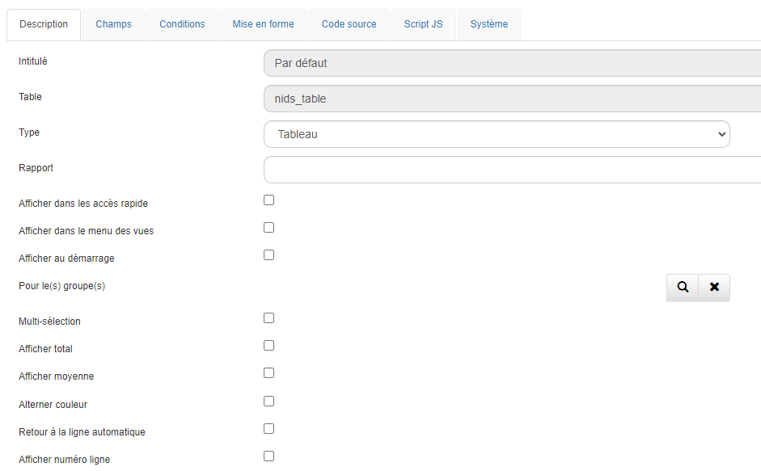
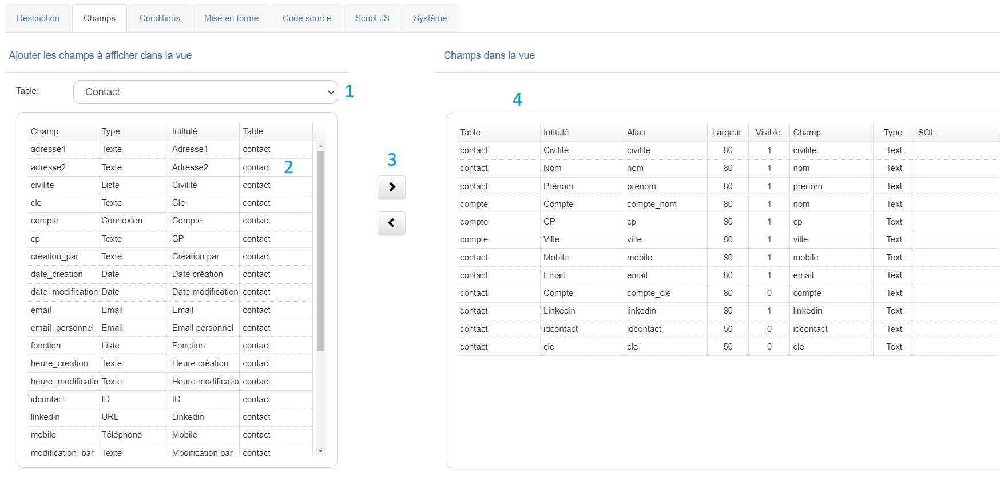
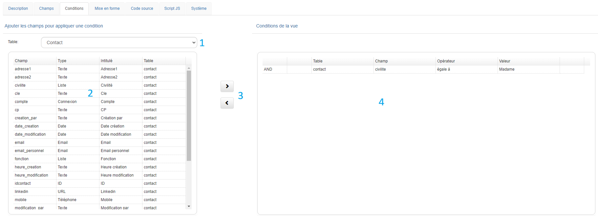
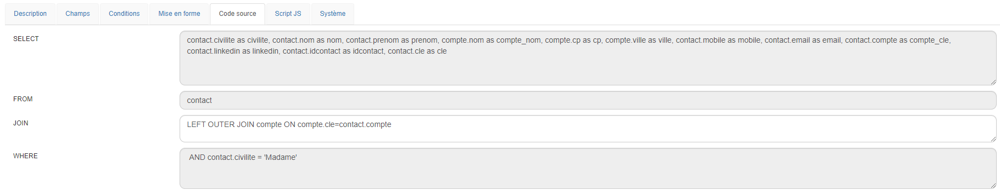
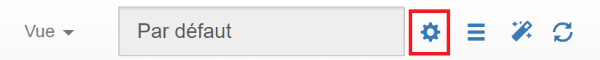

# Vue

## Créer une vue

Vous pouvez adapter une vue en fonction de vos besoins, par exemple changer les couleurs, l'ordre d'affichage,  les conditions et les champs qui la composent. Chaque type de vue (Tableau, Agenda, Graphique et Pivot) dispose de ses propres options permettant une meilleure souplesse. 

Ajouter une nouvelle vue depuis le menu "Vue" puis cliquer sur le bouton "Ajouter" pour accéder au paramétrage.


## Description

Vous voilà sur la fiche de personnalisation des vues, elle se compose de plusieurs onglets, pour le moment cliquer sur l'onglet **Description** pour débuter le paramétrage.




Il est conseillé de renseigner un certain nombre de champs pour paramétrer correctement la vue :

* Renseigner les champs suivants : 

| Champ                         | Description                                                                                                            |
|------------------------------|------------------------------------------------------------------------------------------------------------------------|
| Intitulé                     | Nom de la vue.                                                                                                         |
| Table                        | Table SQL sur laquelle la vue est connectée                                                                            |
| Type                         | Choisir le type de vue : Tableau, Agenda, Graphique, WebReport, Pivot, Kanban                                                      |
| Rapport                      | Afficher la vue dans un rapport.                                                                                       |
| Afficher dans les accès rapide | Permet d'afficher la vue dans l'Accès rapide  de la barre de navigation.                                                 |
| Afficher dans le menu des vues | Permet d'afficher la vue dans le menu des vues.                                                                         |
| Afficher au démarrage        | Option permettant l'ouverture de la vue au chargement de l'application.                                                 |
| Pour le(s) groupes(s)        | Fonctionne avec la case à cocher "Afficher au démarrage".                                                               |
| Multi-sélection              | Active la multi-sélection sur la table.                                                                                |
| Afficher total               | Affiche sur la dernière ligne du tableau le total.                                                                     |
| Afficher moyenne             | Affiche sur la dernière ligne du tableau la moyenne.                                                                   |
| Alterner couleur             | Permet d'alterner la couleur des lignes (blanc/gris).                                                                  |
| Retour à la ligne automatique| Permet de prendre en compte les retours à la ligne dans un texte, dans le cas d'un champ CKEditor.                     |
| Afficher numéro ligne        | Afficher un numéro de ligne.                                                                                           |
| Afficher le mode modification| Offre la possibilité d'utiliser le mode “Edit View”                                                                    |
| Hauteur Max                  | Permet de définir la hauteur d'une vue.                                                                               |
| Afficher barre défilement horizontale | Permet d'obtenir une barre de défilement à l'horizontale.                                                             |
| Figer colonne                | Permet de figer la largeur des colonnes, en partant de la gauche.                                                     |
| Nombre de fiches par page par défaut | Paramétrage du nombre de fiches à afficher sur une page.                                                               |
| Permissions                  | Permet de gérer les permissions de la vue.                                                                            |
| Description                  | Champ note pour la saisie d'une description de la vue.                                                                 |

> Il est déconseillé de cocher toutes les options pour un soucis de performance lors du chargement de la vue.

- Il est également possible de dupliquer la vue par défaut et de modifier les paramètres pour créer une nouvelle vue :
    * Depuis la vue par défaut cliquer sur  ->   ->  Dupliquer, il suffit alors de modifier le nom de la vue puis de cliquer sur  pour commencer le paramétrage.

## Agencer les champs

Nous allons maintenant passer à l'onglet **Champs**, c'est ici que vous allez sélectionner les champs que vous souhaitez voir apparaître dans votre nouvelle vue.



1. La liste de table affiche toutes les tables disponibles dans l'application.

2. Affiche les champs de la table sélectionnée sur le point n°1.

3. Permet d'ajouter un champ (flèche de droite) dans la vue ou de le supprimer (flèche de gauche).

4. Les champs choisis pour apparaître dans la vue, l'ordre d'affichage peut-être modifié avec un glissé-déposé.

> Pour ajouter ou supprimer un champ, il suffit de le sectionner et de le déplacer à droite ou à gauche à l'aide des flèches.

## Propriétés de la colonne

A l'aide d'un double clic sur un des champs de la colonne de droite, vous accédez aux propriétés du champ dans la colonne. C'est ici que vous allez effectuer des actions ciblées sur le champ de votre vue comme par exemple, augmenter ou diminuer la largeur de la colonne ou encore l'alignement du champ.


A l'ouverture de la fiche, un certain nombre de champs sont repris : 

**Table, Champ, Alias, Intitulé.**

D'autres champs sont renseignés par défaut mais peuvent être modifiés :

| Champ               | Signification                                                                                                           |
|---------------------|-------------------------------------------------------------------------------------------------------------------------|
| Largeur             | Définir la largeur souhaitée.                                                                                           |
| Format              | Par défaut, GoPaaS détecte le type de champ et renseigne la donnée automatiquement. Mais pour plus de personnalisation, il est possible de choisir un format SQL ou SQLNumber. |
| SQL                 | Renseigner la commande SQL à condition d'avoir sélectionné le bon format préalablement.                                |
| Alignement          | Définir l'alignement du champ dans la colonne (left, center ou right). Si aucune valeur n'est renseignée, la valeur par défaut est left.                                            |
| Style             | Permet d'ajouter du style dans ma colonne. <br> Exemple : <br> ```[{"value": "Client", "style":"font-size:8px;background-color:#ff0000;color:#fff;font-weight:bold;"}, {"value": "Prospect", "style":"font-size:8px;background-color:green;color:#fff;font-weight:normal;"}]  ```                                                        |
| Visible             | Décocher l'option pour masquer le champ dans la vue.                                                                    |
| Masquer sur mobile  | Cocher l'option pour masquer le champ sur le mobile.                                                                  |
| Masquer intitulé sur mobile  | Cocher l'option pour masquer l'intitulé sur le mobile.                                                                  |
| Afficher en ligne sur mobile  | Cocher l'option pour afficher les données à l'horizontal. **NB** _Le mode mobile de l'utilisateur doit être "List"_          |
| Autoriser modification  | Permet de modifier le champ lors de l'utilisation du mode EditView (se référer à la section "Fonctionnalités d'EditView")                                                                  |

## Ajouter des conditions



1. La liste de table nous affiche toutes les tables disponibles dans l'application.

2. Affiche les champs de la table sélectionnée sur le point n°1.

3. Permet d'ajouter le champ (flèche vers la droite) sur lequel nous allons faire la condition ou de le supprimer (flèche vers la gauche).

4. Les champs choisis pour les conditions.

## Trier une vue

Via l'onglet mise en forme, il est possible d'effectuer des tris sur votre vue, par exemple pour afficher des actions par statut ou encore trier des comptes par ordre alphabétique.


1.  Les tris de 1 à 5 permettent de classer les fiches en fonction des champs qui sont affichés dans la vue (onglet Champs).
2.  Afficher par ordre croissant ou décroissant.
3. Sélectionner le champ pour effectuer le regroupement.

## Code source

Dans l'onglet "Code source" apparaît la requête SQL de la vue.




**Détails :**

| Champs       | Valeur                                                                                                      |
|--------------|-------------------------------------------------------------------------------------------------------------|
| SELECT       | Génère automatiquement en fonction des champs sélectionnés dans l'onglet Champs.                            |
| FROM         | Indique le nom de la table.                                                                                 |
| JOIN         | Permet de créer une jointure avec une autre table.                                                          |
| WHERE        | Génère automatiquement en fonction des champs sélectionnés dans les conditions.                             |
| COLONNE      | Génère automatiquement le paramétrage de chacun des champs.                                                 |
| STYLE        | Permet d'appliquer un style en fonction de la valeur d'un champ du tableau, voir exemple ci-dessous : Si la ville de la fiche contact = "PARIS" il applique une couleur et met en gras le texte :<br> Au format XML : <br>```<format><item datafield="ville" value="PARIS" code="0xAE642D" fontweight="bold" fontstyle="normal"/></format>``` <br> Ou au format JSON : <br>  ``` {"format": {"item": {"datafield": "ville","value": "PARIS","code":"0xAE642D","fontweight": "bold","fontstyle": "normal"}}} ```|

## Script JS

Le champ Script JS est utilisé pour surcharger le code dans le cas d'une vue liée.


Le script JS peut afficher dans la vue liée un nouveau menu sur le bouton "Ajouter"


Détail pour la ligne "Appel sortant" : 
```javascript
vb.addAddButton("Appel sortant", null, {
      type: "Appel sortant",
      objet: "Commercial",
      statut: "En cours",
      compte: itemComponent.getValue('compte')
   }
);
```

| Champ        | Valeur                              |
|-------------|----------------------------------------------|
| Type       | Appel sortant                                   |
| Objet       | Commercial                                   |
| Statut      | En cours                                     |
| Compte      | Récupère la connexion compte de la fiche en cours. |

## Tableau

La vue tableau sert à afficher tout ou partie des enregistrements d’une table donnée. Elle s’ouvre dans un onglet de l’application.


## Mettre à jour en masse

Utilisez la fonction de mise à jour en masse depuis le menu Outil de la vue pour modifier rapidement les valeurs d'une liste de fiches.

Recherche / Remplace, suppression ou concaténation de plusieurs champs, ces fonctions sont disponibles dans l'outil MassUpdate.


L'outil de mise à jour en masse peux s'avérer très utile lorsque que vous souhaitez traiter rapidement un volume de donnée important.

Il existe 4 fonctions :

- Remplacement d'une valeur
- Recherche / Remplace d'une valeur précise
- Concaténation
- Opération sur une valeur numérique

Pour utiliser le module de mise à jour en masse, sélectionnez les fiches sur lesquelles vous souhaitez effectuer une mise à jour > Menu outil > Mettre à jour en masse.


**Remplacement**

Dans notre exemple nous allons remplacer la valeur d'une fiche compte de type "Prospect" à "Client". Recherchez le(s) champ(s) à mettre à jour, dans notre exemple ce sera le champ type
Ajoutez simplement votre valeur dans le(s) champ(s) concerné(s) puis cliquez sur le bouton Mettre à jour.


**Recherche / Remplace**

Dans notre exemple nous allons effectuer une mise à jour de permission. Nous souhaitons remplacer la permission nicolas par Jonathan.
Renseigner le code suivant : \$\$[%note|replace|'nicolas'|'jonathan'%]

Explication du code :

- \$\$ : Déclaration de l'action
- note : Nom du champ sur lequel effectuer l'opération
- replace : Action de remplacement
- nicolas : Valeur à rechercher
- jonathan : Valeur de remplacement
> NB : Pour recherche et supprimer un élement il suffit simplement de ne pas renseigner de valeur de remplacement :
\$\$[%note|replace|'nicolas'|''%]

​​​​​​**​Concaténation**

Concaténation de plusieurs champs existants dans GoPaaS.

Dans notre exemple nous allons concaténer les champs "adresse, cp, ville" dans un champ note
Tapez le code suivant dans le champ note : \$\$[%adresse%] & " " & [%cp%] & " " & [%ville%]

Explication du code :

- \$\$ : Déclaration de l'action
- [%champ de concat%]
- & : Déclaration d'ajout d'une autre valeur
- " " : Caractère permettant d'effectuer un espace entre les champs
> NB : Il est possible d'ajouter d'autres caractères pour effectuer des séparation entre les champs ( " / ", " - ")


**Opération sur une valeur numérique**

Dans notre exemple nous allons soustraire 2 années au champ année d'une fiche.
Tapez le code suivant dans le champ année de la liste : \$\$[%annee%] -2.

Explication du code :

- \$\$ : Déclaration de l'action
- [%nom du champ qui subit l'opération%]
- -2 : Opération à réaliser (+ ou -)

Faites simplement varier le chiffre de fin en fonction de l'opération que vous souhaitez effectuer, -3, -4 ou alors +1, +3,....

> NB : Ce type d'opération ne peut être réalisé que sur les champs de type nombre


**Supprimer les valeurs d'un champ**

Utilisez simplement le code : $$null pour vider la ou les valeur(s) d'un champ.


Les listes déroulantes, les connexions, les champs de type date, nombre et heure définies dans le Designer sont disponibles pour les modifications en masse.


## Agenda

La vue agenda vous permet d'afficher par exemple les historiques directement dans un agenda.


Le paramétrage de la vue Agenda s'effectue dans l'onglet "Agenda". Dans chacune des listes apparaît les champs que l'on a choisi dans l'onglet "Champs" de la vue.


**Détails :** <br>
​​​​
<table>
  <tr>
    <th>Champs</th>
    <th>Valeur</th>
  </tr>
  <tr>
    <td>Titre</td>
    <td>C'est le premier texte qui sera affiché sur l'agenda.</td>
  </tr>
  <tr>
    <td>Description / Description 2 / Description 3</td>
    <td>Idem que sur le point précédent, ce sont les champs que l'on veut voir sur l'agenda.</td>
  </tr>
  <tr>
    <td>Date début</td>
    <td>C'est le champ date de début de votre fiche.</td>
  </tr>
  <tr>
    <td>Heure début</td>
    <td>C'est le champ heure de début de votre fiche.</td>
  </tr>
  <tr>
    <td>Date fin</td>
    <td>C'est le champ date de fin de votre fiche.</td>
  </tr>
  <tr>
    <td>Heure fin</td>
    <td>C'est le champ heure de fin de votre fiche.</td>
  </tr>
  <tr>
    <td>Table de collaboration</td>
    <td>C'est la vue des collaborateurs que l'on veut afficher dans l'agenda.</td>
  </tr>
  <tr>
    <td>Champ du code couleur</td>
    <td>C'est le champ que l'on choisit pour appliquer les codes couleurs.</td>
  </tr>
  <tr>
    <td>Code couleur</td>
    <td>Il faut ici saisir le code couleur en <a href="https://fr.wikipedia.org/wiki/Liste_de_noms_de_couleur#Liste" target="_blank">hexadécimal</a>, exemple ci-dessous :<br><b>{ "Nicolas.":"#8B16E5", "Nambourt.":"#FF0000" // Attention pas de virgule sur la dernière ligne }</b></td>
  </tr>
  <tr>
    <td>Champ du code icône</td>
    <td>C'est le champ que l'on choisit pour l'affichage de l'icône.</td>
  </tr>
  <tr>
    <td>Code icône</td>
    <td>Ce sont les icônes que l'on va afficher en fonction du champ code icône, les codes à utiliser viennent du site <a href="http://fontawesome.io/icons/" target="_blank">Fontawesome</a>.</td>
  </tr>
</table>


## Graphique

Vous pouvez ajouter une vue de type Graphique pour analyser par exemple vos affaires en cours.


**Type graphique** : Choix du type de graphique.


**Détails :**

| Champ                   | Description                                                                                                      |
|-----------------------------|----------------------------------------------------------------------------------------------------------------------|
| Titre                       | Titre du graphique.                                                                                                  |
| Champ Valeur               | C'est le champ qu'il faut sélectionner pour le calcul du pourcentage dans le tableau.                               |
| Type calcul                | Choix du type de calcul : Somme, Nombre, Moyenne, Max ou Min.                                                       |
| Sous-titre                 | Sous-titres du graphique.                                                                                            |
| Champs Dimension           |                                                                                                                       |
| Regroupement               | Permet de grouper le résultat sur un champ.                                                                          |
| Couleur de fond du widget  | Non utilisé sur ce type de graphique.                                                                                |
| En savoir plus             | Non utilisé sur ce type de graphique.                                                                                |

## Pivot

La vue type Pivot vous permet d'avoir un tableau croisé dynamique directement sur votre application.


1. Liste des champs que l'on a ajouté dans la vue.
2. Afficher des champs dans l'axe des ordonnées.
3. Afficher des champs dans l'axe des abscisses.
4. Choix du type de pivot : Table, Bar Chart, ...
5. Visuel dynamique du pivot.

## KanBan

La vue KanBan permet de changer le statut des actions rapidement à l'aide de glisser-déposer.


1. Choix du champ pour regrouper les fiches.
2. Chaîne JSON listant les valeurs de regroupement dans l'ordre souhaité.
3. Chaîne JSON décrivant les couleurs à appliquer.

## Utilisation d’une vue

Les vues servent à afficher tout ou une partie des enregistrements d’une table donnée.
Ou bien dans une fiche, généralement pour lister les enregistrements d’une table connectée, comme par exemple la liste des contacts d’un compte donné.


- Le bouton  permet d’ajouter une fiche dans la table sur laquelle porte la vue.

- Le bouton  sert à supprimer une ou plusieurs fiches dans la vue. Si la vue est du type Multi-sélection (voir plus loin), on peut sélectionner plusieurs fiches et les supprimer en une seule passe. Si la vue n’est pas du type Multi-sélection, le bouton - Supprimer sert uniquement à supprimer la fiche en surbrillance.

- Le menu  de la vue permet d'exporter vers csv, mettre à jour en masse et de fusionner des modèles de document. On peut y ajouter d'autres options en javascript.


- On saisit dans la zone Rechercher la ou les chaînes de caractères que l’on recherche. La zone « dans » permet de préciser sur quel champ la recherche doit s’effectuer. Par défaut, c’est l’option Tous qui est sélectionnée, c’est-à-dire que la recherche doit s’effectuer dans l’ensemble des champs présents dans la vue.

- Le bouton  permet de lancer la recherche

- Le bouton  permet d'accéder à l'outil de recherche avancée, une nouvelle ligne apparaît en dessous


On choisit le champ sur lequel on veut filtrer puis la condition.
Là encore, n’apparaît dans la liste de champs que ceux présents dans la vue (y compris les champs invisibles). Pour ajouter une condition, cliquer sur le bouton plus. Quand on est satisfait de son filtre, on peut l’enregistrer. Cliquer sur la flèche du bouton "Filtrer".


Sur la flèche bas du bouton filtre on retrouve les recherches sauvegardées.


## Fonctionnalités de ViewDesigner

**ViewDesigner** est une fonctionnalité conçue pour offrir aux utilisateurs une flexibilité et une personnalisation de leurs vues de données. 

Grâce au bouton "**Designer**", les utilisateurs peuvent passer une vue en mode édition. 

Ce mode permet de modifier l'emplacement des colonnes, d'ajuster leur taille et de changer les titres des colonnes.

Avec **ViewDesigner**, vous avez le contrôle total sur la présentation de vos données. Voici les fonctionnalités clés :

- **Modification de l'emplacement des colonnes** : Réorganisez l'ordre des colonnes simplement par glisser-déposer pour refléter l'importance des informations selon vos besoins.
- **Ajustement de la taille des colonnes** : Modifiez la largeur des colonnes pour adapter l'affichage des données, garantissant ainsi que les informations clés sont visibles sans avoir à naviguer horizontalement.
- **Changement des titres des colonnes** : Personnalisez les titres des colonnes pour les rendre plus descriptifs, facilitant la compréhension et l'interprétation des données présentées.

### Accès au mode Designer

1. Ouvrir la vue de données : Accédez à la vue de données que vous souhaitez personnaliser dans l'application GoPaaS.
2. Activer ViewDesigner : Cliquez sur le bouton "**Designer**" situé généralement en haut à droite de la vue de données. La vue passera en mode édition, vous permettant de modifier la présentation des données.


### Modification de l'emplacement des colonnes

- **Glisser-Déposer :** Cliquez et maintenez la colonne que vous souhaitez déplacer, puis glissez-la à l'emplacement désiré. Relâchez le bouton de la souris pour confirmer le nouvel emplacement.
 


### Ajustement de la taille des colonnes

- **Redimensionner :** Placez votre curseur sur le bord de la colonne que vous souhaitez ajuster. Le curseur se transformera en icône de redimensionnement. Cliquez et glissez pour ajuster la largeur de la colonne.


### Changement des titres des colonnes

- **Éditer le titre :** Cliquez sur le bouton avec l’icône crayon de la colonne que vous souhaitez modifier. Saisissez le nouveau titre dans le champ éditable qui apparaît et validez votre saisie. Appuyez sur la touche Entrée pour valider.


### Sauvegarde des modifications

- **Enregistrement :** n'oubliez pas de sauvegarder vos changements pour que la vue personnalisée soit conservée pour les prochaines sessions.

## Fonctionnalités d’EditView

**EditView** offre la possibilité d'ajouter ou de modifier des fiches directement depuis une vue. Cet outil flexible permet une gestion des données plus rapide et plus intuitive, en évitant de naviguer entre différentes fiches pour effectuer des modifications ou ajouts de données.

### Activer le Mode Modification

1. Accès aux **Propriétés** de la Vue : Ouvrez les paramètres ou les propriétés de la vue où vous souhaitez utiliser **EditView**. 



2. Activer **EditView** : Recherchez l'option "Afficher le mode modification" et cochez la case correspondante. Cette action active le mode d'édition pour la vue actuelle, permettant des modifications directes.


### Configurer les champs modifiables

Une fois le mode modification activé, vous devez spécifier quels champs seront modifiables :

1. Accéder aux **Propriétés** de chaque **champ** : Ouvrez les propriétés ou les paramètres de chaque champ présent dans la vue.
2. Autoriser la modification : Pour chaque champ que vous souhaitez rendre modifiable, cochez la case "Autoriser modification". Si vous ne cochez pas cette option, le champ restera en lecture seule et ne pourra pas être édité directement depuis la vue.


> L'alias du champ doit rester identique au nom du champ pour que les modifications fonctionnent correctement.

### Fonctionnalités Clés

- **Ajout** de fiches : Créez de nouvelles fiches directement depuis la vue, facilitant l'entrée de données sans quitter le contexte actuel. <br>


-  **Modification** de plusieurs fiches : Editez plusieurs fiches en même temps. Cette fonction est particulièrement utile pour mettre à jour des données en masse ou corriger des informations sur plusieurs entrées rapidement. <br>


- **Enregistrement** : N’oubliez pas d’enregistrer les modifications apportées. <br>

