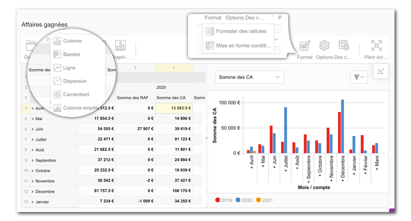
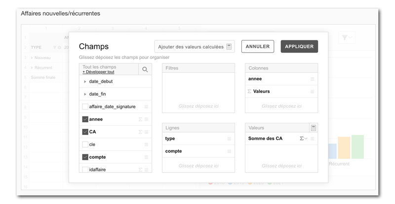

# Webreport

## Quickstart

Pour ajouter un WebReport dans GoPaaS vous devez créer un Dashboard ou utilisé un Dashboard existant.

1. Dans le Dashboard ajouter une **nouvelle ligne de Dashboard**.

2. Donner un Nom à cette nouvelle ligne plus cliquer sur le bouton **« Appliquer »** pour sauvegarder la fiche sans la fermer.

3. Cocher la case **« Options avancées »** pour affiche l’onglet **« Html »** puis l’ouvrir.

4. Dans le menu outil, cliquer sur l’option **« Ajouter un WebReport »**.

5. Cette option permet d’insérer dans le champ **« Html »** le script pour appeler le composant WebReport.

6. Les paramètres du script insérés devront être modifiés pour appeler une source de données existante (**vue**).

7. Rechercher la ligne suivante **« `var viewKey = "A_RENSEIGNER"` »** et remplacer la chaine **« A_RENSEIGNER »** par la **« cle »** de la vue avec la source de données souhaités. Par exemple **« var viewKey = "Par défaut Affaire" »**.

8. **Enregistrer** la ligne de dashboard et ouvrir le Dashboard pour afficher le WebReport avec la configuration par défaut.

9. Cliquer sur la **flèche diagonale** en haut à droite du pivot pour modifier le WebReport en ajoutant des champs dans les lignes, colonnes, filtres, et valeurs.

10. Configurer le WebReport selon les besoins puis cliquer sur le bouton **« Enr. »** pour afficher la nouvelle configuration du WebReport au **format JSON**.

11. Cette configuration devra être **copié** afin de l'insérer dans le champ Html de la ligne de dashboard.

12. Ouvrir la ligne de dashboard puis l’onglet Html.

13. **Coller** pour remplacer la nouvelle configuration au format JSON entre les balises de commentaires ==Début== et ==Fin==.

14. Cliquer sur le bouton **« Enregistrer »** pour sauvegarder dans la nouvelle configuration du WebReport.


> Dans le champ Html, il est possible de modifier la configuration du WebReport en ajoutant ou modifiant les propriétés des objets **slice**, **options**, **conditions** et **formats**.

## Pivot

WebReport propose de nombreuses opérations directement sur le pivot :

- **Afficher** plusieurs champs par ligne, colonne et appliquer les filtres dont vous avez besoin.

- **Faites glisser les champs** entre les colonnes, les lignes et les filtres de rapport.

- Quand il a plus d’un champ dans une ligne ou colonne, **développer ou réduire** la liste des valeurs en cliquant sur l'icône sur la gauche de la cellule.

- **Drill up & down** multi-niveau des champs en cliquant sur l’icône à droite de la cellule.

- **Filtrez les valeurs** en cliquant sur le nom du champ.

- Affichez ou masquez les **totaux et les totaux généraux** sur le pivot.

- **Trier les valeurs** en utilisant les contrôles à droite de chaque nom de champ ou le total des cellules.

- Double-cliquer pour **afficher le détail** d’une cellule avec des données non agrégées.

- **Redimensionnez les colonnes et les lignes** en faisant glisser les limites de l'en-tête; double-cliquez sur les en-têtes de ligne ou colonne pour définir la taille par défaut.

- **Sélectionnez les cellules** du pivot, **copiez le contenu** et collez-le directement dans une feuille de calcul; par exemple - Excel.

- Utilisez la barre d'outils pour sélectionner entre **les vues compact, classique et plat**.




## Liste des champs

La liste des champs peut être utilisé pour **définir les données présentes** sur le pivot ou dans les graphiques. Cet outil peut être accessible en cliquant sur la flèche diagonale dans la partie supérieure droite du pivot ou de la barre d'outils.

Sur le côté gauche de la liste des champs, vous trouverez toutes les champs de la source de données d'origine. Lorsque la liste des champs contient plus de 50 éléments, une **barre de recherche** apparaît pour vous aider à trouver des éléments. Si la source de données contient des regroupements avec plus d'un niveau, le menu **« Tout développer »** est ajouté au sommet de la gauche partie de la liste des champs.

**Faites glisser et déposez les champs** de la partie gauche de la liste des champs vers les zones Lignes, Colonnes, Valeurs ou Filtres de rapport. Chaque zone peut avoir autant de champs que vous le souhaitez. L'ordre des champs à l'intérieur de la zone peut également être modifié par glisser - déposer. Il est également possible d'inclure n'importe quel niveau d'un champ, ainsi que tous ses sous-niveaux, dans les lignes ou les colonnes.

Les valeurs sont généralement placées dans des colonnes mais peuvent également être déplacées vers des lignes. Chaque **valeur nécessite une fonction agrégée**. Selon le type de source de données, les valeurs numériques prennent en charge entre 7 et 13 fonctions d'agrégation différentes. Les champs texte peuvent également être sélectionnées pour les valeurs, mais les seules fonctions d'agrégation disponibles seront Nombre et Nombre distinct. Par défaut, les champs numériques sont agrégés à l'aide de la somme et les champs texte utilisent le nombre. Vous pouvez **modifier la fonction d'agrégation** en appuyant sur l'icône sigma et en choisissant une nouvelle.

Choisissez « Ajouter une valeur calculée » en haut de la liste des champs pour ajouter un champ calculé.



## Champs calculés

WebReport fournit une **interface pour ajouter et modifier des champs calculés**. Cliquez sur « Ajouter champ calculé » dans la liste des champs et une fenêtre pour ajouter un nouveau champ s'affiche. Si nécessaire, entrez le nom de la valeur, puis composez la formule en cliquant sur les opérateurs et en faisant glisser les valeurs existantes dans la zone "formule". Cochez la case " Calculer les valeurs individuelles " pour calculer la formule à l'aide de valeurs brutes. Cliquez sur Appliquer et le nouveau champ sera ajouté à la liste des champs. Il sera déjà sélectionné dans la zone « Valeurs » et prêts à être affichés dans le pivot.  

Tous les champs calculés sont regroupés dans une section « Valeurs calculées ». **Modifiez le champ calculé** en cliquant sur l'icône « modification » à côté du nom du champ. La fenêtre pour l'édition du champ apparaît. Modifiez la formule, mettez à jour le nom si nécessaire et cliquez sur le bouton APPLIQUER pour enregistrer les modifications. Supprimez la valeur calculée en cliquant sur l'icône de la corbeille en haut de la fenêtre d'édition.

## Filtres
Chaque champ sur le pivot a une icône de filtre sur la droite. Il donne accès aux filtres avec du champ sélectionné. Le filtre peut être accessible par menu contextuel.

Dans la fenêtre, on peut trier par **ordre alphabétique ou par ordre inverse alphabétique** toutes les valeurs avec les boutons AZ et ZA.

Dans la liste déroulante des filtres, le premier filtre est « Top ». Il effectue un **filtrage par des valeurs** où seulement N premiers (ou inférieurs) éléments sont affichés sur le pivot. D’autres filtres standards sont disponibles dans cette liste déroulante.  La case à cocher **« Tout sélectionner »** permet de sélectionner ou de désélectionner toutes les valeurs. Les valeurs peuvent également être sélectionnées ou désélectionnées manuellement. Une barre de recherche permet de rechercher des valeurs par leur nom lorsqu'il y en a beaucoup. Après les modifications, appuyez sur le bouton APPLIQUER pour voir les modifications sur le pivot.

## Tri
Une **ligne ou une colonne** spécifique sur le pivot peut être triée à l'aide de la flèche de tri.  Ces flèches sont disponibles à droite de chaque champ ou valeur. Cliquez pour la première fois pour trier par ordre décroissant, puis une deuxième fois pour trier par ordre croissant. En outre, ces options sont accessibles dans le menu contextuel de chaque champ ou valeur. Retirez le tri par le menu contextuel.

## Drill-down
Double cliquez pour **afficher le détail non agrégé des données de la cellule ou de l’élément**. Une fenêtre s’ouvrira avec la liste des enregistrements à partir de laquelle la valeur est composée. En haut de cette fenêtre, il y a un résumé du croisement de la valeur : nom de colonne, nom de ligne nom et la valeur elle-même.  

La liste de tous les champs est également disponible depuis cette fenêtre. Utilisez la flèche pour **l'ajout ou la suppression des champs dans la vue détail** sans changer les champs du pivot. Une autre façon d'ouvrir le détail est d’utiliser le menu contextuel sur l’élément.

## Graphique
Les graphiques pivot offrent les mêmes fonctionnalités d'analyse que le pivot :

- Dans le coin supérieur gauche, choisissez la **valeur active** dans la liste déroulante. Si l'option « Valeurs multiples » est sélectionné (Bouton Graphique), la liste déroulante permettra de sélectionner plusieurs valeurs.   

- **Filtres** pour les champs sélectionnées. 

- Cliquez deux fois sur les éléments du graphique pour afficher le détail et visualiser les premières données.  

- Utilisez la barre d'outils pour basculer facilement entre les différents types de graphiques. 

- S'il y a plusieurs champs dans les lignes, **dépliez ou réduire** les valeurs en cliquant sur le signe plus à gauche du nom du champ sur l'axe x. Pour plusieurs champs dans les colonnes, utilisez le signe plus sur la légende.  

## Barre d'outils

La barre d'outils permet de personnaliser le pivot et le graphique pivot. La barre d'outils utilise des appels d'API les plus couramment utilisés à travers des formulaires :

- Le bouton **Enregistrer** enregistre le pivot avec ses configurations dans un format JSON.

- Utilisez le bouton **Exporter** pour imprimer le contenu ou l’exporter au format HTML, CSV, Excel, Image et PDF.

- Le bouton **Tableau** bascule la vue en mode pivot.

- Le bouton **Graphiques** affiche tous les types de graphiques pivot et possède une case à cocher « Valeurs multiples » pour permettre la sélection de plusieurs valeurs pour les graphiques.

- Le bouton **Format** propose deux options : Formater les cellules pour la mise en forme numérique et la mise en forme conditionnelle.

- Cliquez sur **Options** pour afficher la fenêtre contextuelle avec des options de mise en page telles que les totaux généraux et les sous-totaux. Utilisez la mise en page section pour basculer entre les vues compact, classique et plat.

- Le bouton **Champs** ouvre la liste des champs.

- Cliquez sur **Plein écran** et passez en mode plein écran. Quittez ce mode en cliquant sur Échap.

## Mise en forme

La mise en forme des nombres peut être appliquée via la fenêtre contextuelle **Formater les cellules**. Pour ouvrir cette fenêtre contextuelle, cliquez sur **Format** dans la barre d'outils et choisissez **Format des cellules**. Sélectionnez dans la liste déroulante la valeur à laquelle le format doit être appliqué. Ensuite, vous pouvez modifier une des propriétés suivantes : texte d’alignement, séparateurs des milliers, séparateur décimal, symbole monétaire, le format en pourcentage.

La fenêtre contextuelle de **mise en forme conditionnelle** peut être ouverte en cliquant sur **Format** dans la barre d'outils et en choisissant **Mise en forme conditionnelle**.

Dans la fenêtre contextuelle,

- cliquez sur l’icône plus pour ajouter une nouvelle condition. Vous pouvez appliquer la condition soit à « toutes les valeurs » ou à une valeur spécifique de la liste déroulante. 

- Sélectionnez le type et la valeur de la condition, la famille de polices et la taille. 

- Cliquez sur l’icône de lettre A pour remplacer la police et les couleurs d’arrière-plan par défaut. Choisissez les nouvelles couleurs dans le sélecteur de couleurs ou entrez les codes hexadécimaux. 

- Cliquez sur « Appliquer » pour ajouter ces couleurs à la condition. Découvrez le résultat à l’intérieur de la zone à droite. Pour voir le résultat sur le pivot, cliquez sur le bouton **APPLIQUER**. 

- Supprimez la condition en cliquant sur l'icône de la corbeille à droite de la condition.

## Slice

Slice est la définition de la source de données qui sera affiché dans le pivot. Cet objet a les propriétés suivantes :

- `columns` – Array of objects. Liste des champs sélectionné dans le Pivot pour les. Chaque objet peut avoir les propriétés suivantes :

  - `uniqueName` – String. Nom de champ unique.

  - `caption` (optional) – String. Intitulé du champ.

  - `dimensionName` (optional) – String. Nom de la dimension.

  - `filter` (optional) – Filter Object. Contient les informations de filtres.

  - `levelName` (optional) – String. Permet de spécifier le niveau de la hiérarchie qui s'affiche sur le pivot.

  - `sort` (optional) – String. Tri sur le champ ("asc", "desc" ou "unsorted").

  - `sortOrder` (optional) – Array. Permet de définir un tri personnalisé pour les valeurs du champ. Vous pouvez spécifier sortOrder de la manière suivante : `["Janvier", "Février", "Mars", etc.]`.

- `drills` (optional) – Object. Contient les informations sur le détail des valeurs :

  - `drillAll` (optional) – Boolean. Permet de définir si tous les niveaux seront explorés

- `drillThrough` (optional) – Array. Permet de définir la liste des champs à afficher dans la fenêtre "Détails" pour l'exportation des données. Exemple: `["Compte", "Ville", "CA", etc.]`

- `expands` (optional) – Object. Informations sur les nœuds dépliés :

  - `expandAll` (optional) – Boolean. Permet d’indiquer si tout doit être condensé (false) ou déplié (true) sur le pivot et le graphique.

  - `columns` (optional) – Array of objects. Permet de sauvegarder les colonnes à déplier par défaut.

  - `rows` – Array of objects. Permet de sauvegarder les lignes à déplier par défaut.

- `flatSort` – Array of objects. Contient la liste des objets définissant le tri multi-colonnes sur le tableau. Chaque objet a les propriétés suivantes :

  - `uniqueName` – String. Le nom de champ unique qui sera trié.

  - `sort` – String. Type de tri ("asc", "desc", ou "undefined").

- `measures` – Array of objects. Liste des valeurs sélectionnées et ceux qui ont des propriétés différentes de celles par défaut. Chaque objet a les propriétés suivantes :

  - `uniqueName` – String. Nom unique de la valeur.

  - `active` (optional) – Boolean. Valeur sélectionnée par défaut (true ou false).

  - `aggregation` (optional) — String. Nom unique d'agrégation qui sera donné à la valeur ("sum", "count", "distinctcount", "average", "median", "product", "min", "max", "percent", "percentofcolumn", "percentofrow", "percentofparentrowtotal", "percentofparentcolumntotal", "index", "difference", "%difference", "runningtotals", "stdevp", "stdevs"). Si c’est un champ calculé, cette option sera à "none".

  - `caption` (optional) – String. Intitulé de la valeur.

  - `formula` (optional) – String. Formule contenant les opérations suivantes : +, -, *, / ; les autres valeurs peuvent être utilisées avec les fonctions d'agrégations, par exemple sum("Prix") ou max("Ordre").

  - `individual` (optional) – Boolean. Définit si la formule est calculée à l'aide de valeurs brutes (true) ou utilise des valeurs agrégées (false). Valeur par défaut : false.

  - `calculateNaN` (optional) – Boolean. Définit si la formule est calculée à l'aide des valeurs NaN (true) ou utilise la valeur NULL (false). Valeur par défaut : true.

  - `format` (optional) – String. Nom de formatage des nombres.

  - `grandTotalCaption` (optional) – String. Intitulé du total général.

- `flatOrder` – Array of strings. Définit l’ordre des champs pour le type de tableau "plat". `flatOrder` peut-être spécifié comme ceci : `["Nom champ 1", "Nom champ 2", etc… ]`.

- `reportFilters` – Array of objects. Liste des champs sélectionnés dans le slice pour filtrer le pivot. Chaque objet a des propriétés similaires aux `columns`.

  - `uniqueName` – String. Nom de champ unique.

  - `caption` (optional) – String. Intitulé du champ.

  - `dimensionName` (optional) – String. Nom de la dimension.

  - `filter` (optional) – Filter Object. Contient les informations du filtre.

  - `levelName` (optional) – String. Utilisé pour spécifier le niveau de la hiérarchie affichée sur le tableau.

  - `sort` (optional) – String. Type de tri `("asc", "desc" ou "unsorted")`.

  - `sortOrder` (optional) – Array. Permet de définir un tri personnalisé pour les valeurs du champ. Vous pouvez spécifier sortOrder de la manière suivante : `["champ_1", "champ_2", etc...]`.

- `rows` – Array of objects. A list of hierarchies selected in the report slice for rows. Each object can have the following properties:

  - `uniqueName` – String. Nom de champ unique.

  - `caption` (optional) – String. Intitulé du champ.

  - `dimensionName` (optional) – String. Nom de la dimension.

  - `filter` (optional) – Filter Object. Contient les informations du filtre.

  - `levelName` (optional) – String. Utilisé pour spécifier le niveau de la hiérarchie affichée sur le tableau.

  - `sort` (optional) – String. Type de tri `("asc", "desc" or "unsorted")`.

  - `sortOrder` (optional) – Array. Permet de définir un tri personnalisé pour les valeurs du champ. Vous pouvez spécifier sortOrder de la manière suivante : `["champ_1", "champ_2", etc...]`.
 
- `sorting` (optional) – Object. Définit le tri des nombres dans une ligne ou colonne spécifique du pivot.
 
- `column` – Object. Définit le tri des nombres dans une colonne spécifique.

  - `tuple` – Array. Se compose de noms uniques qui identifient la colonne du tableau en fonction des données qu'elle contient.

  - `measure` – Object. Identifie la valeur sur laquelle le tri sera appliqué.

    - `uniqueName` – String. Nom de mesure unique.

    - `aggregation` (optional) – String. Type d’agrégation de la valeur.

  - `type` – String. Type de tri ("asc" ou "desc").
 
- `row` – Object. Définit le tri des nombres dans une colonne spécifique.
  
  - `tuple` – Array. Se compose de noms uniques qui identifient la colonne du tableau en fonction des données qu'elle contient.
  
  - `measure` – Object. Object. Identifie la valeur sur laquelle le tri sera appliqué.
  
    - `uniqueName` – String. Nom de mesure unique.
  
    - `aggregation` (optional) – String. Type d’agrégation de la valeur.
  
  - `type` – String. Type de tri ("asc" ou "desc").

> Changer le slice en utilisant l’API `runQuery()` et `setReport()`. Récupérer le slice d’un autre en utilisant `getReport()`.

## Options

Un **WebReport** peut être personnalisé à l'aide de l'objet `options`. Cet objet est utilisé pour définir l'apparence selon les besoins de l'utilisateur. Par exemple, vous pouvez afficher ou masquer les fonctionnalités telles que les filtres ou les tris, définir le format des champs date, ou activer/désactiver le drill down.

L'objet `options` est défini dans l'objet Report. Si aucune option n'est spécifiée, le **WebReport** utilisera les options par défaut. Nous allons voir ici toutes les options disponibles et comment les utiliser.

Toutes les options sont définies dans 3 sous-groupes :

- **Grid** – définit l'apparence du pivot et les fonctionnalités.

- **Chart** – définit l'apparence du graphique pivot et les fonctionnalités.

- **General** – définit les options applicables à tous les composants.

### Grid
Toutes les options **« Grid »** sont dans la section **« grid »** de l’objet **« options »**.

| Property                | Type     | Description                                                                                                                                                                    |
|-------------------------|----------|--------------------------------------------------------------------------------------------------------------------------------------------------------------------------------|
| `type`                  | String   | Type d’affichage du pivot : `"compact"`, `"classic"`, et `"flat"`. Valeur par défaut: `"compact"`.                                                                             |
| `title`                 | String   | Titre du pivot. Valeur par défaut: `""`.                                                                                                                                       |
| `showFilter`            | Boolean  | Affiche les filtres des lignes/colonnes et les filtres du pivot : `(true)` ou `(false)`. Valeur par défaut: `true`.                                                            |
| `showHeaders`           | Boolean  | Afficher les numéros de ligne/colonne : `(true)` ou `(false)`. Valeur par défaut: `true`.                                                                                      |
| `showTotals`            | String   | Indique où afficher les totaux : dans les lignes `("rows")`, dans les colonnes `("columns")`, dans les deux `("on")` ou aucun totaux `("off")`. Valeur par défaut: `"on"`.     |
| `showGrandTotals`       | String   | Indique où afficher les totaux généraux : dans les lignes `("rows")`, dans les colonnes `("columns")`, dans les deux `("on")` ou aucun totaux `("off")`. Valeur par défaut: `"on"`.|
| `grandTotalsPosition`   | String   | Indique la position des totaux généraux du pivot : en haut `("top")` ou en bas `("bottom")`. Disponible uniquement pour la vue « brute ». Valeur par défaut: `"top"`.         |
| `showHierarchies`       | Boolean  | Indique comment afficher les valeurs de champs pouvant être explorées sur le pivot : Avec un lien sur la droite `(true)` ou avec une icône sur la gauche `(false)`. Valeur par défaut: `true`.|
| `showHierarchyCaptions` | Boolean  | Afficher les légendes (true) sur le pivot ou non `(false)`. Valeur par défaut: `true`.                                                                                         |
| `drillthroughMaxRows`   | Number   | Définit le nombre maximal de lignes pour la fenêtre d’exploration des valeurs. Valeur par défaut: `1000`.                                                                     |
| `showReportFiltersArea` | Boolean  | Affiche les filtres du pivot `(true)` ou `(false)`. Valeur par défaut: `true`.                                                                                                 |
| `dragging`              | Boolean  | Autoriser le glisser-déposer des champs sur le pivot `(true)` ou `(false)`. Valeur par défaut: `true`.                                                                         |
| `showEmptyValues`       | Boolean  | Afficher les valeurs vides dans le pivot `(true)` ou non `(false)`. Valeur par défaut: `false`.                                                                                |

### Chart
Toutes les options **« chart »** sont dans la section **« chart »** de l’objet **« options »**.

| Property               | Type     | Description                                                                                                                                                                                                                                 |
|------------------------|----------|---------------------------------------------------------------------------------------------------------------------------------------------------------------------------------------------------------------------------------------------|
| `type`                 | String   | Type d’affichage du graphique pivot : `"column"`, `"bar_h"`, `"line"`, `"scatter"`, `"pie"`, `"stacked_column"`, et `"column_line"`. Valeur par défaut: `"column"`.                                                                        |
| `title`                | String   | Titre du graphique. Valeur par défaut: `""`.                                                                                                                                                                                               |
| `showFilter`           | Boolean  | Affiche les filtres des lignes/colonnes et les filtres du pivot : `(true)` ou `(false)`. Valeur par défaut: `true`.                                                                                                                        |
| `multipleMeasures`     | Boolean  | Affiche plusieurs valeurs sur le graphique. Valeur par défaut: `false`.                                                                                                                                                                    |
| `oneLevel`             | Boolean  | Dans les graphiques que l’on peut explorer, défini si le graphique affiche tous les nœuds sur l'axe des x et la légende `(false)` ou uniquement le nœud développé le plus bas sur l'axe des x et la légende `(true)`. Valeur par défaut: `false`. |
| `autoRange`            | Boolean  | Indique si la plage de valeurs dans les graphiques est sélectionnée automatiquement ou non. Valeur par défaut: `false`.                                                                                                                    |
| `reversedAxes`         | Boolean  | Inverse les colonnes et les lignes. Valeur par défaut: `false`.                                                                                                                                                                            |
| `showLegend`           | Boolean  | Afficher les légendes `(true)` sur le graphique ou non `(false)`. Valeur par défaut: `true`.                                                                                                                                               |
| `showLegendButton`     | Boolean  | Indique si le bouton pour afficher/masquer la légende des graphiques est visible. Lorsqu'elle est définie sur `false`, la légende est visible, sans bouton pour la masquer. Valeur par défaut: `false`.                                   |
| `showDataLabels`       | Boolean  | Permet d’afficher les étiquettes. Si la valeur `false`, les étiquettes seront masquées. `showAllLabels` permet de configurer les étiquettes dans les graphiques de type Secteur. Valeur par défaut: `false`.                               |
| `showAllLabels`        | Boolean  | Permet d’afficher toutes les étiquettes dans les graphiques de type secteur si la valeur est à `true`. Si la valeur est à `false` alors seules les étiquettes pouvant être affichées sans se chevaucher seront affichées. Valeur par défaut: `false`.|
| `showMeasures`         | Boolean  | Permet d’afficher les listes déroulantes en haut des graphiques `(false)`. Valeur par défaut: `true`.                                                                                                                                      |
| `showOneMeasureSelection` | Boolean  | Permet d’afficher la liste déroulante des valeurs `(true)` ou `(false)` la liste déroulante des valeurs sur les graphiques sera masquée s'il n'y a qu'une seule valeur dans la liste et visible s'il y a deux valeurs ou plus. Valeur par défaut: `true`.|
| `showWarning`          | Boolean  | Indique une alerte Indique si les données sont trop volumineuses pour les graphiques. Valeur par défaut: `true`.                                                                                                                           |
| `position`             | String   | Indique la position du graphique par rapport au pivot : `"bottom"`, `"top"`, `"left"`, ou `"right"`. Valeur par défaut: `"bottom"`.                                                                                                        |
| `activeMeasure`        | Object   | Liste des valeurs sélectionnées dans le graphique.                                                                                                                                                                                          |
| `activeMeasure.uniqueName` | String   | Nom de la valeur unique.                                                                                                                                                                                                                   |
| `activeMeasure.aggregation` | String   | Type d’agrégation pour les valeurs.                                                                                                                                                                                                         |
| `axisShortNumberFormat`| Boolean  | Indique si les étiquettes des axes sur les graphiques sont affichées en utilisant un format numérique court comme 10K, 10M, 10B, 10T `(true)` ou non `(false)`. Valeur par défaut: `undefined` (affiche le format court si valeur max > 10M).|

### General
Toutes les options **« general »** sont dans l’objet **« options »**.

| Property                  | Type     | Description                                                                                                                                                                                                                                                       |
|---------------------------|----------|-------------------------------------------------------------------------------------------------------------------------------------------------------------------------------------------------------------------------------------------------------------------|
| `viewType`                | String   | Type de vue à afficher : `"grid"`, `"charts"` ou `"grid_charts"`. Valeur par défaut: `"grid"`.                                                                                                                                                                   |
| `filter`                  | Object   | Filtres :                                                                                                                                                                                                                                                         |
| `filter.timezoneOffset`   | Number   | La différence en minute entre UTC et l’heure locale de l’utilisateur, utilisé pour ajuster les dates dans le filtre. Valeur par défaut: the user’s local time.                                                                                                   |
| `filter.weekOffset`       | Number   | Définit le nombre de jours à ajouter au début de la semaine (dimanche). Utilisé pour ajuster le premier jour de la semaine dans le calendrier du filtre. Valeur par défaut: `1` (Lundi est le premier jour de la semaine).                                       |
| `filter.dateFormat`       | String   | Modèle de date à utiliser pour formater les dates des filtres. Deux valeurs possibles : `"dd/MM/yyyy"` et `"MM/dd/yyyy"`. Valeur par défaut: `"dd/MM/yyyy"`.                                                                                                     |
| `filter.liveSearch`       | Boolean  | Indique si la recherche est effectuée pendant que l'utilisateur tape (true) ou en cliquant sur le bouton Entrée (false). Valeur par défaut: `true`.                                                                                                               |
| `configuratorActive`      | Boolean  | Indique si la liste des champs est ouverte (true) ou fermée (false). Valeur par défaut: `false`.                                                                                                                                                                 |
| `configuratorButton`      | Boolean  | Affiche le bouton de configuration de la liste des champs. (true) ou (false). Valeur par défaut: `true`.                                                                                                                                                         |
| `showAggregations`        | Boolean  | Affiche la sélection d’agrégation (true) ou non (false) pour les valeurs dans la liste de champs. Valeur par défaut: `true`.                                                                                                                                      |
| `showCalculatedValuesButton` | Boolean  | Afficher le bouton « Ajouter champs calculés » (true) ou non (false). Valeur par défaut: `true`.                                                                                                                                                                 |
| `grouping`                | Boolean  | Indique si le regroupement est activé. Cette fonctionnalité permet aux utilisateurs de regrouper les éléments choisis à l'aide d'une fenêtre de filtre. Valeur par défaut: `false`.                                                                             |
| `editing`                 | Boolean  | Indique si la fonction d'édition est activée (true) ou désactivée (false) dans la fenêtre d’exploration des données « Détail ». Valeur par défaut: `false`.                                                                                                      |
| `drillThrough`            | Boolean  | Indique si la fonction d'exploration des données est activée (true) ou désactivée (false). Valeur par défaut: `true`.                                                                                                                                            |
| `showDrillThroughConfigurator` | Boolean  | Indique si le bouton Liste des champs est visible dans la vue « Détails ». Valeur par défaut: `true`.                                                                                                                                                           |
| `sorting`                 | String   | Indique si les contrôles de tri sont visibles. Valeur par défaut: `on`.                                                                                                                                                                                           |
| `defaultDateType`         | String   | Utilisé pour spécifier les types de données à appliquer aux champs de date par défaut. Valeur par défaut: `"date"`.                                                                                                                                              |
| `strictDataTypes`         | Boolean  | Permet d'augmenter la vitesse de traitement des données. Valeur par défaut: `false`.                                                                                                                                                                              |
| `datePattern`             | String   | Format des champs de type « date string ». Valeur par défaut: `"dd/MM/yyyy"`.                                                                                                                                                                                     |
| `dateTimePattern`         | String   | Format des champs de type « datetime ». Valeur par défaut: `"dd/MM/yyyy HH:mm:ss"`.                                                                                                                                                                               |
| `timePattern`             | String   | Format des champs de type « time ». Valeur par défaut: `"HH:mm:ss"`.                                                                                                                                                                                              |
| `dateTimezoneOffset`      | Number   | Permet de configurer les regroupements de date.                                                                                                                                                                                                                     |
| `showDefaultSlice`        | Boolean  | Définit une configuration du Slice par défaut. Valeur par défaut: `true`.                                                                                                                                                                                         |
| `showEmptyData`           | Boolean  | Définit le comportement en cas de source de données vide de deux manières : (true), un pivot vide s’affiche et déclenche un événement dataerror. (false), un message s’affiche «La source de données est vide» et déclenche un événement dataerror pour tous les types mentionnés de la source de données vide.Valeur par défaut: `true`. |
| `defaultHierarchySortName`	 | String	 | Tri par défaut des valeurs des champs ("asc", "desc", ou "unsorted"). Valeur par défaut:`asc`. |
| `showAggregationLabels`	 | Boolean	 | Affiche dans les titres des colonnes/lignes des agrégations "Somme des", "Somme de", etc.. Valeur par défaut: `true`. |
| `showAllFieldsDrillThrough`	 | Boolean | Affiche les colonnes pré-sélectionnées dans la vue « Détails » pour l’exploration des données (false) ou toutes les colonnes disponibles (true). Valeur par défaut: `false`. |
| `liveFiltering`	 | Boolean	 | Indique si le filtre dynamique pour les valeurs des champs est activé (true) ou désactivé (false). Valeur par défaut: `false`. |
| `showFieldListSearch`	 | Boolean	 | Indique si la barre de recherche dans la liste des champs est affichée (true) ou masquée (false). Valeur par défaut: `false`.
| `validateFormulas`	 | Boolean	 | Indique si la validation est effectuée pour les champs calculées (true) ou non (false). Si la validation est activée et que le pivot contient une formule non valide, le message d'alerte «Formule incorrect» s'affiche. Pour désactiver le message d'alerte, mettre à (false). Valeur par défaut: `true`. |
| `caseSensitiveMembers`	 | Boolean	 | Indique si les valeurs des champs sont sensibles à la casse (true) ou non (false). Valeur par défaut: `false`. |
| `validateReportFiles`	 | Boolean	 | Indique si la validation des fichiers de configuration est activée (true) ou désactivée (false).. Valeur par défaut: `true`. |
| `fieldListPosition`	 | String	 | Afficher la liste des champs toujours à droite ("right") ou dans une fenêtre distincte ("undefined"). Valeur par défaut: `undefined`. |
| `allowBrowsersCache`	 | Boolean	 | Permet aux navigateurs à mettre en cache les données (true) ou non (false). Valeur par défaut: `false`. |

_Exemple de l'ojet options défini par défaut dans un Webreport:_
```json
"options": {
        "viewType": "grid",
        "grid": {
            "type": "compact",
            "title": "",
            "showFilter": true,
            "showHeaders": true,
            "showTotals": "on",
            "showGrandTotals": "on",
            "grandTotalsPosition": "top",
            "showExtraTotalLabels": false,
            "showHierarchies": true,
            "showHierarchyCaptions": true,
            "drillthroughMaxRows": 1000,
            "showReportFiltersArea": true,
            "dragging": true,
            "showAutoCalculationBar": true,
            "showEmptyValues": false
        },
        "chart": {
            "type": "column",
            "title": "",
            "showFilter": true,
            "labelsHierarchy": "",
            "multipleMeasures": false,
            "oneLevel": false,
            "autoRange": false,
            "reversedAxes": false,
            "showLegend": true,
            "showLegendButton": false,
            "showDataLabels": false,
            "showAllLabels": false,
            "showMeasures": true,
            "showOneMeasureSelection": true,
            "showWarning": true,
            "activeMeasure": {}
        },
        "filter": {
            "weekOffset": 1,
            "dateFormat": "dd/MM/yyyy",
            "liveSearch": true
        },
        "configuratorActive": false,
        "configuratorButton": true,
        "showAggregations": true,
        "showCalculatedValuesButton": true,
        "grouping": false,
        "editing": false,
        "drillThrough": true,
        "showDrillThroughConfigurator": true,
        "sorting": "on",
        "defaultDateType": "date",
        "strictDataTypes": false,
        "datePattern": "dd/MM/yyyy",
        "dateTimePattern": "dd/MM/yyyy HH:mm:ss",
        "showDefaultSlice": true,
        "showEmptyData": true,
        "defaultHierarchySortName": "asc",
        "showAggregationLabels": true,
        "sortAlphabetically": [],
        "showAllFieldsDrillThrough": false,
        "liveFiltering": false,
        "showFieldListSearch": false,
        "validateFormulas": true,
        "caseSensitiveMembers": false,
        "validateReportFiles": true,
        "fieldListPosition": undefined,
        "allowBrowsersCache": false
    }
```