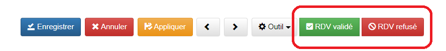
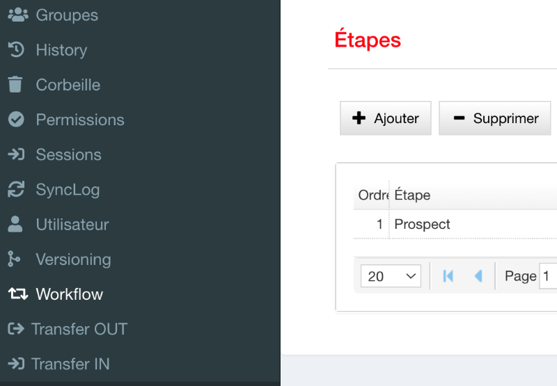
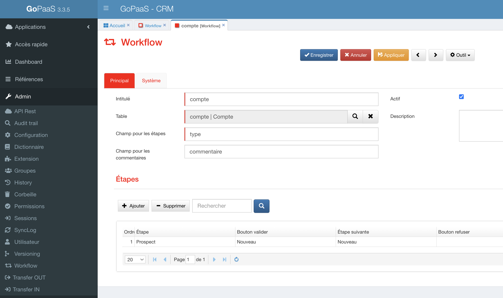

<!-- You have some errors, warnings, or alerts. If you are using reckless mode, turn it off to see inline alerts.
* ERRORs: 0
* WARNINGs: 0
* ALERTS: 1 -->


# Workflow

Le workflow permet de structurer et d'automatiser des tâches ou des processus, améliorant ainsi l'efficacité et la cohérence des opérations. Il facilite également la coordination entre les personnes impliquées dans ces processus en définissant clairement les étapes à suivre





### Prérequis

Pour pouvoir utiliser un workflow sur une table, il y a deux paramètres à prendre en compte.


* Il est impératif de définir un champ "Étape" pour superviser les diverses phases du workflow. Ce champ doit être obligatoire et configuré exclusivement en format liste en mode lecture seule.
* Il serait pertinent de spécifier un champ "Commentaires workflow" de type "mémo", avec un accès en lecture seule, pour enregistrer les commentaires en cas de rejet. Ce champ reste facultatif.


## Ajouter un workflow

Pour créer un nouveau workflow, rendez vous dans la barre de navigation > Admin > Workflow.



Cliquer sur `ajouter`.

Ci-dessous, la description des champs de l’onglet principal.


| Champ                      | Description                                   |
|----------------------------|-----------------------------------------------|
| Intitulé                   | Nom du workflow                               |
| Table                      | Table concernée                               |
| Champ pour les étapes      | Intitulé du champ "Étape" à utiliser</br>  Exemple : Statut       |                          |
| Champ pour les commentaires| Intitulé du champ "Commentaire" dans la table |
| Actif                      | Rendre actif ou non le workflow               |
| Description                | Description détaillée du workflow             |


Une fois renseigné, cliquer sur `appliquer` pour continuer.


## Définir les étapes du workflow

Dans la section étape, cliquer sur ajouter pour créer une nouvelle étape de workflow.



Ci-dessous, la description des champs de l’onglet principal.


| Champ                     | Description                                                                                   |
|---------------------------|-----------------------------------------------------------------------------------------------|
| Workflow                  | Nom du workflow associé                                                                      |
| Ordre                     | Ordre des étapes du workflow                                                                 |
| Etape                     | Valeur du champ "Etape" à laquelle les options du workflow doivent être visibles  </br>           Exemple: "Nouveau"                                                                                 |
| Champs obligatoires       | Liste des champs obligatoires pour valider le passage à l’étape suivante </br>  Ex: </br> `[{ "name": "contact_rdv" },` </br> `{ "name":"date_rdv"},` </br> `{ "name": "heure_rdv" }]`                                                                   |
| Nom du bouton             | Intitulé du bouton.                                                                          |
| Etape déclencheur         | Valeur du champ "Étape", sur laquelle notre automatisme se déclenche</br>                        Exemple : Validation du rdv                                                                        |
| Etape suivante à renseigner| Valeur du champ "Étape" après exécution de notre automatisme.Exemple : RDV validé                                   |                                                               


* Renseigner les champs suivants pour le bouton de "Refus" (optionnel) :

| Champ                   | Description                                                                         |
|-------------------------|-------------------------------------------------------------------------------------|
| Workflow                | Nom du workflow associé                                                            |
| Ordre                   | Ordre des étapes du workflow                                                       |
| Etape                   | Valeur du champ "Etape" à laquelle le bouton doit apparaître</br>                     Exemple: "Nouveau"                                                                       |
| Nom du bouton           | Intitulé du bouton                                                                 |
| Etape déclencheur       | Valeur du champ "Étape", sur laquelle notre automatisme se déclenche </br>             Exemple : Refus du RDV                                                              |
| Étape refus à renseigner| Valeur du champ "Étape" après exécution de notre automatisme </br> Exemple : RDV refusé                                                                |


Une fois renseigné, cliquer sur `appliquer` pour continuer et enregistrer l’étape de workflow.

Répéter l’opération pour ajouter d’autres étapes au workflow.


## Ajouter un automatisme

Afin de déclencher correctement le workflow il faut utiliser un automatisme spécifique pour chacune des étapes du processus.

Rendez-vous dans le menu paramétrage en haut à droite de l’écran > Automatisation puis cliquer sur ajouter pour créer un nouvel automatisme.


<table>
  <tr>
   <td colspan="2" >
<h4>Déclencheur</h4>


   </td>
  </tr>
  <tr>
   <td>Type
   </td>
   <td>Sélectionner “Enregistrement de fiche”
   </td>
  </tr>
  <tr>
   <td>Mode
   </td>
   <td>Sélectionner “Création et/ou modification” en fonction de la situation
   </td>
  </tr>
  <tr>
   <td>Table
   </td>
   <td>Sélectionner la table correspondante
   </td>
  </tr>
  <tr>
   <td colspan="2" >
<h4>Filtre</h4>


   </td>
  </tr>
  <tr>
   <td>Sélectionner le champ défini pour l’étape
   </td>
   <td>Égale à “Etape déclencheur” du workflow
   </td>
  </tr>
  <tr>
   <td colspan="2" >
<h4>Action</h4>


   </td>
  </tr>
  <tr>
   <td>Action 1
   </td>
   <td>Envoyer un email
   </td>
  </tr>
  <tr>
   <td>Action 2
   </td>
   <td>Mettre à jour la fiche avec “Étape suivante à renseigner” dans le champ défini pour l’étape.
   </td>
  </tr>
</table>


NB : Il est possible de cumuler plusieurs filtres et/ou plusieurs actions pour une seule automatisation.


## Rendre le workflow disponible

Il faut maintenant rendre le workflow disponible sur la fiche correspondante.

Rendez-vous sur la fiche où le workflow doit être visible puis > menu outil > Personnaliser > onglet Script JS.

Ajouter le code JS suivant pour initialiser le workflow

```js
gopaas.util.loadWorkflow(thisComponent, NOM_DE_LA_TABLE);
```


Remplacer “NOM_DE_LA_TABLE” par le nom de la table où le workflow doit être visible.

```js
Exemple : gopaas.util.loadWorkflow(thisComponent, contact);
```

Le champ utilisé comme “étape” est normalement en lecture seule, il est donc question de définir une valeur par défaut à la création d’une nouvelle fiche pour rendre visible la première étape du workflow.

Dans le Javascript de la fiche, ajouter le code suivant

```js
if (thisComponent.isNew()){
	thisComponent.setValue('etape', 'Nouveau');
}
```

Remplacer "étape" par le nom du champ utilisé et ‘Nouveau’ par la valeur de la première étape du workflow.
