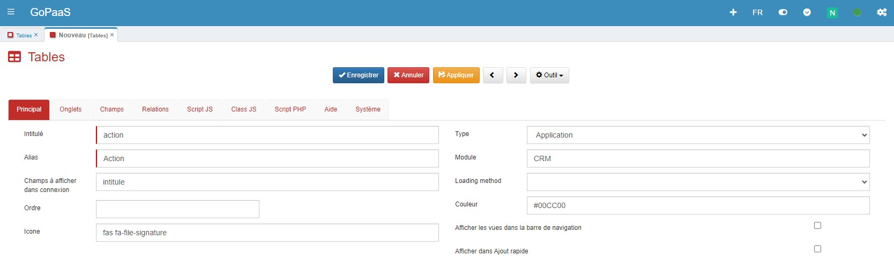

# Action

## Création de la table te

Dans le menu personnalisation :
- Cliquer sur le menu `Tables` pour afficher la vue avec la liste de toutes les tables.
- Cliquer ensuite sur le bouton `Ajouter`.

Renseigner les champs suivant:

| Champ    | Valeur                               |
|----------|--------------------------------------|
| Intitulé | Le nom de la table en base de données |
| Alias    | Le nom de la table dans l'application |
| Champs à afficher dans connexion    | le nom du champ de la table qui sera visible dans le champ de connexion |
| Type    | Ex: **Application** |
| Module    | Ex: **CRM** |

* Assurez-vous que votre **groupe** a bien accès à ce **module** en vérifiant dans la **barre de navigation** >  > **Groupes**.

* Si vous faites partie du groupe **ADMIN**, ouvrez la fiche du groupe **ADMIN** pour ajouter par exemple le module **CRM**.

* Enregistrer la table **Compte**.

* Pour ouvrir la nouvelle table, il est nécessaire de vous déconnecter de GoPaaS et de vous reconnecter.

## FormDesigner

Le FormDesigner permet de créer des champs.

Dans le menu personnalisation :
- Cliquer sur le menu `Tables` pour afficher la vue avec la liste de toutes les tables.
- Rechercher la table **Action** et double cliquer sur la fiche pour l'ouvrir.