# Action

## Création de la table Action

Dans le menu personnalisation :
- Cliquer sur le menu `Tables` pour afficher la vue avec la liste de toutes les tables.
- Cliquer ensuite sur le bouton `Ajouter`.

    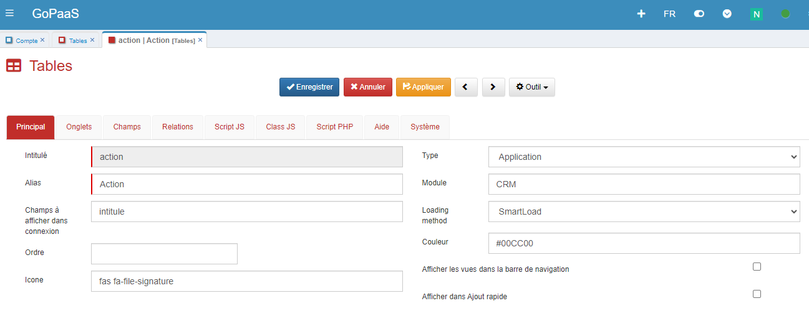

Renseigner les champs suivant:

| Champ    | Valeur                               |
|----------|--------------------------------------|
| Intitulé | Le nom de la table en base de données |
| Alias    | Le nom de la table dans l'application |
| Champs à afficher dans connexion    | Le nom du champ de la table action qui sera affiché dans les champs de connexion présents sur d'autre tables |
| Icone    | Icone [Font Awesome](https://fontawesome.com/) qui permet de personnaliser la table  |
| Type    | Ex: **Application** |
| Module    | Ex: **CRM** |

* S'assurer que le **groupe** a bien accès à ce **module** en vérifiant dans la **barre de navigation** >  > **Groupes**.

* Pour le groupe **ADMIN**, ouvrir la fiche du groupe **ADMIN** pour ajouter par exemple le module **CRM**.

    

* Enregistrer la table **Action**.

* Pour ouvrir la nouvelle table, il est nécessaire de se déconnecter de GoPaaS et de se reconnecter.

    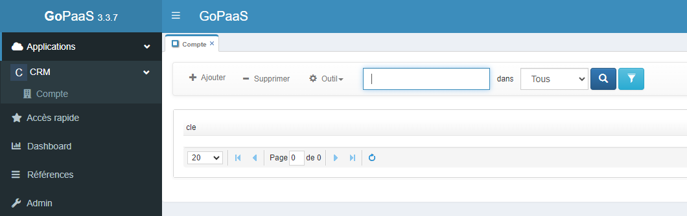

## FormDesigner

Le FormDesigner permet de créer facilement des champs personnalisés dans les formulaires en quelques clics.

Dans le menu personnalisation :
- Cliquer sur le menu `Tables` pour afficher la vue avec la liste de toutes les tables.
- Rechercher la table **Action** et double cliquer sur la fiche pour l'ouvrir.

    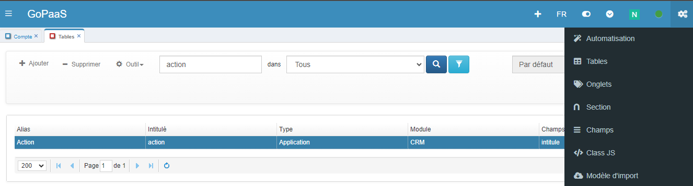

### Ouvrir le FormDesigner
- Cliquer sur le menu `Outil` de la fiche puis `FormDesigner`.
- Dans le menu qui apparaît cliquer sur **FormDesigner**.

    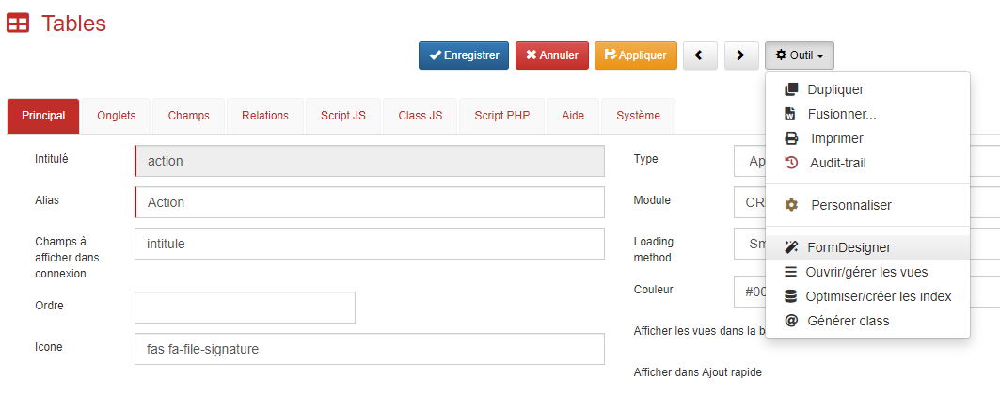

###  Création des champs

Nous avons dans une fiche dans GoPaaS, des onglets, des sections et des colonnes

- Les Onglets contiennent des sections.
- Les Sections contiennent 1 à 4 colonnes.
- Cliquer sur l'un des boutons 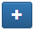 pour ajouter un nouveau champ dans une colonne.

    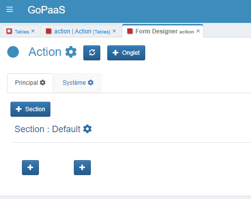

### Création des champs

#### Création d'un champ `intitule` (type *Texte*)

| Nom des champs | Valeur                          |
|----------------|-------------------------------|
| Type            | Texte           |
| Nom champ       | intitule |
| Alias/Nom table connectée   | intitule |
| Intitulé   | Intitulé |
| Largeur intitulé   | 3 |
| Obligatoire        | [x] |

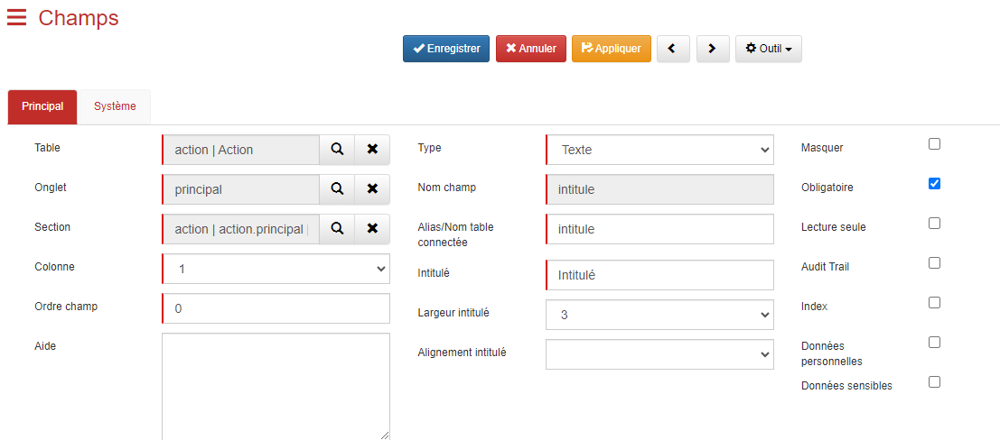

#### Création d'un champ `date` (type *Date*)

| Nom des champs | Valeur                          |
|----------------|-------------------------------|
| Type            | Date           |
| Nom champ       | date |
| Alias/Nom table connectée   | date |
| Intitulé   | Date |
| Largeur intitulé   | 3 |
| Obligatoire        | [x] |

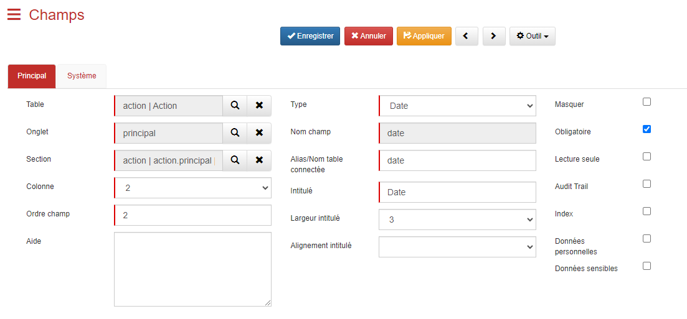

#### Création d'un champ `duree` (type *Nombre*)

| Nom des champs | Valeur                          |
|----------------|-------------------------------|
| Type            | Nombre           |
| Nom champ       | duree |
| Alias/Nom table connectée   | duree |
| Intitulé   | Durée |
| Largeur intitulé   | 3 |
| Nombre de décimales   | 0 |

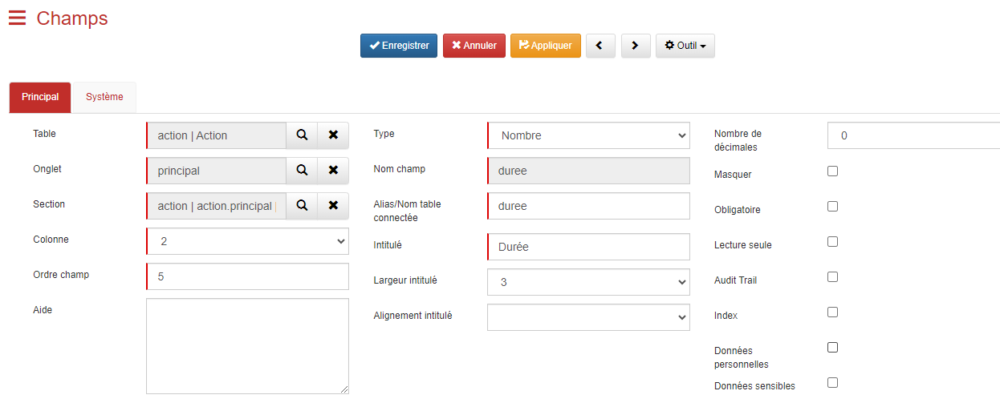

#### Création d'un champ `compte` (type *Connexion*)

| Nom des champs | Valeur                        |
|----------------|-------------------------------|
| Type            | Connexion           |
| Nom champ       | compte |
| Alias/Nom table connectée   | compte (table de connexion) |
| Intitulé   | Compte  |
| index      | [x] |

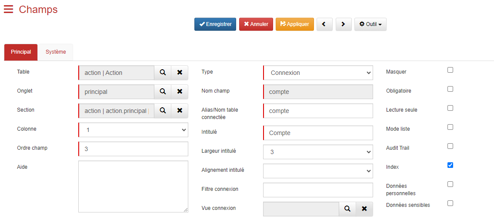

####  Liste des autres champs à créer

Voici un tableau avec les champs de la table `Action` à créer et leur types :

| Nom des champs | Type     |
|----------------|----------|
| Intitulé       | Texte `Obligatoire` |
| Nature         | Liste `Obligatoire` Valeur de la liste : - Commerciale - Administrative - Comptable - Juridique - Marketing |
| Type           | Liste Valeur de la liste : - Tâche - Appel - Email - Appel sortant - Appel entrant - Email sortant - Email entrant - RDV - Visio - SMS sortant - SMS entrant |
| Compte         | Connexion `Table compte` |
| Contact        | Connexion `Table contact` |
| Utilisateur    | Connexion `Table utilisateur` |
| Statut         | Liste Valeur de la liste : - Pas commencée - En cours - Terminée - Annulée |
| Date           | Date `Obligatoire` |
| Heure début    | Heure `Obligatoire` |
| Heure fin      | Heure |
| Durée          | Nombre |
| Affaire        | Connexion `Table affaire` |
| Devis          | Connexion `Table devis` |
| Facture        | Connexion `Table facture` |
| Note           | Memo |
| PJ             | Fichier |

### Options d'un champ

| Option        | Description|
|-------------------------|-------------------------------------------------------------------------------------------------------------------------------------------------|
| Aide                    | Ajouter une aide contextuelle pour l'utilisateur au survol du champ.                                                                                |
| Type                    | Choisir le type de champ parmi les options disponibles.                                                                                              |
| Nom champ               | Nom du champ dans la base de données.                                                                                                               |
| Alias/Nom table connectée | L'alias du champ doit être unique dans toute la table. Dans le cas où le champ créé serait de type connexion, il faut renseigner le nom de la table à connecter. |
| Intitulé                | Nom du champ tel qu'il apparaît dans l'application.                                                                                                      |
| Largeur intitulé        | Espacement entre le titre du champ et le champ lui-même, valeurs prédéfinies de 1 à 12.                                     |
| Alignement intitulé     | Positionnement de l'intitulé par rapport au champ.                                                                                             |
| Masquer                 | Option permettant de masquer le champ.                                                                                                         |
| Obligatoire             | Option permettant de rendre obligatoire le champ.                                                                                              |
| Lecture seule           | Option permettant de rendre le champ non modifiable par l'utilisateur.         |
| Audit Trail             | Suivre un historique sur les modifications apportées à ce champ.                                                                     |
| Index                   | Indexer le champ dans la base de données.                                                                                                  |
| Données personnelles    | Catégoriser le champ comme contenant des données personnelles (RGPD).                                                                                                |
| Données sensibles       | Catégoriser le champ comme contenant des données sensibles (RGPD).                                                                                                  |

### Actualisation du FormDesigner
- Cliquer sur le bouton  pour mettre à jour le `FormDesigner` et visualiser les modifications apportées.

    > *Astuce : Il est possible de **glisser-déposer** les champs pour réorganiser leur ordre sur le formulaire.*
    
    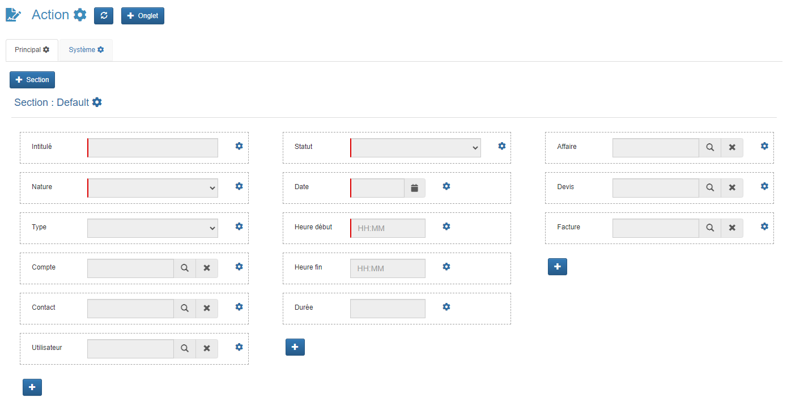

### Agencer la vue `Par défaut`

* Dans le menu **Application** > cliquer sur le sous-menu **CRM** > et cliquer sur **Action**

    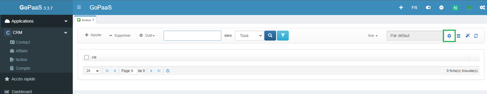

* Cliquer sur l'icône de modification  pour accéder aux paramètres de la vue pour pouvoir la personnaliser.
* Cliquer sur l'onglet `Champs` pour voir la liste des champs de la table **Action** dans la colonne de gauche.

    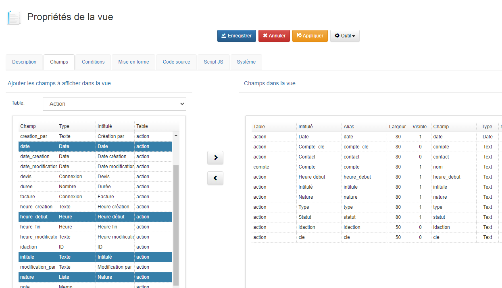
* Sélectionner les champs à afficher dans la vue.
  > *Astuce : Sélectionner plusieurs champs simultanément en maintenant la touche CTRL enfoncée.*
* Après avoir sélectionné les champs, cliquer sur la flèche 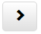 pour les ajouter.
* Cliquer sur le bouton **Enregistrer** pour appliquer les modifications.
* Pour voir les changements effectués, fermer la vue actuelle et la ré-ouvrir.

    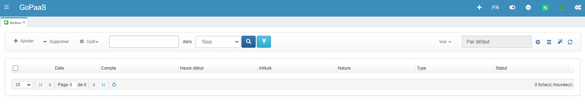

## Vue liée

### Création de la vue liée

Pour afficher les **Actions** liés au **Compte**, il faut créer une vue liée. Pour celà on peut utiliser une vue existante et la dupliquer.
- Ouvrir la vue "Par défaut" des **Actions**.
- Cliquer sur 

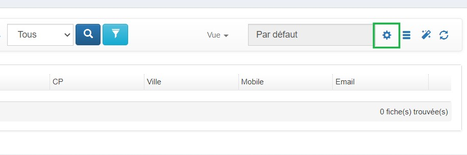.

* Dans le menu outil, cliquer sur **Dupliquer**.

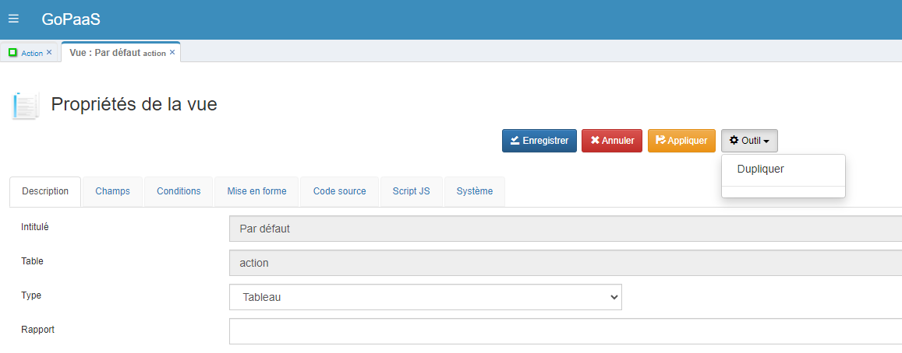

- Renommer la nouvelle vue avec la convention de nommage suivante:
  - Link pour indiquer que c'est une vue liée.
  - `Compte` est le nom de la table parent.
  - `Actions` est la table liée avec les fiches enfants).
  - Soit dans ce cas `LinkCompteActions`.

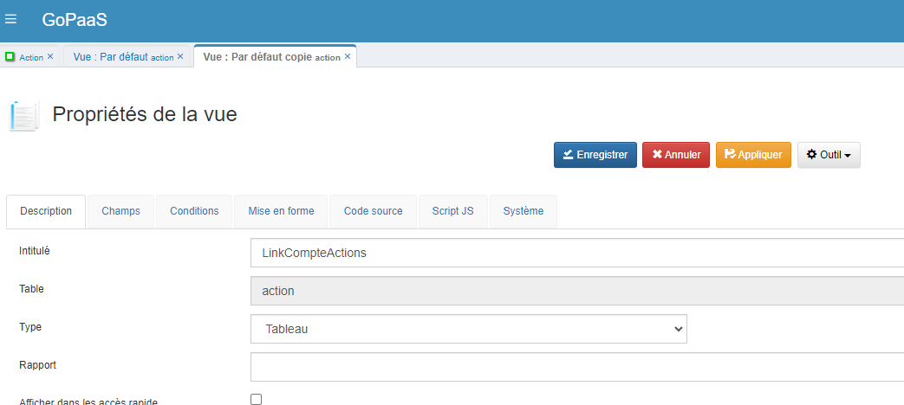

Pour afficher seulement les actions du compte, il faut créer une condition sur le champ de connexion `compte`.

- Cliquer sur l'onglet `Conditions`.
- Sélectionner le champ **compte** puis cliquer sur la flèche  pour ajouter le champ dans les conditions de la vue.

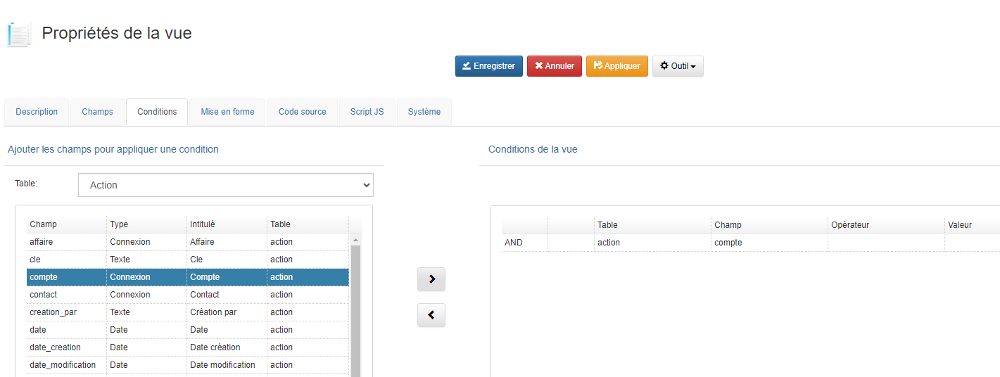

- Ouvrir la condition, puis renseigner le mot-clé **(-TrigItemName-)** et enregistrer la fiche.
  
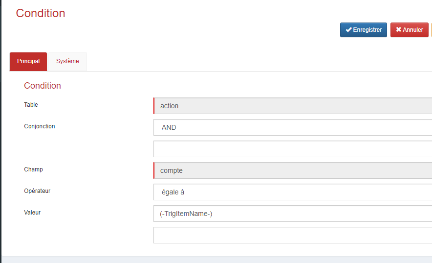

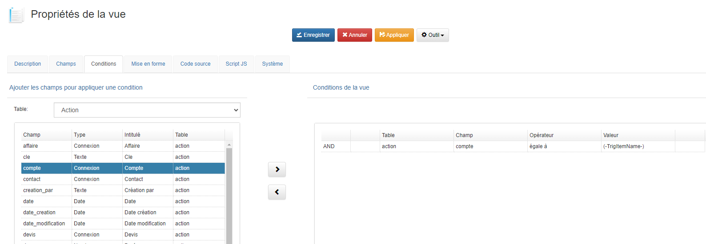

- Cliquer sur le bouton **Enregistrer** pour appliquer les modifications.
  
### Ajouter la vue liée linkCompteActions dans un onglet de la table **Compte**

Dans le menu personnalisation :
- Cliquer sur le menu `Tables` pour afficher la vue avec la liste de toutes les tables.
- Rechercher la table **Compte** et double cliquer sur la fiche pour l'ouvrir.

    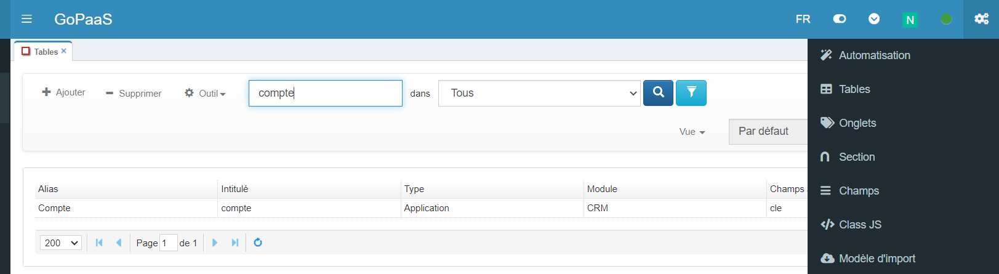

#### Ouvrir le FormDesigner
- Cliquer sur le menu `Outil` de la fiche puis `FormDesigner`.
- Dans le menu qui apparaît cliquer sur **FormDesigner**.

    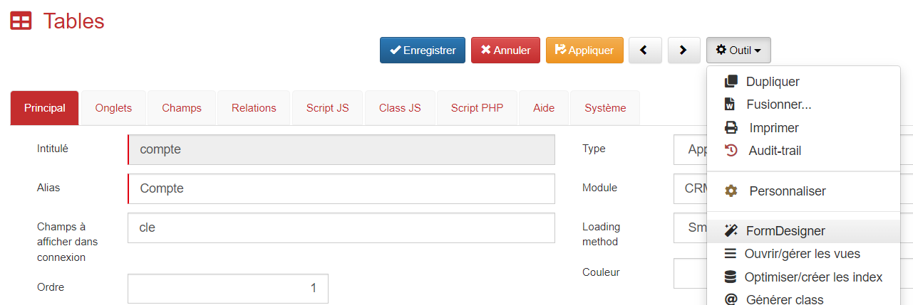

- Cliquer sur le bouton  pour ajouter un nouvel onglet.

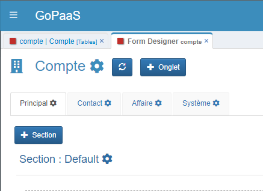

- Renseigner l'intitulé, le label et l'ordre du nouvel onglet.

| Nom des champs        | Description                        |
|------------------------|-----------------------------------------------|
| Intitulé | Action        |
| Label    | Action   |
| Ordre    | 4       |

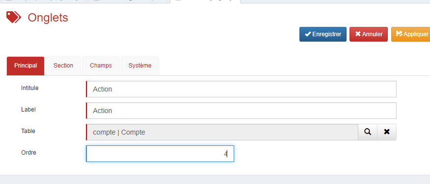

- Cliquer sur le bouton **Enregistrer** pour appliquer les modifications.
- Une fois la création de l'onglets terminée, cliquer sur le bouton  pour actualiser le FormDesigner et visualiser les modifications.

### Ajouter le champ de type **Vue**

- Cliquer sur le nouvel onglet  `Action`

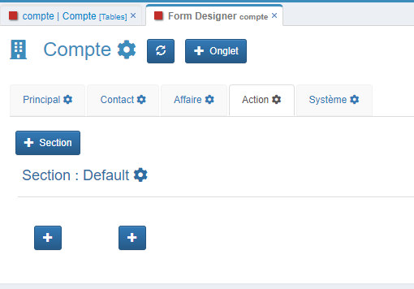

* Modifier la `Section : Default` avec le bouton 

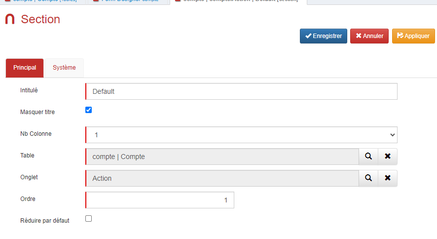

* Mettre NB colonne a `1`, Ordre à `1`.
* Cliquer sur le bouton Enregistrer pour appliquer les modifications.
- Cliquer sur le bouton  pour actualiser le FormDesigner et visualiser les modifications.

* Cliquer sur le bouton `+` pour ajouter un nouveau champ.

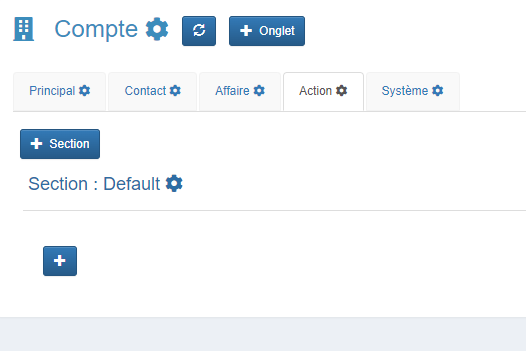

#### Configurer le Champ

| Nom des champs | Valeur                          |
|----------------|-------------------------------|
| Type            | Vue           |
| Nom de la table | contact (table à partir de laquelle vous souhaitez insérer la vue) |
| Nom champ   | nom de la vue que vous avez créée `LinkCompteContacts` |

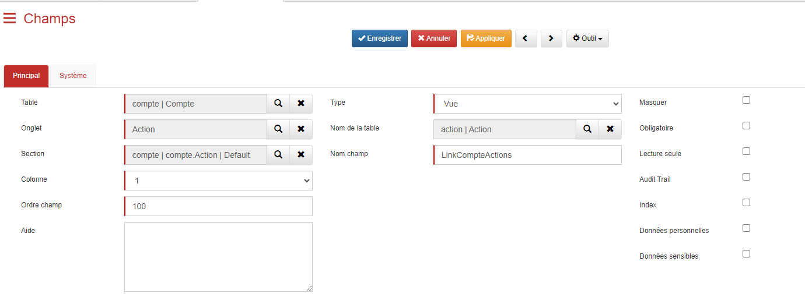

- Cliquer sur le bouton **Enregistrer** pour appliquer les modifications.

#### Actualiser le `FormDesigner`

* Cliquer sur le bouton  pour mettre à jour le `FormDesigner` et visualiser les modifications.

* Ouvrir la vue par défaut des comptes et ouvrir une fiche `compte` pour voir le résultat.

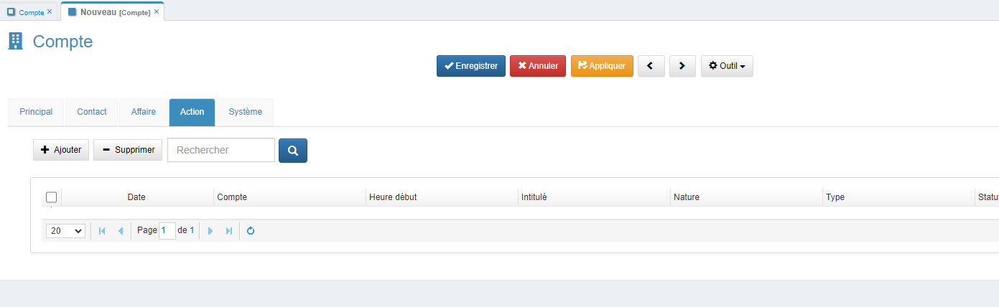