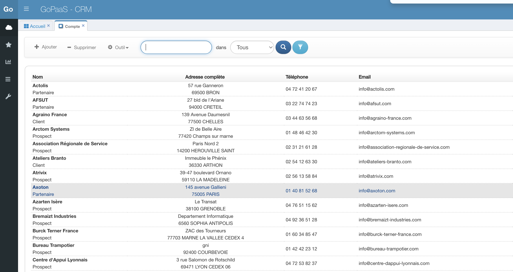
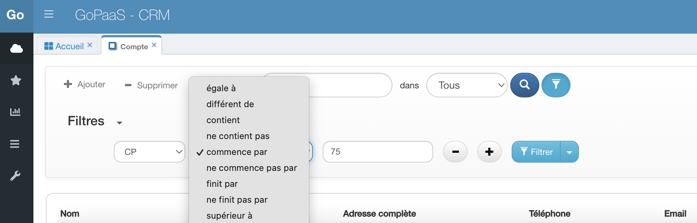
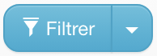

# Composants

## Les fiches

Quand vous saisissez des données dans une catégorie vous créez un nouvel enregistrement, ou ce que GoPaaS appelle une fiche. Par exemple, dans la table Contact figure la fiche Dupont, avec son nom, son adresse et un certain nombre d’informations le concernant.
## Les vues
Pour visualiser les données saisies dans la base, GoPaaS met à votre disposition un ensemble de vues entièrement personnalisables. Ces vues peuvent se présenter sous forme de tableau, liste, agenda, graphique ou encore widget. Elles sont créées à partir d’une seule table mais peuvent afficher des informations issues d’autres tables grâce aux connexions (voir ci-après). Elles peuvent être triées, filtrées et sauvegardées sous des noms différents. Les vues liées, enfin, permettent de regrouper plusieurs vues dans un onglet d’une fiche. C’est un moyen très puissant de visualiser rapidement un ensemble d’informations liées.
### Tableau

#### Les filtres avancés

Pour activer la fonction filtre avancé sur une vue, cliquez sur  puis sélectionnez la colonne sur laquelle effectuer la première condition, choisir l'opérateur et la valeur recherchée.

Il est possible de cummuler plusieurs conditions en cliquant sur le bouton

Cliquez sur le bouton pour lancer la recherche

Cliquez sur le bouton à droite du bouton pour enregistrer la recherche sur la vue.
### Agenda
### Agile
### Vue liée
## Les connexions
Cette classification des données par table aurait bien peu d'intérêt si GoPaaS ne permettait de les relier entre elles et de respecter ainsi les associations que vous faites tout naturellement, dans votre esprit, entre différents types d'information. Telle note concerne tel projet et doit être communiquée à telle personne. Une telle réunion prend place dans telle salle, avec tels collaborateurs, et mobilise telles ressources. Dans GoPaaS ces liens s'appellent des connexions ; elles vous permettent de lier les informations entre elles et donc de ne les saisir qu'une fois, de les retrouver facilement, ou encore de naviguer rapidement dans votre base ; GoPaaS vous permettra d'en rajouter ou d'en supprimer librement.
### Connexion simple
### Connexion multiple