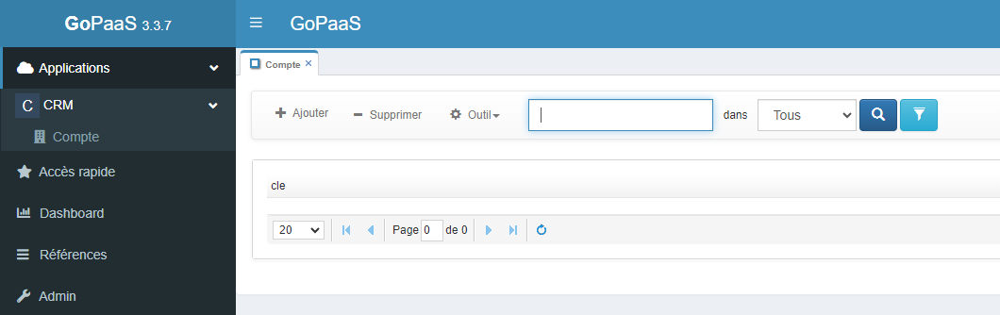

# Compte

## Création de la table compte

Pour cela, rendez-vous dans le menu personnalisation  -> Tables -> cliquez sur Ajouter.

Afin d'enregistrer la table en base de données, il est nécessaire de renseigner deux champs obligatoires :

| Champ    | Valeur                               |
|----------|--------------------------------------|
| Intitulé | Le nom de la table en base de données |
| Alias    | Le nom de la table dans l'application |

> Nous allons aussi renseigner le champ **Module** pour l'afficher dans le menu **Application**. Assurez-vous que votre groupe a bien accès à ce module en vérifiant dans la **barre de navigation** >  > **Groupes**.

Dans mon cas, je fais partie du groupe **ADMIN**, j'ouvre donc la fiche du groupe **ADMIN** pour ajouter le module CRM.

Vous pouvez maintenant enregistrer votre table **Compte**.

> Pour avoir accès à la nouvelle table, il est nécessaire de vous déconnecter de GoPaaS et de vous reconnecter.

## FormDesigner

Nous allons maintenant créer les champs de la table **Compte** et procéder à l'agencement.

Pour cela, accédez au FormDesigner. Rendez-vous dans le menu personnalisation  -> Tables -> et recherchez la table **Compte**, puis ouvrez-la.

Ensuite, cliquez sur le menu Outil > FormDesigner.

Cliquez sur le bouton + sur la section **Default** pour ajouter un champ.

## Exemple de tableau

Voici un tableau avec une en-tête et 9 lignes :

| Nom des champs | Type                          |
|----------------|-------------------------------|
| Nom            | Texte (obligatoire)           |
| Adresse        | Texte                         |
| CP             | Texte                         |
| Ville          | Texte                         |
| Téléphone      | Téléphone                     |
| Email          | Email                         |
| Site web       | URL                           |
| Type           | Liste Valeur de la liste : - Client - Prospect |
| Utilisateur    | Connexion                     |

### Création du champ **Nom**

Lorsque vous avez terminé la création des champs, vous pouvez cliquer sur le bouton  pour actualiser le FormDesigner.

