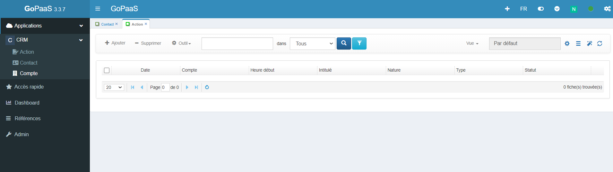

# Compte

## Création de la table compte

Pour cela, rendez-vous dans le menu personnalisation  -> Tables -> cliquez sur Ajouter.

Pour créer la table en base de données, nous allons renseigner 3 champs :

| Champ    | Valeur                               |
|----------|--------------------------------------|
| Intitulé | Le nom de la table en base de données |
| Alias    | Le nom de la table dans l'application |
| Module    | Pour visualiser dans le menu **Application** |

* Assurez-vous que votre **groupe** a bien accès à ce **module** en vérifiant dans la **barre de navigation** >  > **Groupes**.

* Je fais partie du groupe **ADMIN**, j'ouvre donc la fiche du groupe **ADMIN** pour ajouter le module CRM.

* Vous pouvez maintenant enregistrer votre table **Compte**.

* Pour avoir accès à la nouvelle table, il est nécessaire de vous déconnecter de GoPaaS et de vous reconnecter.

## FormDesigner

* Créer des champs de la table **Compte** et procéder à l'agencement.

* Accédez au FormDesigner. Rendez-vous dans le menu personnalisation  -> Tables -> et recherchez la table **Compte**, puis ouvrez-la.

* cliquez sur le menu Outil > FormDesigner.

* Cliquez sur le bouton + sur la section **Default** pour ajouter un champ.

###  Création des champs
* Cliquez sur l'icône d'ajout  pour ouvrir une nouvelle fiche de création de champ.

####  Liste des champs à créer

Voici un tableau avec une en-tête et 13 lignes :

| Nom des champs | Type                          |
|----------------|-------------------------------|
| Nom            | Texte `Obligatoire`           |
| Adresse1       | Texte                         |
| Adresse2       | Texte                         |
| CP             | Texte `Obligatoire`           |
| Ville          | Texte `Obligatoire`           |
| Pays           | Texte `Obligatoire`           |
| Gestion par    | Connexion `Table utilisateur` |
| Type           | Liste Valeur de la liste : - Client - Prospect |
| Origine        | Liste Valeur de la liste : - Réseau - Web - Fichier - Partenariat - Salon  |
| Téléphone      | Téléphone                     |
| Fax            | Téléphone                     |
| Site web       | URL                           |
| Email          | Email                         |

* Détails d'une fiche champ

| Nom des champs | Type                          |
|----------------|-------------------------------|
| Aide                    | Permet d'ajouter une aide pour l'utilisateur au survole du champ.                                                                        |
| Type            | Plusieurs types de champs sont mis à disposition.         |
| Nom champ       | Nom du champ en base de données.           |
| Alias/Nom table connectée   | L'alias du champ doit être unique dans toute la table. Dans le cas où le champ créé est de type connexion, il faut renseigner le nom de la table à connecter. |
| Intitulé   | C'est le nom du champ dans l'application.   |
| Largeur intitulé   | C'est l'espacement entre le titre du champ et le champ, il existe des valeurs prédéfinies allant de 1 à 12.           |
| Alignement intitulé   | Permet de régler le positionnement de l'intitulé.          |
| Masquer                 | Option permettant de masquer le champ.                                                                                                   |
| Obligatoire             | Option permettant de rendre obligatoire le champ.                                                                                        |
| Lecture seule           | Option permettant de rendre le champ insaisissable.                                                                                      |
| Audit Trail             | Permet d'obtenir un historique sur les modifications apportées à ce champ.                                                                |
| index                   | Permet d'indexer le champ en base de données.                                                                                             |
| Données personnelles    | Permet de catégoriser ce champ au niveau RGPD.                                                                                            |
| Données sensibles       | Permet de catégoriser ce champ au niveau RGPD.      

* Exemple de création d'un champ de type : **Texte**

| Nom des champs | Type                          |
|----------------|-------------------------------|
| Type            | Texte           |
| Nom champ       | Nom |
| Alias/Nom table connectée   | Nom |
| Intitulé   | Raison sociale |
| Largeur intitulé   | 3 |
| Obligatoire        | [x] |

* Exemple de création d'un champ de type : **Connexion**

| Nom des champs | Type                          |
|----------------|-------------------------------|
| Type            | Connexion           |
| Nom champ       | gestion_par |
| Alias/Nom table connectée   | utilisateur (table de connexion) |
| Intitulé   | Gestion par  |
| index      | [x] |

* Exemple de création d'un champ de type : **Liste**

| Nom des champs | Type                          |
|----------------|-------------------------------|
| Type            | Liste           |
| Nom champ       | origine    |
| Alias/Nom table connectée   | origine |
| Intitulé   | Origine  |
| Largeur intitulé   | 3 |
| Valeur  | Réseau Web Fichier Partenariat Salon |

* Exemple de création d'un champ de type : **Téléphone**

| Nom des champs | Type                          |
|----------------|-------------------------------|
| Type            | Téléphone           |
| Nom champ       | telephone |
| Alias/Nom table connectée   | telephone |
| Intitulé   | Téléphone |
| Largeur intitulé   | 3 |

* Exemple de création d'un champ de type : **URL**

| Nom des champs | Type                          |
|----------------|-------------------------------|
| Type            | URL           |
| Nom champ       | Nom du champ en base de données.           |
| Alias/Nom table connectée   | L'alias du champ doit être unique dans toute la table. |
| Intitulé   | Nom du champ sur le formulaire           |
| Largeur intitulé   | 3 |

* Exemple de création d'un champ de type : **Email**

| Nom des champs | Type                          |
|----------------|-------------------------------|
| Type            | Email           |
| Nom champ       | email  |
| Alias/Nom table connectée   | email |
| Intitulé   | Email |
| Largeur intitulé   | 3 |

#### Actualisation du FormDesigner
* Lorsque vous avez terminé la création des champs, cliquez sur le bouton  pour mettre à jour le `FormDesigner` et visualiser les modifications.

* Vous pouvez **glisser-déposer** les champs pour modifier leur ordre sur le formulaire.

### Agencer la vue "Par défaut"

* Accédez au menu **Application** > **CRM** > **Compte**.

* Cliquez sur modifier la vue  pour personnaliser l'affichage.
* Rendez-vous dans l'onglet **Champs**

* Dans la colonne de gauche, selectionnez les champs à afficher dans la vue. *Astuce : Vous pouvez sélectionner plusieurs champs simultanément en maintenant la touche CTRL enfoncée.*
* Cliquez ensuite sur la flèche vers la droite  pour ajouter les champs sélectionnés à la vue.
* Une fois terminé, cliquez sur **Enregistrer** pour appliquer les modifications.
* Pour visualiser les changements, fermez la vue et rouvrez-la.

### Création des Onglets

#### Exemple de liste des onglets à créer

| Nom des onglets        | Ordre `Correspond à l'emplacement de l'onglet`|
|------------------------|-----------------------------------------------|
| Principal `Par défault`| 1                                             |
| Actions                | 2                                             |
| Affaires               | 3                                             |
| Système `Par défault`  | 10                                            |

#### Ajouter un Onglet
Cliquez sur le bouton `+ Onglet` situé dans la barre supérieure du FormDesigner .

Une fenêtre de configuration apparaîtra. Entrez le nom de votre nouvel onglet. Par exemple, vous pouvez nommer cet onglet `Actions`.

#### Actualisez le FormDesigner
Lorsque vous avez terminé la création des onglets, cliquez sur le bouton  pour actualiser le `FormDesigner` et voir les modifications appliquées.

### Création des champs de type Vue

Pour créer une vue liée dans une fiche, rendez vous sur dans votre onglet `Actions` et  suivez les étapes ci-dessous. Ces instructions vous guideront pour insérer une vue de la table souhaitée dans le FormDesigner de votre fiche compte et créer une nouvelle vue (Vous devez créer une nouvelle table nommé **actions**).

#### Étape 1 : Créer une Nouvelle Vue

1. Accédez à la section des vues de votre application.
   > Sur votre vue par défaut de la table **action** cliquez sur le menu des vues  .
2. Créez une nouvelle vue pour la table **Actions**. Nommons cette vue `LinkCompteActions`.
   > 
3. Configurez la vue selon vos besoins (colonnes, filtres, etc.).
   > Voici les colonnes (Les colonnes sont des champs disponibles sur la table) que de notre vue `LinkCompteActions` aura besoin. 

   > 
   
   > Pour le filtre de votre vue, 

4. Sauvegardez la vue.

#### Étape 2 : Choisir une Vue

1. Accédez à votre FormDesigner pour la fiche `Compte`.
2. Cliquez sur le bouton **+** pour ajouter un nouveau champ.

#### Étape 3 : Configurer le Champ

1. Dans le formulaire d'ajout de champ, choisissez le type **Vue**.

2. Sélectionnez la table à partir de laquelle vous souhaitez insérer la vue. Utilisez le champ de recherche pour trouver et sélectionner la table appropriée.

3. Entrez le nom de la vue que vous avez créée. Suivez la convention de nommage `LinkCompteActions`.

#### Étape 4 : Insérer la Vue dans le FormDesigner

1. Revenez au FormDesigner de la fiche "Compte".
2. Dans le champ de configuration du type **Vue**, entrez le nom de la vue `LinkCompteActions`.

   

3. Remplissez les autres champs nécessaires, tels que la section, la colonne, et l'ordre du champ.
4. Configurez les options avancées comme **Masquer**, **Obligatoire**, **Lecture seule**, **Audit Trail**, etc., selon vos besoins.

#### Étape 5 : Sauvegarder et Actualiser

1. Une fois que vous avez configuré le champ, cliquez sur **Enregistrer** pour sauvegarder les modifications.
2. Cliquez sur **Actualiser** pour appliquer les modifications et voir la vue liée dans votre fiche "Compte".
