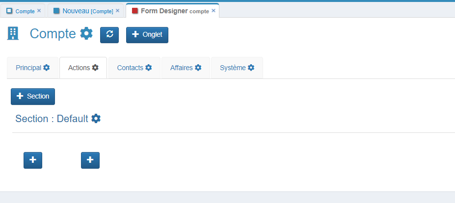
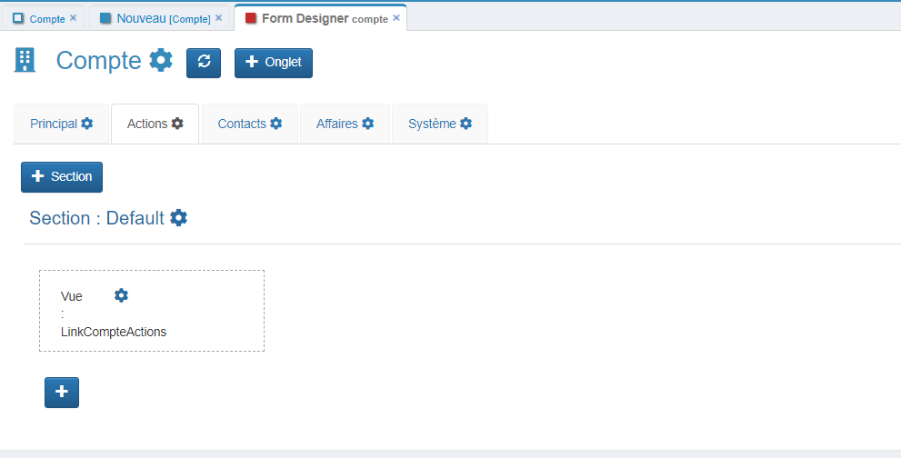

# Compte

## Création de la table compte

Pour cela, rendez-vous dans le menu personnalisation  -> Tables -> cliquez sur Ajouter.

Pour créer la table en base de données, nous allons renseigner 3 champs :

| Champ    | Valeur                               |
|----------|--------------------------------------|
| Intitulé | Le nom de la table en base de données |
| Alias    | Le nom de la table dans l'application |
| Module    | Pour visualiser dans le menu **Application** |

* Assurez-vous que votre **groupe** a bien accès à ce **module** en vérifiant dans la **barre de navigation** >  > **Groupes**.

* Je fais partie du groupe **ADMIN**, j'ouvre donc la fiche du groupe **ADMIN** pour ajouter le module CRM.

* Vous pouvez maintenant enregistrer votre table **Compte**.

* Pour avoir accès à la nouvelle table, il est nécessaire de vous déconnecter de GoPaaS et de vous reconnecter.

## FormDesigner

* Créer des champs de la table **Compte** et procéder à l'agencement.

* Accédez au FormDesigner. Rendez-vous dans le menu personnalisation  -> Tables -> et recherchez la table **Compte**, puis ouvrez-la.

* Cliquez sur le menu Outil > FormDesigner.

* Cliquez sur le bouton  de la **Section : Default** pour ajouter un champ.

###  Création des champs

####  Liste des champs à créer

Voici un tableau avec une en-tête et 13 lignes :

| Nom des champs | Type                          |
|----------------|-------------------------------|
| Nom            | Texte `Obligatoire`           |
| Adresse1       | Texte                         |
| Adresse2       | Texte                         |
| CP             | Texte `Obligatoire`           |
| Ville          | Texte `Obligatoire`           |
| Pays           | Texte `Obligatoire`           |
| Gestion par    | Connexion `Table utilisateur` |
| Type           | Liste Valeur de la liste : - Client - Prospect |
| Origine        | Liste Valeur de la liste : - Réseau - Web - Fichier - Partenariat - Salon  |
| Téléphone      | Téléphone                     |
| Fax            | Téléphone                     |
| Site web       | URL                           |
| Email          | Email                         |

* Détails d'une fiche champ

| Nom des champs          | Valeur                                                                                                                                         |
|-------------------------|-------------------------------------------------------------------------------------------------------------------------------------------------|
| Aide                    | Permet d'ajouter une aide pour l'utilisateur au survol du champ.                                                                                |
| Type                    | Plusieurs types de champs sont mis à disposition.                                                                                              |
| Nom champ               | Nom du champ en base de données.                                                                                                               |
| Alias/Nom table connectée | L'alias du champ doit être unique dans toute la table. Dans le cas où le champ créé est de type connexion, il faut renseigner le nom de la table à connecter. |
| Intitulé                | C'est le nom du champ dans l'application.                                                                                                      |
| Largeur intitulé        | C'est l'espacement entre le titre du champ et le champ, il existe des valeurs prédéfinies allant de 1 à 12.                                     |
| Alignement intitulé     | Permet de régler le positionnement de l'intitulé.                                                                                              |
| Masquer                 | Option permettant de masquer le champ.                                                                                                         |
| Obligatoire             | Option permettant de rendre obligatoire le champ.                                                                                              |
| Lecture seule           | Option permettant de rendre le champ non éditable.         |
| Audit Trail             | Permet d'obtenir un historique sur les modifications apportées à ce champ.                                                                     |
| Index                   | Permet d'indexer le champ en base de données.                                                                                                  |
| Données personnelles    | Permet de catégoriser ce champ au niveau RGPD.                                                                                                 |
| Données sensibles       | Permet de catégoriser ce champ au niveau RGPD.                                                                                                 |

* Exemple de création d'un champ de type : **Texte**

| Nom des champs | Valeur                          |
|----------------|-------------------------------|
| Type            | Texte           |
| Nom champ       | Nom |
| Alias/Nom table connectée   | Nom |
| Intitulé   | Raison sociale |
| Largeur intitulé   | 3 |
| Obligatoire        | [x] |

* Exemple de création d'un champ de type : **Connexion**

| Nom des champs | Valeur                          |
|----------------|-------------------------------|
| Type            | Connexion           |
| Nom champ       | gestion_par |
| Alias/Nom table connectée   | utilisateur (table de connexion) |
| Intitulé   | Gestion par  |
| index      | [x] |

* Exemple de création d'un champ de type : **Liste**

| Nom des champs | Valeur                          |
|----------------|-------------------------------|
| Type            | Liste           |
| Nom champ       | origine    |
| Alias/Nom table connectée   | origine |
| Intitulé   | Origine  |
| Largeur intitulé   | 3 |
| Valeur  | Réseau Web Fichier Partenariat Salon |

* Exemple de création d'un champ de type : **Téléphone**

| Nom des champs | Valeur                          |
|----------------|-------------------------------|
| Type            | Téléphone           |
| Nom champ       | telephone |
| Alias/Nom table connectée   | telephone |
| Intitulé   | Téléphone |
| Largeur intitulé   | 3 |

* Exemple de création d'un champ de type : **URL**

| Nom des champs | Valeur                          |
|----------------|-------------------------------|
| Type            | URL           |
| Nom champ       | site_web |
| Alias/Nom table connectée   | site_web |
| Intitulé   | Site web |
| Largeur intitulé   | 3 |

* Exemple de création d'un champ de type : **Email**

| Nom des champs | Valeur                          |
|----------------|-------------------------------|
| Type            | Email           |
| Nom champ       | email  |
| Alias/Nom table connectée   | email |
| Intitulé   | Email |
| Largeur intitulé   | 3 |

#### Actualisation du FormDesigner
* Lorsque vous avez terminé la création des champs, cliquez sur le bouton  pour mettre à jour le `FormDesigner` et visualiser les modifications.

* Vous pouvez **glisser-déposer** les champs pour modifier leur ordre sur le formulaire.

### Agencer la vue "Par défaut"

* Accédez au menu **Application** > **CRM** > **Compte**.

* Cliquez sur l'icône de modification  pour personnaliser la vue.
* Rendez-vous dans l'onglet **Champs**

* Dans la colonne de gauche, selectionnez les champs à afficher dans la vue.
    > *Astuce : Vous pouvez sélectionner plusieurs champs simultanément en maintenant la touche CTRL enfoncée.*
* Cliquez ensuite sur la flèche vers la droite  pour ajouter les champs sélectionnés à la vue.
* Une fois terminé, cliquez sur **Enregistrer** pour appliquer les modifications.
* Pour visualiser les changements, fermez la vue et rouvrez-la.

### Création des Onglets

#### Liste des onglets à créer sur la table Compte

| Nom des onglets        | Valeur |
|------------------------|-----------------------------------------------|
| Principal `Par défault`| 1                                             |
| Actions                | 2                                             |
| Contact                | 3                                             |
| Affaires               | 4                                             |
| Système `Par défault`  | 10                                            |

#### Ajouter un Onglet
Cliquez sur le bouton `+ Onglet` situé dans la barre supérieure du FormDesigner .

Entrez l'intitulé, Label et Ordre de votre nouvel onglet.

| Nom des champs        | Détail |
|------------------------|-----------------------------------------------|
| Intitulé | le nom doit être unique sur la table         |
| Label    | Valeur qui s'affichera sur le formulaire     |
| Ordre    | Ordre d'affichage de l'onglet                |

#### Actualisez le FormDesigner
Lorsque vous avez terminé la création des onglets, cliquez sur le bouton  pour actualiser le `FormDesigner` et voir les modifications appliquées.

### Création d'un champ de type Vue pour la table `Action`

Rendez vous dans votre onglet `Actions` et suivez les étapes ci-dessous.
> La table nommée `Action` doit avoir été créée au préalable.

#### Créer une Nouvelle Vue liée  `Action`

* Se rendre sur la vue par défaut de la table `Action`
* Cliquez sur le menu des vues . 
* Créez une nouvelle vue pour la table `Action`. Nommons cette vue `LinkCompteActions`.

   
* Ajouter les colonnes dans la vue selon vos besoins.
   

   
* Condition **(-TrigItemName-)** pour la connexion avec le `Compte`.
    > Le **(-TrigItemName-)** renvoie la clé de la fiche `Action`.

* Sauvegardez la vue.

#### Ajouter le champ de type `Vue` sur la table `Compte`

* Accédez à votre FormDesigner de la table `Compte` et se rendre dans l'onglet `Actions`.
* Modifiez la `Section : Default` avec le bouton 

* Mettre NB colonne a `1` et enregistrer la section.

* Cliquez sur le bouton `+` pour ajouter un nouveau champ.

#### Configurer le Champ

| Nom des champs | Valeur                          |
|----------------|-------------------------------|
| Type            | Vue           |
| Nom de la table | action (table à partir de laquelle vous souhaitez insérer la vue) |
| Nom champ   | nom de la vue que vous avez créée `LinkCompteActions` |

#### Actualiser le `FormDesigner`

* Une fois que vous avez terminé, cliquez sur le bouton  pour mettre à jour le `FormDesigner` et visualiser les modifications.

### Création d'un champ de type Vue pour la table `Contact`

Rendez vous dans votre onglet `Contacts` et suivez les étapes ci-dessous.
> La table nommée `Contact` doit avoir été créée au préalable.

#### Créer une Nouvelle Vue liée  `Contact`

* Se rendre sur la vue par défaut de la table `Contact`
* Cliquez sur le menu des vues . 
* Créez une nouvelle vue pour la table `Contact`. Nommons cette vue `LinkCompteContacts`.

   
* Ajouter les colonnes dans la vue selon vos besoins.
   

   
* Condition **(-TrigItemName-)** pour la connexion avec le `Compte`.
    > Le **(-TrigItemName-)** renvoie la clé de la fiche `Contact`.

* Sauvegardez la vue.

#### Ajouter le champ de type `Vue` sur la table `Compte`

* Accédez à votre FormDesigner de la table `Compte` et se rendre dans l'onglet `Contacts`.

* Modifiez la `Section : Default` avec le bouton 

* Mettre NB colonne a `1` et enregistrer la section.

* Cliquez sur le bouton `+` pour ajouter un nouveau champ.

#### Configurer le Champ

| Nom des champs | Valeur                          |
|----------------|-------------------------------|
| Type            | Vue           |
| Nom de la table | contact (table à partir de laquelle vous souhaitez insérer la vue) |
| Nom champ   | nom de la vue que vous avez créée `LinkCompteContacts` |

#### Actualiser le `FormDesigner`

* Une fois que vous avez terminé, cliquez sur le bouton  pour mettre à jour le `FormDesigner` et visualiser les modifications.

### Création d'un champ de type Vue pour la table `Affaire`

Rendez vous dans votre onglet `Affaires` et suivez les étapes ci-dessous.
> La table nommée `Affaire` doit avoir été créée au préalable.

#### Créer une Nouvelle Vue liée  `Affaire`

* Se rendre sur la vue par défaut de la table `Affaire`
* Cliquez sur le menu des vues . 
* Créez une nouvelle vue pour la table `Affaire`. Nommons cette vue `LinkCompteAffaires`.

   
* Ajouter les colonnes dans la vue selon vos besoins.
   

   
* Condition **(-TrigItemName-)** pour la connexion avec le `Compte`.
    > Le **(-TrigItemName-)** renvoie la clé de la fiche `Affaire`.

* Sauvegardez la vue.

#### Ajouter le champ de type `Vue` sur la table `Compte`

* Accédez à votre FormDesigner de la table `Compte` et se rendre dans l'onglet `Affaires`.

* Modifiez la `Section : Default` avec le bouton 

* Mettre NB colonne a `1` et enregistrer la section.

* Cliquez sur le bouton `+` pour ajouter un nouveau champ.

#### Configurer le Champ

| Nom des champs | Valeur                          |
|----------------|-------------------------------|
| Type            | Vue           |
| Nom de la table | affaire (table à partir de laquelle vous souhaitez insérer la vue) |
| Nom champ   | nom de la vue que vous avez créée `LinkCompteAffaires` |

#### Actualiser le `FormDesigner`

* Une fois que vous avez terminé, cliquez sur le bouton  pour mettre à jour le `FormDesigner` et visualiser les modifications.

