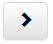
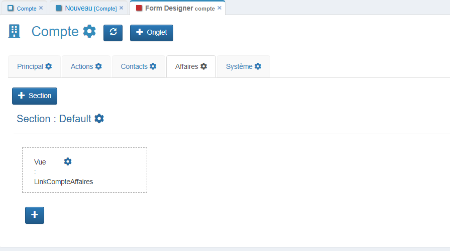

# Compte

## Création de la table compte

Dans le menu personnalisation :
- Cliquer sur le menu `Tables` pour afficher la vue avec la liste de toutes les tables.
- Cliquer ensuite sur le bouton `Ajouter`.

    

Renseigner les champs suivant:

| Champ    | Valeur                               |
|----------|--------------------------------------|
| Intitulé | Le nom de la table en base de données |
| Alias    | Le nom de la table dans l'application |
| Champs à afficher dans connexion    | le nom du champ de la table qui sera visible dans le champ de connexion |
| Type    | Ex: **Application** |
| Module    | Ex: **CRM** |

* Assurez-vous que votre **groupe** a bien accès à ce **module** en vérifiant dans la **barre de navigation** >  > **Groupes**.

* Si vous faites partie du groupe **ADMIN**, ouvrez la fiche du groupe **ADMIN** pour ajouter par exemple le module **CRM**.

    

* Enregistrer la table **Compte**.

* Pour ouvrir la nouvelle table, il est nécessaire de vous déconnecter de GoPaaS et de vous reconnecter.

    

## FormDesigner

Le FormDesigner permet de créer facilement des champs personnalisés dans vos formulaires en quelques clics.

Dans le menu personnalisation :
- Cliquer sur le menu `Tables` pour afficher la vue avec la liste de toutes les tables.
- Rechercher la table **Compte** et double cliquer sur la fiche pour l'ouvrir.

    

### Ouvrir le FormDesigner
- Cliquer sur le menu `Outil` de la fiche puis `FormDesigner`.
- Dans le menu qui apparaît cliquer sur **FormDesigner**.

    

###  Création des champs

-  Une fois dans FormDesigner, cliquer sur le bouton  pour ajouter un nouveau champ.

    

####  Liste des champs à créer

Voici un tableau avec les champs à créer et leur types :

| Nom des champs | Type                          |
|----------------|-------------------------------|
| Nom            | Texte `Obligatoire`           |
| Adresse1       | Texte                         |
| Adresse2       | Texte                         |
| CP             | Texte `Obligatoire`           |
| Ville          | Texte `Obligatoire`           |
| Pays           | Texte `Obligatoire`           |
| Gestion par    | Connexion `Table utilisateur` |
| Type           | Liste Valeur de la liste : - Client - Prospect |
| Origine        | Liste Valeur de la liste : - Réseau - Web - Fichier - Partenariat - Salon  |
| Téléphone      | Téléphone                     |
| Fax            | Téléphone                     |
| Site web       | URL                           |
| Email          | Email                         |

### Détails d'une fiche champ

| Nom des champs          | Description|
|-------------------------|-------------------------------------------------------------------------------------------------------------------------------------------------|
| Aide                    | Ajouter une aide contextuelle pour l'utilisateur au survol du champ.                                                                                |
| Type                    | Choisir le type de champ parmi les options disponibles.                                                                                              |
| Nom champ               | Nom du champ dans la base de données.                                                                                                               |
| Alias/Nom table connectée | L'alias du champ doit être unique dans toute la table. Dans le cas où le champ créé serait de type connexion, il faut renseigner le nom de la table à connecter. |
| Intitulé                | Nom du champ tel qu'il apparaît dans l'application.                                                                                                      |
| Largeur intitulé        | Espacement entre le titre du champ et le champ lui-même, valeurs prédéfinies de 1 à 12.                                     |
| Alignement intitulé     | Positionnement de l'intitulé par rapport au champ.                                                                                             |
| Masquer                 | Option permettant de masquer le champ.                                                                                                         |
| Obligatoire             | Option permettant de rendre obligatoire le champ.                                                                                              |
| Lecture seule           | Option permettant de rendre le champ non modifiable par l'utilisateur.         |
| Audit Trail             | Suivre un historique sur les modifications apportées à ce champ.                                                                     |
| Index                   | Indexer le champ dans la base de données.                                                                                                  |
| Données personnelles    | Catégoriser le champ comme contenant des données personnelles (RGPD).                                                                                                |
| Données sensibles       | Catégoriser le champ comme contenant des données sensibles (RGPD).                                                                                                  |

### Exemples de création de champs

#### Champ de type : **Texte**

| Nom des champs | Valeur                          |
|----------------|-------------------------------|
| Type            | Texte           |
| Nom champ       | Nom |
| Alias/Nom table connectée   | Nom |
| Intitulé   | Raison sociale |
| Largeur intitulé   | 3 |
| Obligatoire        | [x] |

#### Champ de type : **Connexion**

| Nom des champs | Valeur                          |
|----------------|-------------------------------|
| Type            | Connexion           |
| Nom champ       | gestion_par |
| Alias/Nom table connectée   | utilisateur (table de connexion) |
| Intitulé   | Gestion par  |
| index      | [x] |

#### Champ de type : **Liste**

| Nom des champs | Valeur                          |
|----------------|-------------------------------|
| Type            | Liste           |
| Nom champ       | origine    |
| Alias/Nom table connectée   | origine |
| Intitulé   | Origine  |
| Largeur intitulé   | 3 |
| Valeur  | Réseau Web Fichier Partenariat Salon |

#### Champ de type : **Téléphone**

| Nom des champs | Valeur                          |
|----------------|-------------------------------|
| Type            | Téléphone           |
| Nom champ       | telephone |
| Alias/Nom table connectée   | telephone |
| Intitulé   | Téléphone |
| Largeur intitulé   | 3 |

#### Champ de type : **URL**

| Nom des champs | Valeur                          |
|----------------|-------------------------------|
| Type            | URL           |
| Nom champ       | site_web |
| Alias/Nom table connectée   | site_web |
| Intitulé   | Site web |
| Largeur intitulé   | 3 |

#### Champ de type : **Email**

| Nom des champs | Valeur                          |
|----------------|-------------------------------|
| Type            | Email           |
| Nom champ       | email  |
| Alias/Nom table connectée   | email |
| Intitulé   | Email |
| Largeur intitulé   | 3 |

### Actualisation du FormDesigner
- Cliquer sur le bouton  pour mettre à jour le `FormDesigner` et visualiser les modifications apportées.

    > *Astuce : Vous pouvez également **glisser-déposer** les champs pour réorganiser leur ordre sur le formulaire.*
    
    

### Agencer la vue "Par défaut"

* Aller dans le menu **Application**
  * Ensuite, accéder au sous-menu **CRM**
      * Puis, sélectionner **Compte**

    

* Cliquer sur l'icône de modification  pour aux paramettre de la vue pour pouvoir la personnaliser.
* Accéder à l'onglet `Champs` pour voir la liste des champs de votre table **Compte**.

    
* Dans la colonne de gauche, vous avez la liste de champs disponibles. Sélectionner les champs que vous souhaitez afficher dans la vue.
  > *Astuce : Vous pouvez sélectionner plusieurs champs simultanément en maintenant la touche CTRL enfoncée.*
* Après avoir sélectionné les champs désirés, cliquer sur la flèche vers la droite  pour les ajouter à la vue.
* Une fois que vous avez ajouté tous les champs nécessaires, cliquer sur le bouton **Enregistrer** pour appliquer les modifications à votre vue.
* Pour voir les changements effectués, fermer la vue actuelle et rouvrez là.

    

### Création des Onglets

#### Liste des onglets à créer sur la table Compte

| Nom des onglets        | Valeur |
|------------------------|-----------------------------------------------|
| Principal `Par défault`| 1                                             |
| Actions                | 2                                             |
| Contact                | 3                                             |
| Affaires               | 4                                             |
| Système `Par défault`  | 10                                            |

#### Ajouter un Onglet

* Cliquer sur le bouton `+ Onglet` situé dans la barre supérieure du FormDesigner .

* Entrer l'intitulé, Label et Ordre de votre nouvel onglet.

| Nom des champs        | Description                        |
|------------------------|-----------------------------------------------|
| Intitulé | Le nom doit être unique sur la table.        |
| Label    | Le texte qui apparaîtra sur le formulaire.   |
| Ordre    | La position de l'onglet dans l'affichage.       |

#### Actualisez le FormDesigner
* Une fois la création des onglets terminée, cliquer sur le bouton  pour actualiser le FormDesigner et visualiser les modifications.

    

### Création d'un champ de type Vue pour la table `Action`

Cliquer sur votre onglet `Actions` dans votre FormDesigner.
>*Info : La table nommée `Action` doit avoir été créée au préalable.*
    

#### Créer une nouvelle Vue liée  `Action`

* Accéder à la vue par défaut de la table `Action`.
* Cliquer sur le bouton  pour ouvrir le menu des vues. 
* Cliquer sur le bouton  pour ajouter une nouvelle vue. 
* En créant cette nouvelle vue pour la table `Action`, nommer là `LinkCompteActions`.

    
   
* Ajouter les champs pour qu'ils soient visible dans la vue.
    - `Date`, `Heure début`, `Intitule`, `Nature`, `Type`, `Statut`

    
   
* Définisser la condition **(-TrigItemName-)** pour la connexion avec la table `Compte`. 
    * Cliquer sur l'onglet `Condition`.
    * Sélectionner le champ `Compte`, ce champ servira de condition pour la table `Compte`.
    * Cliquer sur le bouton  pour mettre votre champ de condtion sur la liste des champs de condtion le champ.
    
    * Double-cliquer sur votre champ pour ouvrir la fiche de condition.

# ---------------------------------A CONTINUER A APRTIR D'ICI -------------------------
    

* Sauvegardez la vue.

#### Ajouter le champ de type `Vue` sur la table `Compte`

* Accédez à votre FormDesigner de la table `Compte` et se rendre dans l'onglet `Actions`.
* Modifiez la `Section : Default` avec le bouton 

* Mettre NB colonne a `1` et enregistrer la section.

* Cliquez sur le bouton `+` pour ajouter un nouveau champ.

#### Configurer le Champ

| Nom des champs | Valeur                          |
|----------------|-------------------------------|
| Type            | Vue           |
| Nom de la table | action (table à partir de laquelle vous souhaitez insérer la vue) |
| Nom champ   | nom de la vue que vous avez créée `LinkCompteActions` |

#### Actualiser le `FormDesigner`

* Une fois que vous avez terminé, cliquez sur le bouton  pour mettre à jour le `FormDesigner` et visualiser les modifications.

### Création d'un champ de type Vue pour la table `Contact`

Rendez vous dans votre onglet `Contacts` et suivez les étapes ci-dessous.
> La table nommée `Contact` doit avoir été créée au préalable.

#### Créer une Nouvelle Vue liée  `Contact`

* Se rendre sur la vue par défaut de la table `Contact`
* Cliquez sur le menu des vues . 
* Créez une nouvelle vue pour la table `Contact`. Nommons cette vue `LinkCompteContacts`.

   
* Ajouter les colonnes dans la vue selon vos besoins.
   

   
* Condition **(-TrigItemName-)** pour la connexion avec le `Compte`.
    > Le **(-TrigItemName-)** renvoie la clé de la fiche `Contact`.

* Sauvegardez la vue.

#### Ajouter le champ de type `Vue` sur la table `Compte`

* Accédez à votre FormDesigner de la table `Compte` et se rendre dans l'onglet `Contacts`.

* Modifiez la `Section : Default` avec le bouton 

* Mettre NB colonne a `1` et enregistrer la section.

* Cliquez sur le bouton `+` pour ajouter un nouveau champ.

#### Configurer le Champ

| Nom des champs | Valeur                          |
|----------------|-------------------------------|
| Type            | Vue           |
| Nom de la table | contact (table à partir de laquelle vous souhaitez insérer la vue) |
| Nom champ   | nom de la vue que vous avez créée `LinkCompteContacts` |

#### Actualiser le `FormDesigner`

* Une fois que vous avez terminé, cliquez sur le bouton  pour mettre à jour le `FormDesigner` et visualiser les modifications.

### Création d'un champ de type Vue pour la table `Affaire`

Rendez vous dans votre onglet `Affaires` et suivez les étapes ci-dessous.
> La table nommée `Affaire` doit avoir été créée au préalable.

#### Créer une Nouvelle Vue liée  `Affaire`

* Se rendre sur la vue par défaut de la table `Affaire`
* Cliquez sur le menu des vues . 
* Créez une nouvelle vue pour la table `Affaire`. Nommons cette vue `LinkCompteAffaires`.

   
* Ajouter les colonnes dans la vue selon vos besoins.
   

   
* Condition **(-TrigItemName-)** pour la connexion avec le `Compte`.
    > Le **(-TrigItemName-)** renvoie la clé de la fiche `Affaire`.

* Sauvegardez la vue.

#### Ajouter le champ de type `Vue` sur la table `Compte`

* Accédez à votre FormDesigner de la table `Compte` et se rendre dans l'onglet `Affaires`.

* Modifiez la `Section : Default` avec le bouton 

* Mettre NB colonne a `1` et enregistrer la section.

* Cliquez sur le bouton `+` pour ajouter un nouveau champ.

#### Configurer le Champ

| Nom des champs | Valeur                          |
|----------------|-------------------------------|
| Type            | Vue           |
| Nom de la table | affaire (table à partir de laquelle vous souhaitez insérer la vue) |
| Nom champ   | nom de la vue que vous avez créée `LinkCompteAffaires` |

#### Actualiser le `FormDesigner`

* Une fois que vous avez terminé, cliquez sur le bouton  pour mettre à jour le `FormDesigner` et visualiser les modifications.

