# Contact

## Création de la table contact

Dans le menu personnalisation :
- Cliquer sur le menu `Tables` pour afficher la vue avec la liste de toutes les tables.
- Cliquer ensuite sur le bouton `Ajouter`.

    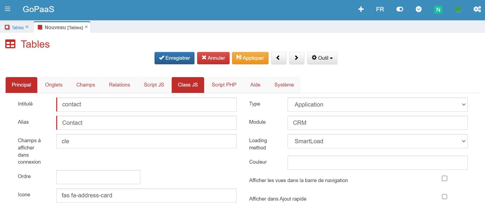

Renseigner les champs suivant:

| Champ                            | Valeur                                                                                                       |
| -------------------------------- | ------------------------------------------------------------------------------------------------------------ |
| Intitulé                         | Le nom de la table en base de données                                                                        |
| Alias                            | Le nom de la table dans l'application                                                                        |
| Champs à afficher dans connexion | Le nom du champ de la table contact qui sera affiché dans les champs de connexion présents sur d'autre tables |
| Icone                            | Icone [Font Awesome](https://fontawesome.com/) qui permet de personnaliser la table                               |
| Type                             | Ex: **Application**                                                                                          |
| Module                           | Ex: **CRM**                                                                                                  |

* Assurez-vous que votre **groupe** a bien accès à ce **module** en vérifiant dans la **barre de navigation** > 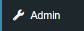 > **Groupes**.

* Si vous faites partie du groupe **ADMIN**, ouvrez la fiche du groupe **ADMIN** pour ajouter par exemple le module **CRM**.

    

* Enregistrer la table **Contact**.

* Pour ouvrir la nouvelle table, il est nécessaire de vous déconnecter de GoPaaS et de vous reconnecter.

    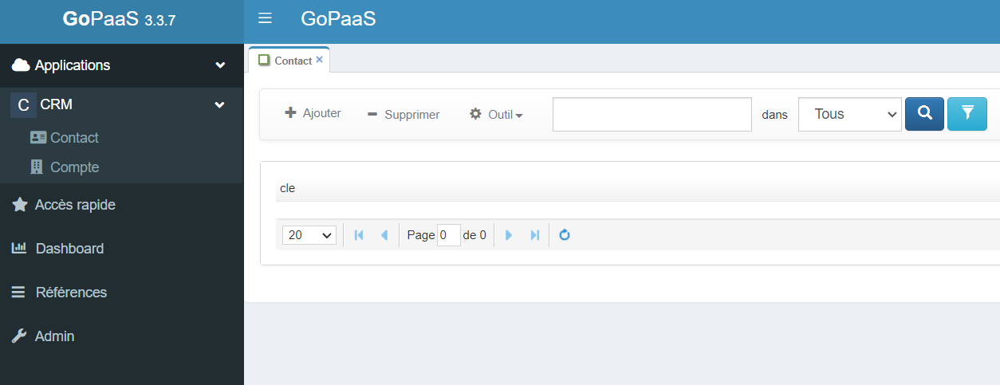

## FormDesigner

Le FormDesigner permet de créer facilement des champs personnalisés dans vos formulaires en quelques clics.

Dans le menu personnalisation :
- Cliquer sur le menu `Tables` pour afficher la vue avec la liste de toutes les tables.
- Rechercher la table **Contact** et double cliquer sur la fiche pour l'ouvrir.

    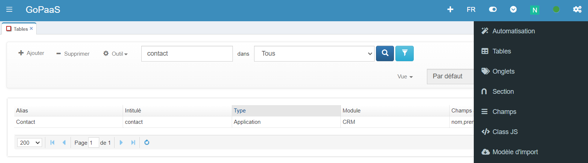

### Ouvrir le FormDesigner
- Cliquer sur le menu `Outil` de la fiche puis `FormDesigner`.
- Dans le menu qui apparaît cliquer sur **FormDesigner**.

    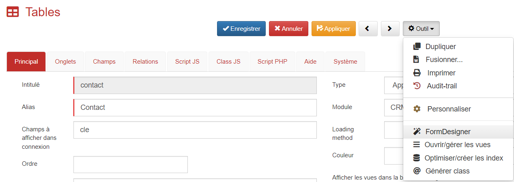

###  Création des champs

Nous avons dans une fiche GoPaaS, des onglets, des sections et des colonnes.

- Les Onglets contiennent des sections.
- Les Sections contiennent 1 à 4 colonnes.
- Cliquer sur l'un des boutons  pour ajouter un nouveau champ dans une colonne.

    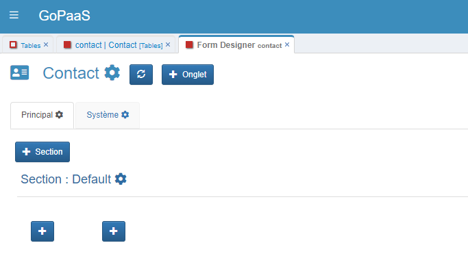

#### Champ de type `Texte`

| Nom des champs            | Valeur |
| ------------------------- | ------ |
| Type                      | Texte  |
| Nom champ                 | Nom    |
| Alias/Nom table connectée | Nom    |
| Intitulé                  | Nom    |
| Largeur intitulé          | 3      |
| Obligatoire               | [x]    |

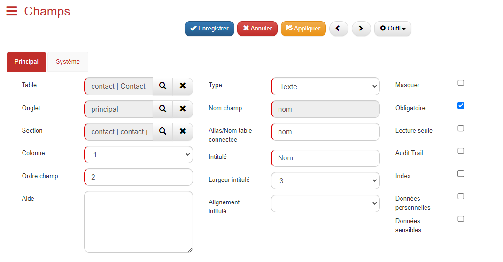

#### Champ de type `Connexion`

| Nom des champs            | Valeur                      |
| ------------------------- | --------------------------- |
| Type                      | Connexion                   |
| Nom champ                 | compte                      |
| Alias/Nom table connectée | compte (table de connexion) |
| Intitulé                  | Compte                      |
| index                     | [x]                         |

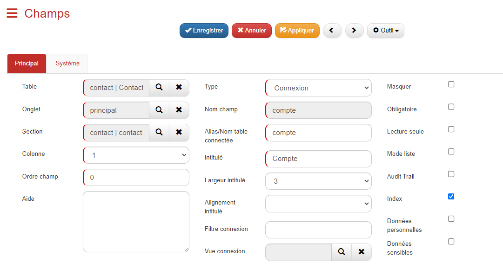

#### Champ de type `Liste`

| Nom des champs            | Valeur             |
| ------------------------- | ------------------ |
| Type                      | Liste              |
| Nom champ                 | civilite           |
| Alias/Nom table connectée | civilite           |
| Intitulé                  | Civilité           |
| Largeur intitulé          | 3                  |
| Valeur                    | Monsieur Madame |

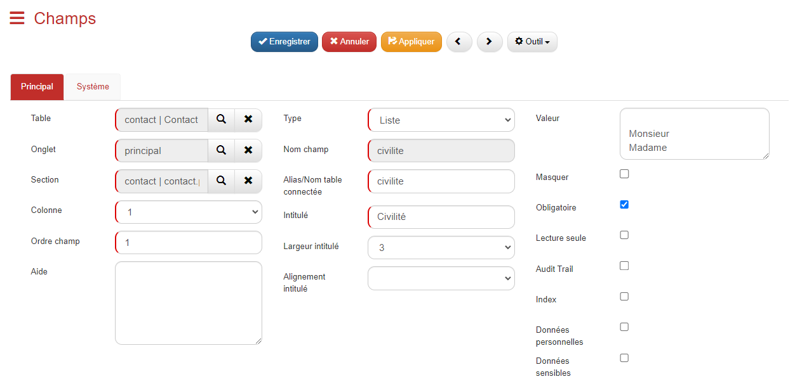

#### Champ de type `Téléphone`

| Nom des champs            | Valeur    |
| ------------------------- | --------- |
| Type                      | Téléphone |
| Nom champ                 | telephone |
| Alias/Nom table connectée | telephone |
| Intitulé                  | Téléphone |
| Largeur intitulé          | 3         |

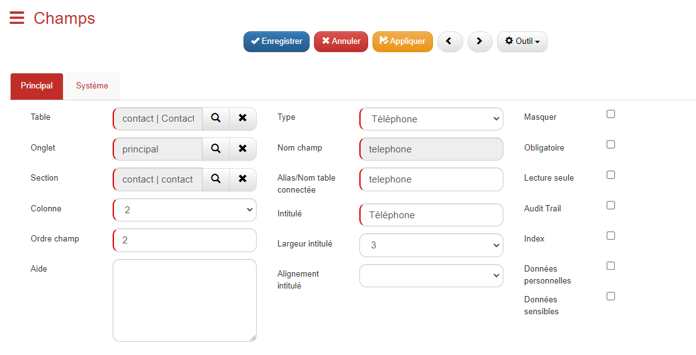

#### Champ de type `URL`

| Nom des champs            | Valeur   |
| ------------------------- | -------- |
| Type                      | URL      |
| Nom champ                 | linkedin |
| Alias/Nom table connectée | linkedin |
| Intitulé                  | Linkedin |
| Largeur intitulé          | 3        |

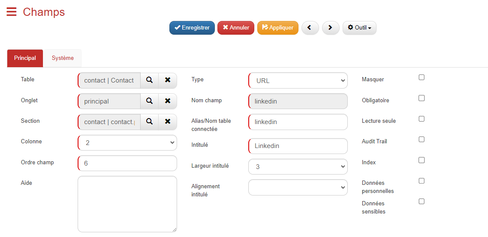

#### Champ de type `Email`

| Nom des champs            | Valeur |
| ------------------------- | ------ |
| Type                      | Email  |
| Nom champ                 | email  |
| Alias/Nom table connectée | email  |
| Intitulé                  | Email  |
| Largeur intitulé          | 3      |

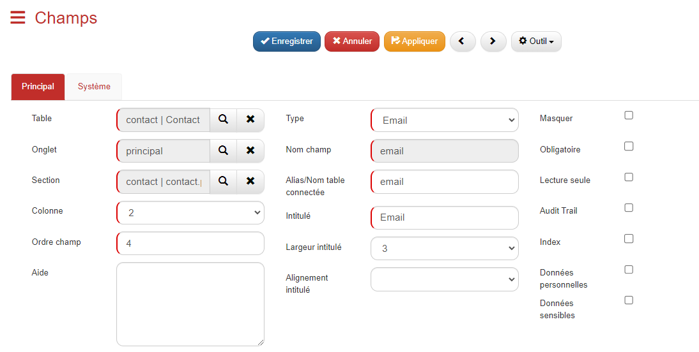

####  Liste des autres champs à créer

Voici un tableau avec les champs de la table `Contact` à créer et leur types :

| Nom des champs  | Type                                                                                                                                                                                                                          |
| --------------- | ----------------------------------------------------------------------------------------------------------------------------------------------------------------------------------------------------------------------------- |
| Compte          | Connexion                                                                                                                                                                                                                     |
| Civilité        | Liste `Obligatoire` Valeur de la liste : - Monsieur - Madame                                                                                                                                                         |
| Nom             | Texte `Obligatoire`                                                                                                                                                                                                           |
| Prénom          | Texte `Obligatoire`                                                                                                                                                                                                           |
| Fonction        | Liste   Valeur de la liste : - Président - Directeur général - Gérant - Directeur adjoint - Directeur financier - Directeur commercial - Directeur système d'information - Directeur juridique  |
| Profession      | Texte                                                                                                                                                                                                                         |
| Type            | Liste Valeur de la liste : - Ambassadeur - Ami                                                                                                                                                                       |
| Origine         | Liste Valeur de la liste : - Réseau - Web - Fichier - Partenariat - Salon                                                                                                                                   |
| Téléphone       | Téléphone                                                                                                                                                                                                                     |
| Mobile          | Téléphone                                                                                                                                                                                                                     |
| Email           | Email                                                                                                                                                                                                                         |
| Email personnel | Email                                                                                                                                                                                                                         |
| Linkedin        | URL                                                                                                                                                                                                                           |

### Option d'un champ

| Option           | Description                                                                                                                                                      |
| ------------------------- | ---------------------------------------------------------------------------------------------------------------------------------------------------------------- |
| Aide                      | Ajouter une aide contextuelle pour l'utilisateur au survol du champ.                                                                                             |
| Type                      | Choisir le type de champ parmi les options disponibles.                                                                                                          |
| Nom champ                 | Nom du champ dans la base de données.                                                                                                                            |
| Alias/Nom table connectée | L'alias du champ doit être unique dans toute la table. Dans le cas où le champ créé serait de type connexion, il faut renseigner le nom de la table à connecter. |
| Intitulé                  | Nom du champ tel qu'il apparaît dans l'application.                                                                                                              |
| Largeur intitulé          | Espacement entre le titre du champ et le champ lui-même, valeurs prédéfinies de 1 à 12.                                                                          |
| Alignement intitulé       | Positionnement de l'intitulé par rapport au champ.                                                                                                               |
| Masquer                   | Option permettant de masquer le champ.                                                                                                                           |
| Obligatoire               | Option permettant de rendre obligatoire le champ.                                                                                                                |
| Lecture seule             | Option permettant de rendre le champ non modifiable par l'utilisateur.                                                                                           |
| Audit Trail               | Suivre un historique sur les modifications apportées à ce champ.                                                                                                 |
| Index                     | Indexer le champ dans la base de données.                                                                                                                        |
| Données personnelles      | Catégoriser le champ comme contenant des données personnelles (RGPD).                                                                                            |
| Données sensibles         | Catégoriser le champ comme contenant des données sensibles (RGPD).                                                                                               |

### Actualisation du FormDesigner
- Cliquer sur le bouton  pour mettre à jour le `FormDesigner` et visualiser les modifications apportées.

    > *Astuce : Vous pouvez également **glisser-déposer** les champs pour réorganiser leur ordre sur le formulaire.*
    
    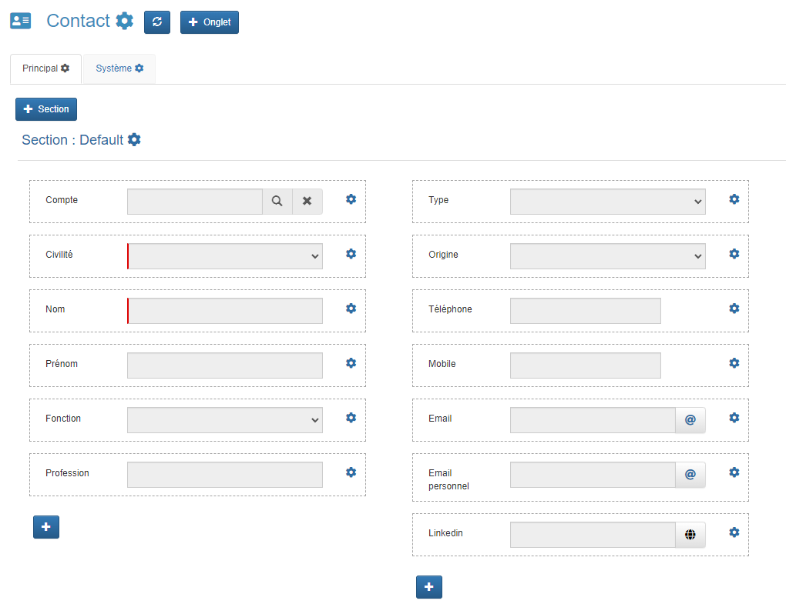

### Agencer la vue `Par défaut`

* Dans le menu **Application** > cliquer sur le sous-menu **CRM** > et cliquer sur **Contact**

    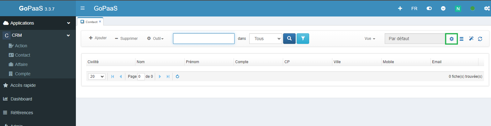

* Cliquer sur l'icône de modification  pour accéder aux paramètres de la vue pour pouvoir la personnaliser.
* Cliquer sur l'onglet `Champs` pour voir la liste des champs de la table **Contact** dans la colonne de gauche.

    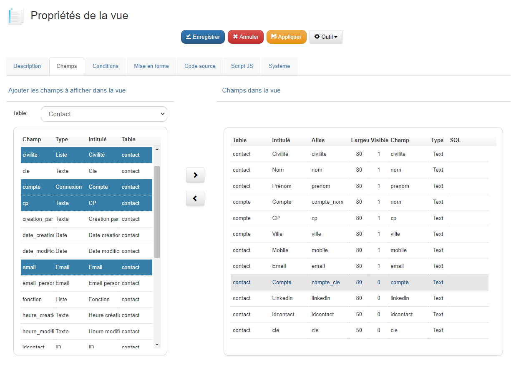

* Sélectionner les champs à afficher dans la vue.
  > *Astuce : Sélectionner plusieurs champs simultanément en maintenant la touche CTRL enfoncée.*
* Après avoir sélectionné les champs, cliquer sur la flèche  pour les ajouter.
* Cliquer sur le bouton **Enregistrer** pour appliquer les modifications.
* Pour voir les changements effectués, fermer la vue actuelle et la ré-ouvrir.

    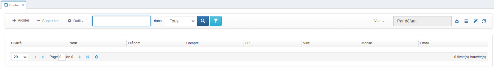

## Vue liée

### Création de la vue liée

Pour afficher les **Contacts** sur le **Compte**, créer une vue liée.

- Pour cela, ouvrir la vue "Par défaut" des **Contacts** et cliquer sur 

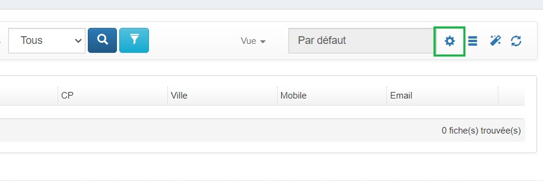

- Dans le menu outil, cliquer sur **Dupliquer**.

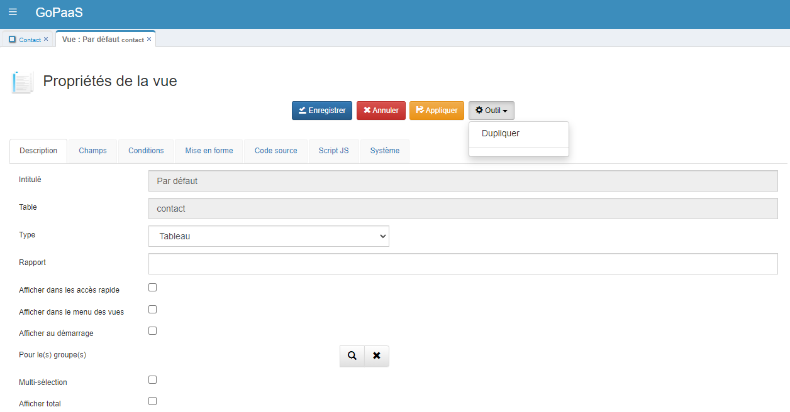

- Renommer la nouvelle vue **LinkCompteActions**

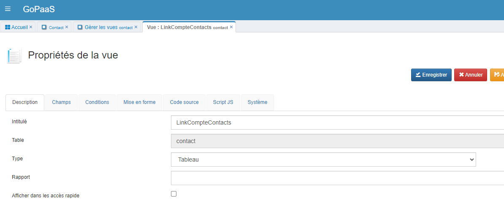

- Cliquer sur l'onglet `Conditions` pour établir la connexion avec la table `Compte`.
- Sélectionner le champ **compte** puis cliquer sur la flèche  pour ajouter le champ dans les conditions de la vue.
  
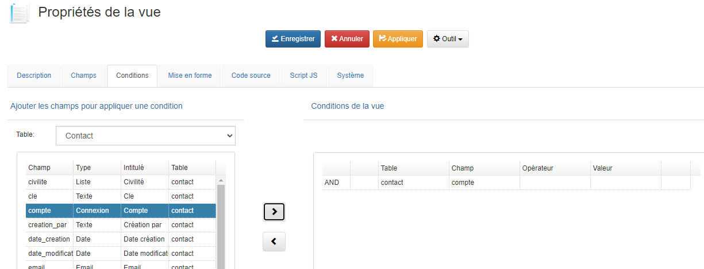

- Ouvrir la condition, puis ajouter la valeur **(-TrigItemName-)** et enregistrer la fiche.
  
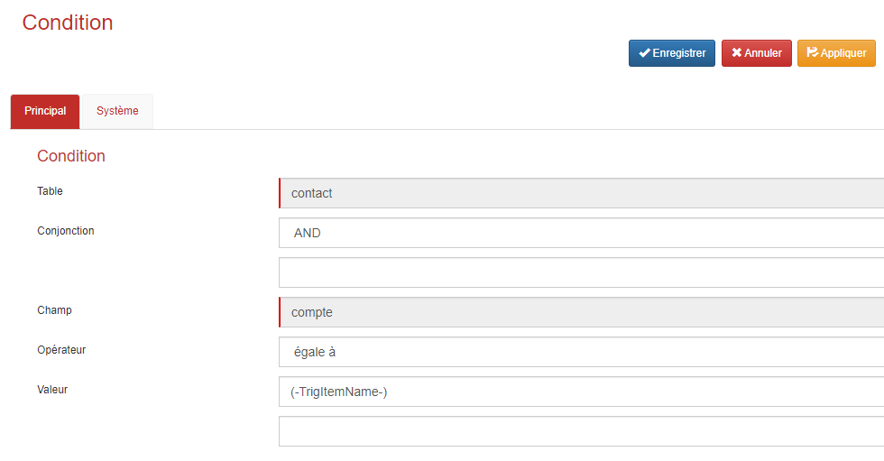

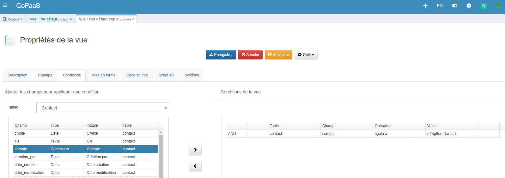

- Cliquer sur le bouton **Enregistrer** pour appliquer les modifications.
  
### Ajouter l'onglet dans la table **Compte**

Dans le menu personnalisation :
- Cliquer sur le menu `Tables` pour afficher la vue avec la liste de toutes les tables.
- Rechercher la table **Compte** et double cliquer sur la fiche pour l'ouvrir.

    

#### Ouvrir le FormDesigner
- Cliquer sur le menu `Outil` de la fiche puis `FormDesigner`.
- Dans le menu qui apparaît cliquer sur **FormDesigner**.

    

- Cliquer sur le bouton 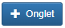 pour ajouter un nouvel onglet.

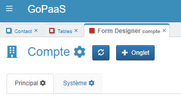

- Renseigner l'intitulé, le label et l'ordre du nouvel onglet.

| Nom des champs        | Description                        |
|------------------------|-----------------------------------------------|
| Intitulé | Le nom doit être unique sur la table.        |
| Label    | Le texte qui apparaîtra sur le formulaire.   |
| Ordre    | La position de l'onglet dans l'affichage.       |

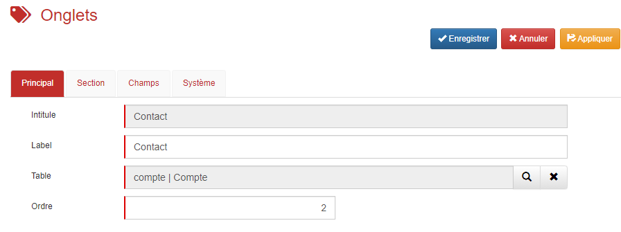

- Cliquer sur le bouton **Enregistrer** pour appliquer les modifications.
- Une fois la création de l'onglets terminée, cliquer sur le bouton  pour actualiser le FormDesigner et visualiser les modifications.

### Ajouter le champ de type **Vue**

- Cliquer sur le nouvel onglet  `Contact`

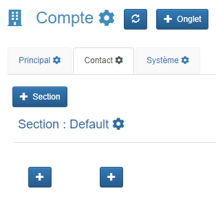

* Modifiez la `Section : Default` avec le bouton 

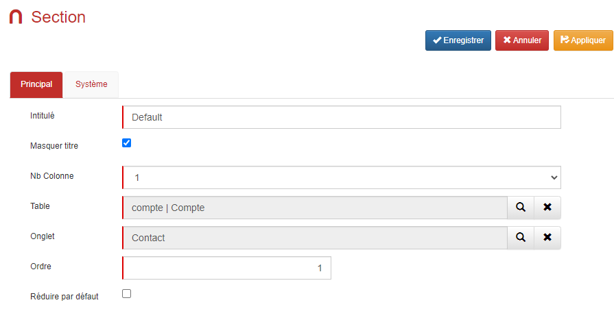

* Mettre NB colonne a `1`, Ordre à `1` et enregistrer la section.

- Une fois la modification de la section terminée, cliquer sur le bouton  pour actualiser le FormDesigner et visualiser les modifications.

* Cliquez sur le bouton `+` pour ajouter un nouveau champ.

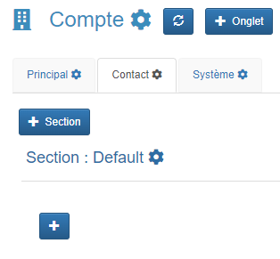

#### Configurer le Champ

| Nom des champs | Valeur                          |
|----------------|-------------------------------|
| Type            | Vue           |
| Nom de la table | contact (table à partir de laquelle vous souhaitez insérer la vue) |
| Nom champ   | nom de la vue que vous avez créée `LinkCompteContacts` |

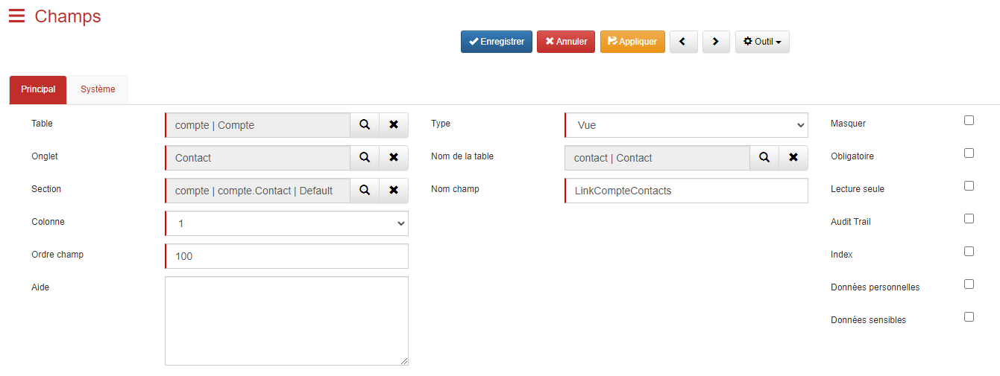

- Cliquer sur le bouton **Enregistrer** pour appliquer les modifications.

#### Actualiser le `FormDesigner`

* Une fois que vous avez terminé, cliquez sur le bouton  pour mettre à jour le `FormDesigner` et visualiser les modifications.

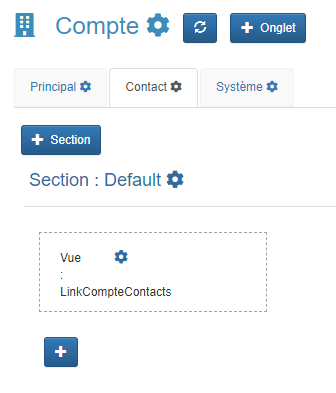

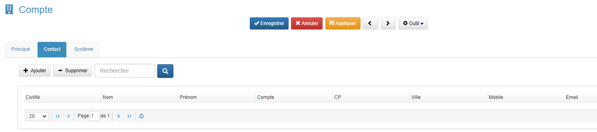