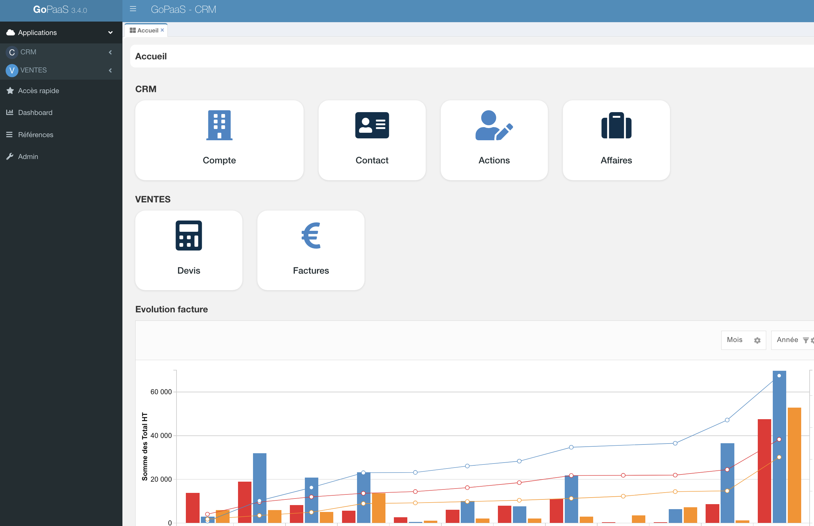

## Création d'un CRM

L'objectif de cette formation est de vous guider dans la création d'un CRM (Customer Relationship Management) sur GoPaaS, afin de centraliser et de gérer efficacement vos relations clients, en optimisant la collecte, le suivi et l'analyse des données clients.

### Définition

Un **CRM (Customer Relationship Management)** est un système ou une stratégie qui centralise toutes les informations et interactions liées aux clients et prospects. Il permet de suivre l'historique des communications, de gérer les ventes, d'automatiser certaines tâches marketing, et d'analyser les comportements des clients. Les principaux bénéfices d'un CRM incluent une meilleure organisation des données, une communication plus personnalisée avec les clients, une amélioration de la satisfaction client, et une augmentation des ventes grâce à une gestion plus efficace des opportunités commerciales.
### Création des tables

- **Compte** : Gestion des comptes clients, fournisseurs, partenaires

- **Contact** : Contact physique au sein des comptes

- **Action** : Échange de type email, appel, RDV

- **Affaire** : Opportunité de vente

#### Relation

| Table 1 | Relation | Table 2 | Type de relation |
|---------|----------|---------|-----------------|
| compte  | 1 à n    | contact | Vue liée        |
| compte  | 1 à n    | action  | Vue liée        |
| compte  | 1 à n    | affaire | Vue liée        |
| contact | 1 à 1    | compte  | Connexion       |
| contact | 1 à n    | action  | Vue liée        |
| contact | 1 à n    | affaire | Vue liée        |
| affaire | 1 à 1    | compte  | Connexion       |
| affaire | 1 à 1    | contact | Connexion       |
| affaire | 1 à n    | action  | Vue liée        |
| action  | 1 à 1    | compte  | Connexion       |
| action  | 1 à 1    | contact | Connexion       |
| action  | 1 à 1    | affaire | Connexion       |
