# Form Designer

## Description

Le **Form Designer** est un outil puissant qui permet d'éditer et de personnaliser l'organisation des formulaires. Avec cet outil, vous pouvez créer, déplacer et modifier les champs, les onglets et les sections. Que ce soit pour ajuster la disposition ou pour ajouter de nouveaux éléments, le **Form Designer** vous donne un contrôle total sur la structure et le contenu de vos formulaires.

## Création d'une table

Pour créer une nouvelle table, suivez les étapes ci-dessous :

1. Rendez-vous dans le menu, puis sélectionnez **Tables**.

   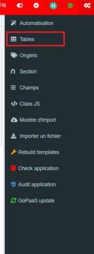
2. Cliquez sur le bouton **Ajouter**.

   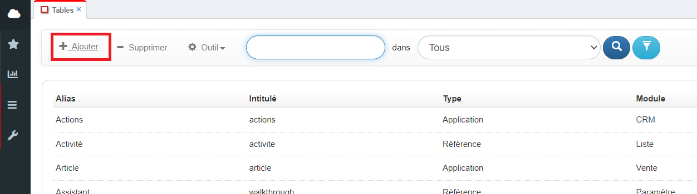
3. Remplissez le formulaire suivant :

   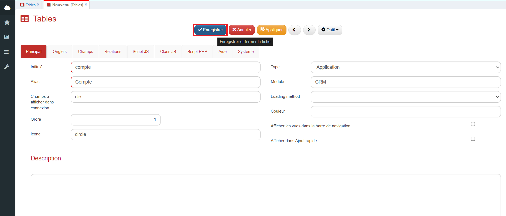

   | Champ                                                   | Description                                                                                                                                                                                                                                                                                                                                                                                                                                                                                                                                                                                                                                                                    |
   | ------------------------------------------------------- | ------------------------------------------------------------------------------------------------------------------------------------------------------------------------------------------------------------------------------------------------------------------------------------------------------------------------------------------------------------------------------------------------------------------------------------------------------------------------------------------------------------------------------------------------------------------------------------------------------------------------------------------------------------------------------ |
   | **Intitulé**                                     | Le nom de la table en base de donnée                                                                                                                                                                                                                                                                                                                                                                                                                                                                                                                                                                                                                                          |
   | **Alias**                                         | Le nom de la table dans l'application                                                                                                                                                                                                                                                                                                                                                                                                                                                                                                                                                                                                                                          |
   | **Champs à afficher dans connexion**             | Définir les champs à afficher dans un champ de type connexion sur une autre table Séparer les champs par une virgule pour en afficher plusieurs lors de la connexion                                                                                                                                                                                                                                                                                                                                                                                                                                                                                                   |
   | **Ordre**                                         | Ordre de la table dans la barre de navigation                                                                                                                                                                                                                                                                                                                                                                                                                                                                                                                                                                                                                                  |
   | **Icône**                                        | Icône de la table dans la barre de navigation, aller à l'URL suivante pour avoir accès à la bibliothèque d'icônes. ([https://fontawesome.com/v5/search](https://fontawesome.com/v5/search))                                                                                                                                                                                                                                                                                                                                                                                                                                                                                 |
   | **Type**                                          | Choisir l'onglet de la barre de navigation dans lequel afficher la table                                                                                                                                                                                                                                                                                                                                                                                                                                                                                                                                                                                                       |
   | **Module**                                        | Choisir le module de la barre de navigation dans lequel afficher la table                                                                                                                                                                                                                                                                                                                                                                                                                                                                                                                                                                                                      |
   | **Loading method**                                | Choisir l’option de chargement des données des fiches de la table **Synchronous** : Les données se chargent en arrière-plan et l’utilisateur peut interagir avec l’interface **Asynchronous** : Toutes les données et les interfaces sont pré-chargées et prêtes à être consultées immédiatement **Lazy** : Seul les données de l’onglet principal se chargent et l’utilisateur peut interagir avec l’interface **SmartLoad** : Les données de l’onglet principal et toutes les interfaces sont pré-chargées, prêtes à être consultées immédiatement et l’utilisateur peut interagir avec l’interface |
   | **Couleur**                                       | Choisir la couleur en anglais (green) ou au format hexadécimal (#095A35) pour modifier la couleur des onglets et des intitulés des sections                                                                                                                                                                                                                                                                                                                                                                                                                                                                                                                                  |
   | **Afficher les vues dans la barre de navigation** | Cocher cette option permet d'afficher le menu des vues en sous-menu dans la barre de navigation                                                                                                                                                                                                                                                                                                                                                                                                                                                                                                                                                                                |
   | **Afficher dans Ajout rapide**                    | Cocher cette option permet d'afficher une option de création rapide                                                                                                                                                                                                                                                                                                                                                                                                                                                                                                                                                                                                           |
4. Une fois le formulaire rempli, cliquez sur **Enregistrer**. La table sera alors créée dans la base de données.
5. Pour rendre la table accessible, déconnectez-vous puis reconnectez-vous.

   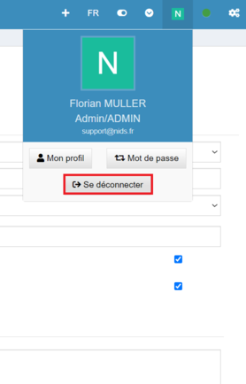
6. Retournez dans la vue des tables, puis dans le menu **Outil**, cliquez sur **Form Designer**.

   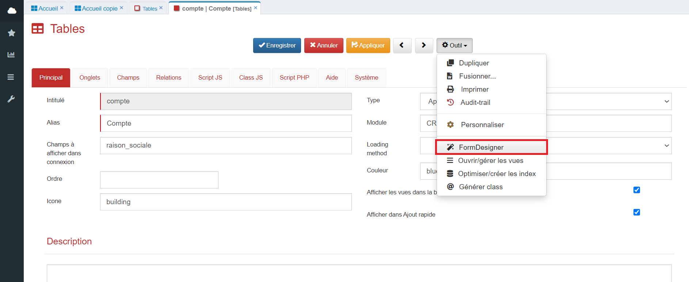

## Utilisation du Form Designer

### Ajouter un onglet

1. Dans l'interface du Form Designer, cliquez sur le bouton **Onglet**.

   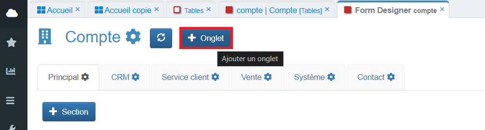
2. Remplissez le formulaire suivant :

   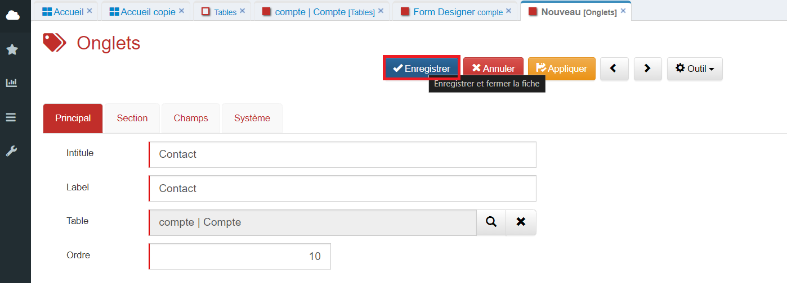

   | Champ               | Description                                      |
   | ------------------- | ------------------------------------------------ |
   | **Intitulé** | Nom du champ en base                             |
   | **Label**     | Étiquette visible pour l'onglet                 |
   | **Table**     | Nom de la table dans laquelle l'onglet se trouve |
   | **Ordre**     | Ordre de l'onglet sur la table                   |
3. Une fois le formulaire enregistré, cliquez sur le bouton de mise à jour pour actualiser l'interface du designer et voir apparaître les modifications.

   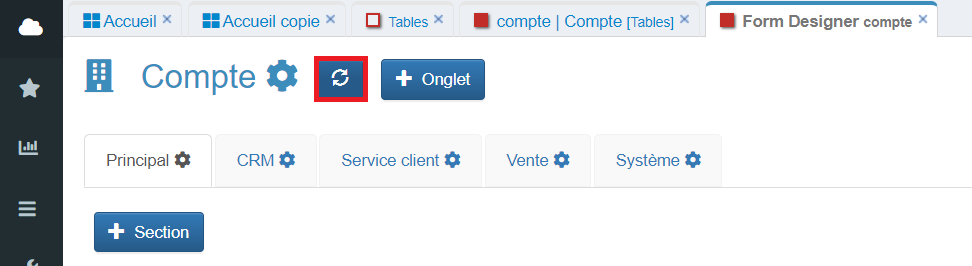

### Ajouter une section

1. Cliquez sur le bouton **Section** dans l'interface du Form Designer.

   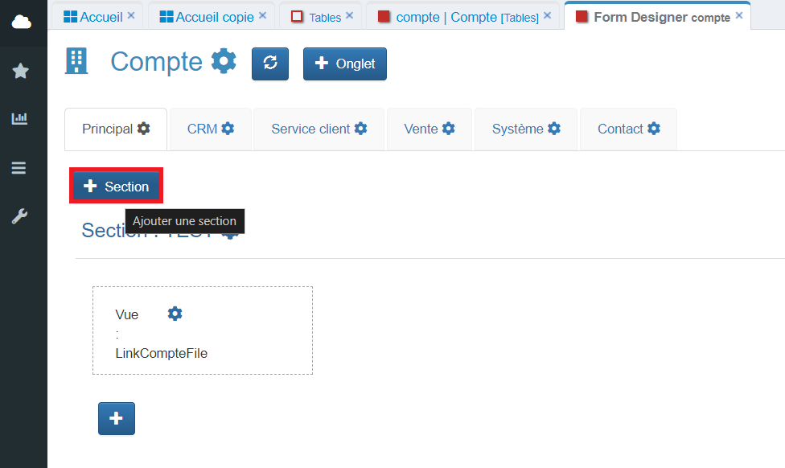
2. Remplissez le formulaire suivant :

   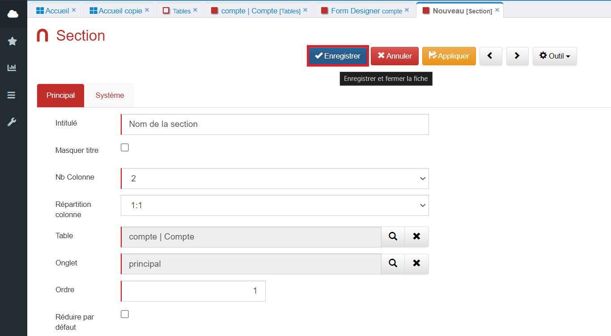

   | Champ                          | Description                                  |
   | ------------------------------ | -------------------------------------------- |
   | **Intitulé**            | Nom de la section                            |
   | **Masquer titre**        | Option pour masquer le titre de la section   |
   | **Nb Colonne**           | Nombre de colonnes dans la section           |
   | **Répartition colonne** | Répartition des colonnes entre elles        |
   | **Table**                | Table associée à la section                |
   | **Onglet**               | Onglet dans lequel la section sera affichée |
   | **Ordre**                | Ordre d'affichage de la section              |
   | **Réduire par défaut** | Option pour réduire la section par défaut  |
3. Mettez à jour l'interface du designer pour voir apparaître la nouvelle section.

   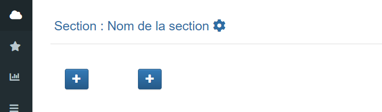

### Ajouter un champ

1. Cliquez sur le bouton **+** pour ajouter un champ.

   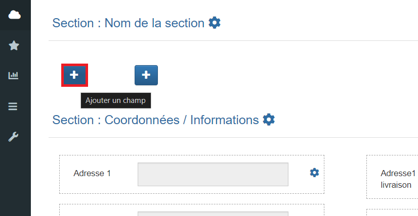
2. Remplissez le formulaire suivant :

   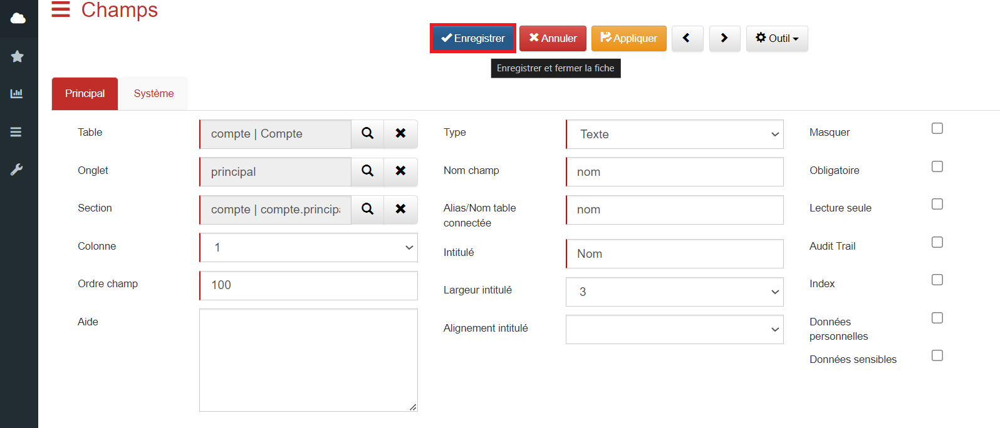

   | Champ                                | Description                                                                                                                                                                      |
   | ------------------------------------ | -------------------------------------------------------------------------------------------------------------------------------------------------------------------------------- |
   | **Table**                      | Table à laquelle le champ est lié                                                                                                                                              |
   | **Onglet**                     | Onglet dans lequel le champ sera affiché                                                                                                                                        |
   | **Section**                    | Section dans laquelle le champ sera affiché                                                                                                                                     |
   | **Colonne**                    | Définir le numéro de colonne, une section peut contenir au maximum 3 colonnes                                                                                                  |
   | **Ordre champ**                | Ordre du champ dans la colonne                                                                                                                                                   |
   | **Type**                       | Plusieurs types de champs sont mis à disposition                                                                                                                                |
   | **Nom champ**                  | Nom du champ en base de données                                                                                                                                                 |
   | **Alias/Nom Table connectée** | L'alias du champ doit être unique dans toute l'application Dans le cas où le champ créé est de type *connexion* , il faut renseigner le nom de la table à connecter |
   | **Intitulé**                  | Nom du champ dans l'application.                                                                                                                                                 |
   | **Largeur intitulé**          | Largeur du label du champ                                                                                                                                                        |
   | **Alignement intitulé**       | Alignement du label (ex : Gauche, Droite, Centre)                                                                                                                                |
3. Une fois le champ enregistré, mettez à jour l'interface pour le rendre visible.

   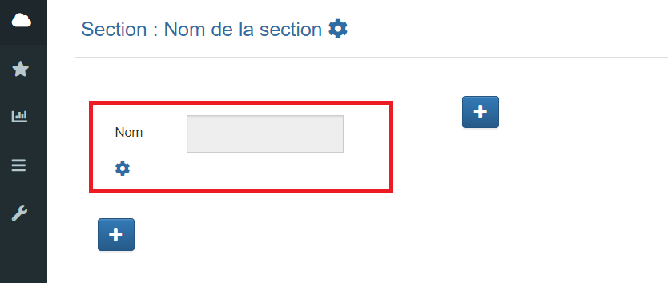
4. Vous pouvez également déplacer un champ par glisser-déposer.

   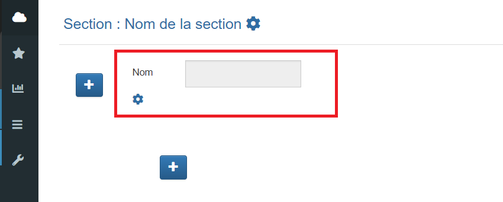

## Gestion des vues

Pour gérer les vues associées à une table, suivez ces étapes :

1. Retournez dans les paramètres de la table, ouvrez le menu **Outil**, puis cliquez sur **Ouvrir/gérer les vues**.

   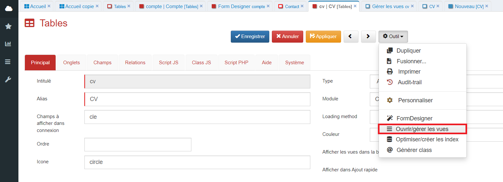
2. Vous arriverez sur cette interface avec trois vues par défaut.

   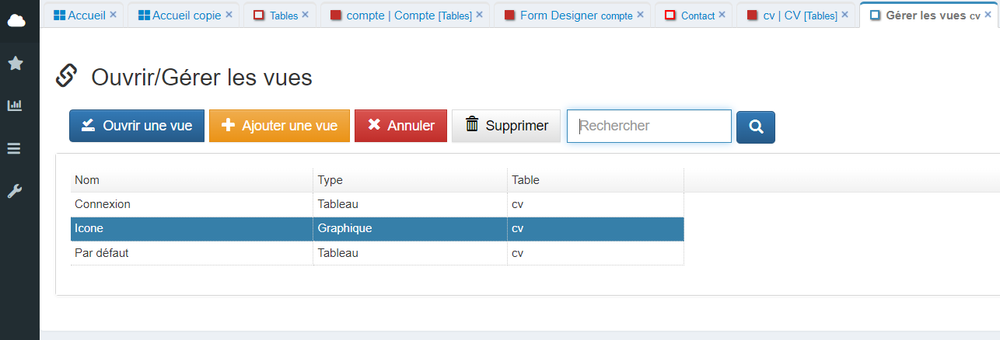
3. En sélectionnant la vue **Par défaut** et en cliquant sur **Ouvrir une vue**, vous accéderez à la vue par défaut de la table sélectionnée.

   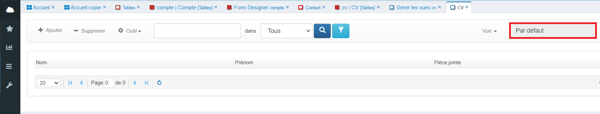
4. En sélectionnant la vue **Connexion** et en cliquant sur **Ouvrir une vue**, vous accéderez à la vue Connexion de la table sélectionnée.

   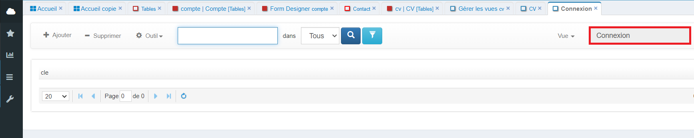
5. En sélectionnant la vue **Icône** et en cliquant sur **Ouvrir une vue**, vous accéderez à la vue Icône de la table sélectionnée.

   
