# Automatisation

## Description

Les automatisations permettent à GoPaaS d'accomplir des tâches répétitives ou routinières, telles que l’envoi d’un email quotidien à 9 heures contenant les tâches de la journée, ou encore des tâches plus complexes, comme l’envoi d’un email à un commercial responsable d’un compte pour lequel un technicien a signalé un incident important ou critique.

Dans le menu de personnalisation de l'application, cliquez sur "Automatisation" pour accéder à cette fonctionnalité.

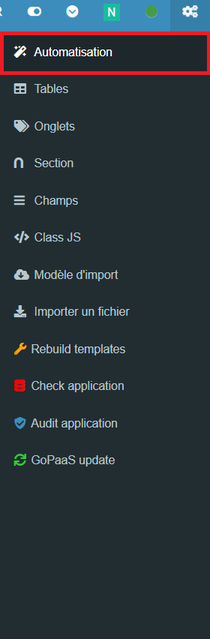

## Fonctionnement des automatisations

Une automatisation est une série d’instructions que GoPaaS exécute automatiquement en réponse à un événement spécifique. Pour créer une automatisation, il est nécessaire de définir un déclencheur. Le nombre de conditions et d’actions consécutives est illimité.

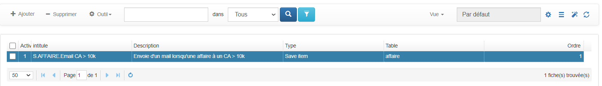

### **Exercice :**

Lors de l'enregistrement d'une nouvelle affaire avec un CA > 10 000€, envoyez un email à mgooriah@nids.fr.

Pour ce faire, cliquez sur le bouton "Ajouter" pour créer une nouvelle fiche.

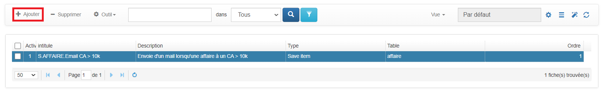

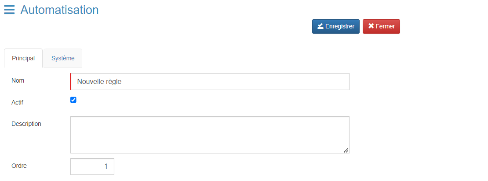

| Champ                 | Description                                                           |
| --------------------- | --------------------------------------------------------------------- |
| **Nom**         | Intitulé de l'automatisation                                         |
| **Actif**       | Si coché, l'automatisation est activée, sinon elle est désactivée |
| **Description** | Description de l'automatisation                                       |
| **Ordre**       | Ordre d'apparition dans la vue                                        |

Une fois les champs remplis, cliquez sur le bouton "Enregistrer" pour sauvegarder.

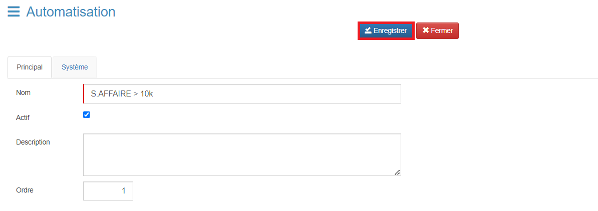

Ouvrez de nouveau la fiche pour accéder aux paramètres d'automatisation.

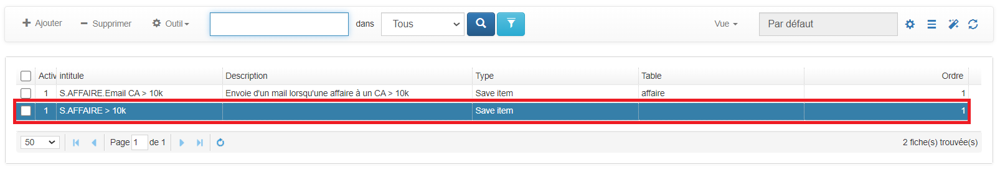

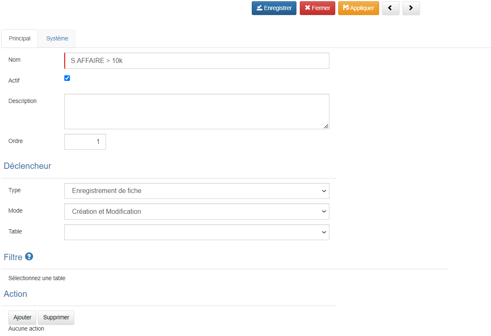

#### Déclencheur

Un déclencheur est un événement qui lance l’exécution de l’automatisation.

Il existe deux types de déclencheurs :

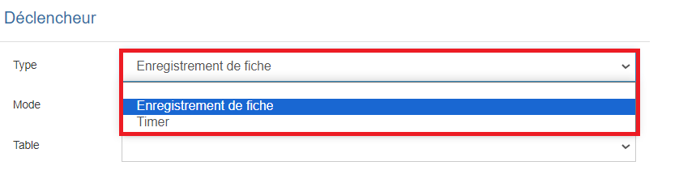

##### Enregistrement d’une fiche

L'automatisation se déclenche lors de l'enregistrement de la fiche. Plusieurs paramètres doivent être pris en compte.

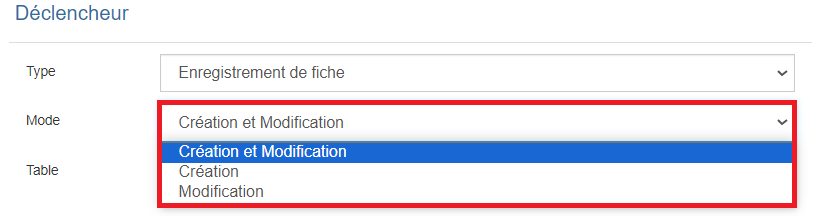

| Intitulé | Description                                                                                                                                              |
| --------- | -------------------------------------------------------------------------------------------------------------------------------------------------------- |
| Mode      | Création et Modification = Créer et modifier une ou plusieurs fiches Création = Créer une nouvelle fiche Modification = Modifier une fiche |
| Table     | Sélection de la table concernée par l’automatisation                                                                                                  |

Dans le cadre de l'exercice, nous allons choisir "Enregistrement de fiche" et "Création" sur la table "Affaire".

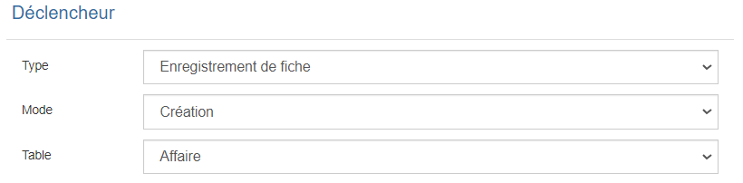

Ensuite, dans la section "Filtre", sélectionnez le champ "CA" avec la condition "supérieur ou égal à" et une valeur de 10 000.

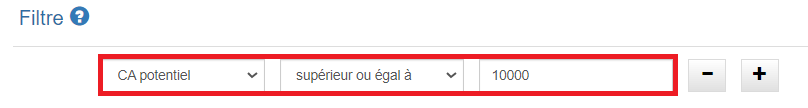

Dans la section "Action", cliquez sur "Ajouter" pour créer une nouvelle action.

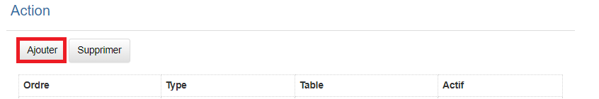

Sélectionnez le type "Email".

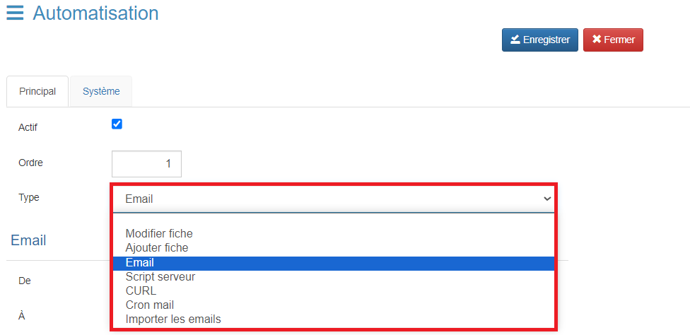

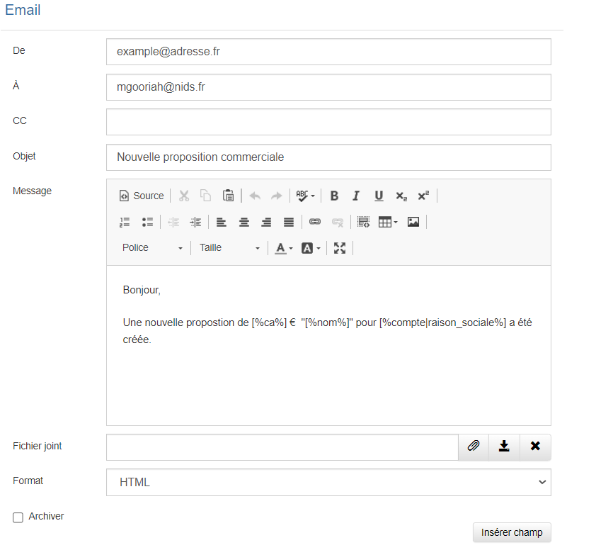

- **De :** Expéditeur de l'email
- **À :** Destinataire de l'email
- **CC :** Copie carbone
- **Objet :** Objet de l'email
- **Message :** Contenu de l'email
- **Fichier joint :** Fichier à joindre à l'email
- **Format :** "HTML" pour un formatage avancé ou "Texte" pour un texte simple
- **Archiver :** Option pour archiver l'email

Pour insérer un champ de la table "Affaire", utilisez le bouton "Insérer champ".

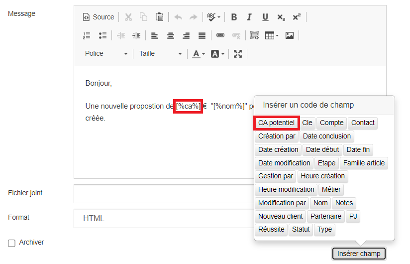

Ensuite, enregistrez la fiche.

##### Timer

L'automatisation se déclenche en fonction d'une configuration temporelle. Plusieurs autres paramètres doivent être pris en compte.

| Intitulé  | Description                                             | Explication                                                                                                                                       |
| ---------- | ------------------------------------------------------- | ------------------------------------------------------------------------------------------------------------------------------------------------- |
| Fréquence | x minutes                                               | Spécifie le temps en minutes entre chaque déclenchement                                                                                         |
| Heure      | Heure                                                   | Spécifie l'intervalle régulier entre chaque déclenchement. Par exemple : 15, l'automatisation se déclenchera chaque heure à la 15ème minute |
| Jour       | Jour                                                    | Spécifie le(s) jour(s) de la semaine et l’heure de déclenchement                                                                               |
| Mois       | Mois                                                    | Spécifie le jour du mois et l’heure de déclenchement                                                                                           |
| Table      | Sélection de la table concernée par l’automatisation |                                                                                                                                                   |

## Actions

Cette dernière section permet d’ajouter les actions à exécuter lorsque les conditions sont respectées.

Au total de sept actions sont disponibles dans GoPaaS.

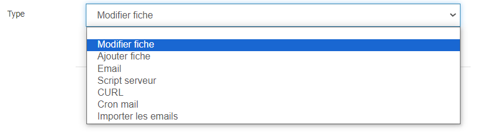

| Nom de l'action          | Description                                                     |
| ------------------------ | --------------------------------------------------------------- |
| **Modifier fiche**      | Modifier la fiche spécifiée dans le déclencheur.             |
| **Ajouter fiche**       | Ajoute une nouvelle fiche dans une table que l'on sélectionne. |
| **Email**               | Envoyer un email personnalisé                                  |
| **Script serveur**      | Exécuter un script PHP côté serveur (back-end).              |
| **CURL**                | Exécuter une requête cURL                                     |
| **Cron mail**           | Exécuter une tâche cronmail                                   |
| **Importer les emails** | Exécuter une tâche d’import d’email                         |

A l’image des conditions, plusieurs actions peuvent être cumulées dans une seule automatisation.

## A savoir

Ajouter ces options supplémentaires dans les champs de fusion pour formater un champ.

| Méthode                                       | Description                                                         | Exemple                         |
|-----------------------------------------------|---------------------------------------------------------------------|---------------------------------|
| **Date FR vers Date SQL (Y-m-d)**              | Convertit une date du format FR au format SQL (Y-m-d).                | [%datefrtosql/date_client%]     |
| **1ère lettre en majuscule**                   | Met la première lettre d'un texte en majuscule.                      | [%ucfirst/nom_contact%]         |
| **Nombre avec aucun chiffre après la virgule** | Formate un nombre sans chiffres après la virgule.                     | [%number0/ca%]                  |
| **Nombre avec 1 chiffre après la virgule**     | Formate un nombre avec un chiffre après la virgule.                  | [%number1/ca%]                  |
| **Nombre avec 2 chiffres après la virgule**    | Formate un nombre avec deux chiffres après la virgule.               | [%number2/ca%]                  |