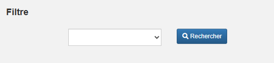
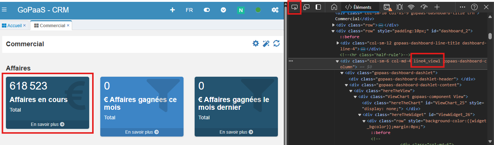

# Script JS - Dashboard

## Description

Le thème abordé est la personnalisation du tableau de bord, incluant le masquage d'éléments et l'application de filtres.

### Filtre

```
<div class="form-group">
  <label for="famille_article" class="col-sm-1 control-label">
      <span class="trn"></span>
  </label>
  <div class="col-sm-2">
    <select operator="in" title="" id="dash_searchFilter1" name="ALIAS_CHAMP_FILTRE" class="form-control  gopaas-field gopaas-field-list">
        <option class="trn" value=""></option>
        <option class="trn" value="CLEF_1">A</option>
        <option class="trn" value="CLEF_2">B</option>
        <option class="trn" value="CLEF_3">C</option>
     </select>
  </div>
</div>

<div class="col-sm-1">
  <button type="button" id="dash_searchFilterButton" class="btn btn-primary btn-sm trn-title gopaas-refresh" style="margin-right:3px;" title="Rechercher">
    <i class="fas fa-search"></i>&nbsp;<span class="hidden-xs trn">Rechercher</span>
      </button>
</div>
```

Exemple :

```
<div class="form-group">
  <label for="famille_article" class="col-sm-1 control-label">
      <span class="trn"></span>
  </label>
  <div class="col-sm-2">
    <select operator="in" title="" id="dash_searchFilter1" name="entreprise" class="form-control  gopaas-field gopaas-field-list">
        <option class="trn" value=""></option>
        <option class="trn" value="1642067984342_A">A</option>
        <option class="trn" value="1611318445524_C">B</option>
        <option class="trn" value="1619006799683_D">C</option>
     </select>
  </div>
</div>

<div class="col-sm-1">
  <button type="button" id="dash_searchFilterButton" class="btn btn-primary btn-sm trn-title gopaas-refresh" style="margin-right:3px;" title="Rechercher">
    <i class="fas fa-search"></i>&nbsp;<span class="hidden-xs trn">Rechercher</span>
      </button>
</div>
```

Résultat :



A noter :

Il est nécessaire que la valeur contenue dans le champ "name" soit présente dans tous les widgets à filtrer.

### Masquer des éléments

Dans les paramètres du dashboard, onglet "Script JS", ajouter le script suivant :

```
    thisComponent.ui.find('.lineX_viewX').hide();
```

Exemple :

Pour trouver la classe du widget à masquer, il est nécessaire d'inspecter le dashboard.

Dans notre exemple, nous avons inspecté le premier widget du tableau de bord "Affaires en cours" et constaté qu'il occupe la position : line4_view1.



Résultat :

```
function onLoad_dashboard18(){
    var thisComponent = this;

    thisComponent.ui.find('.line4_view1').hide();
}
```