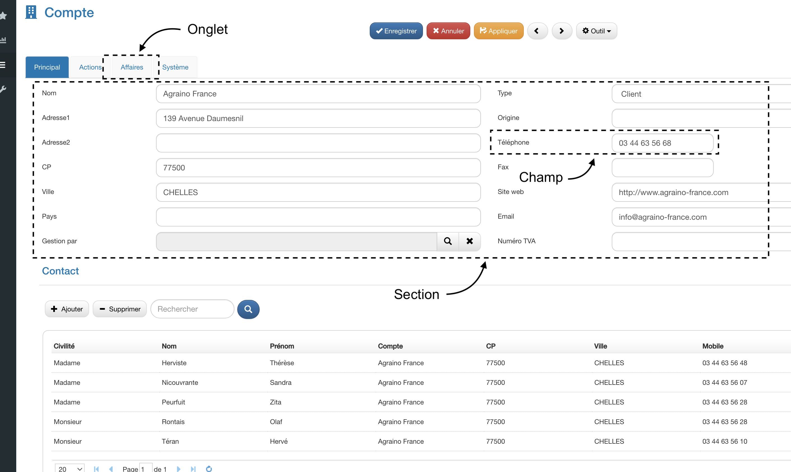
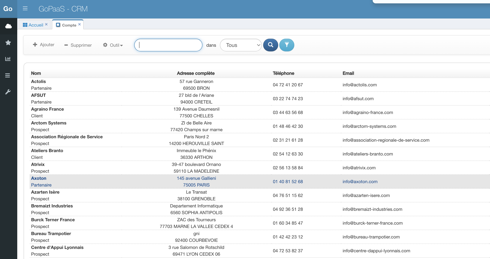
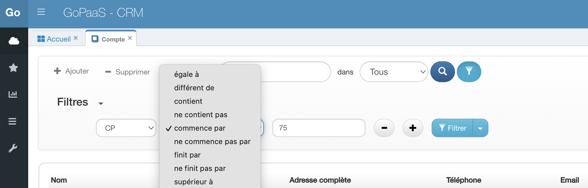
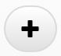
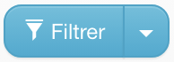
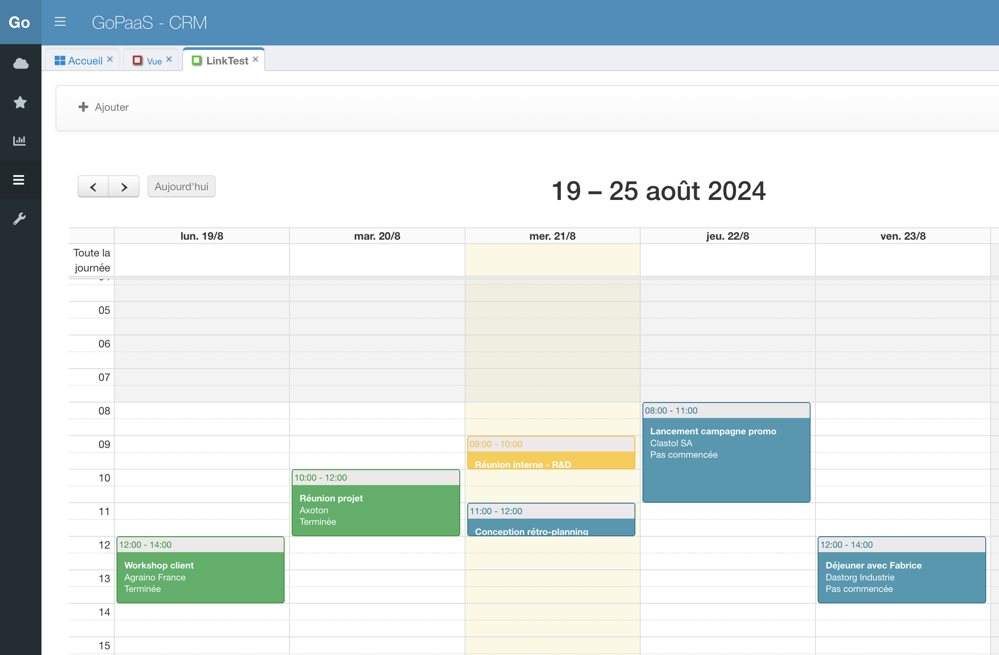
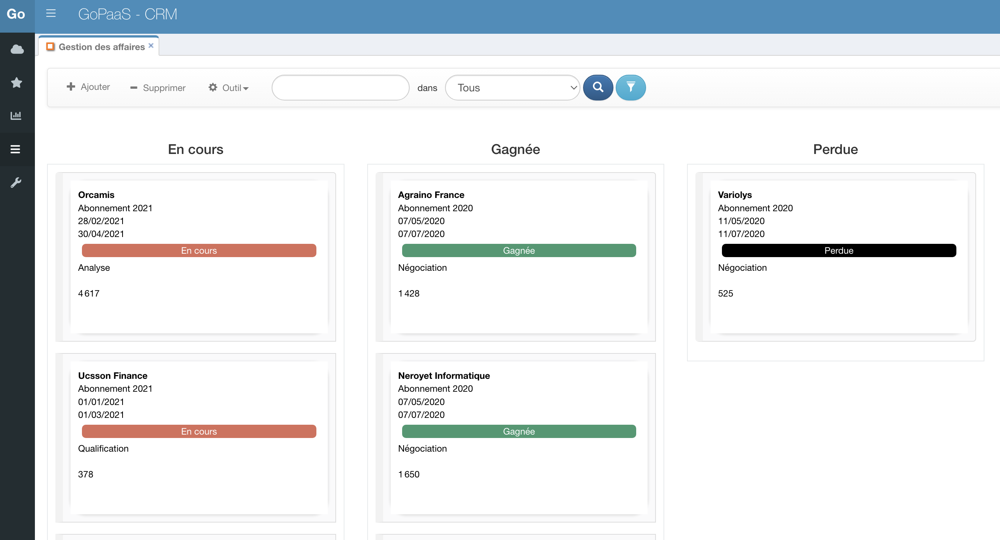
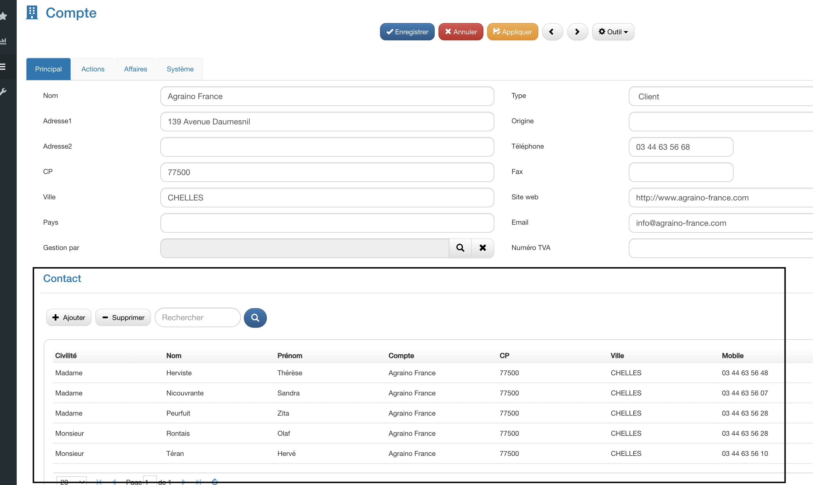
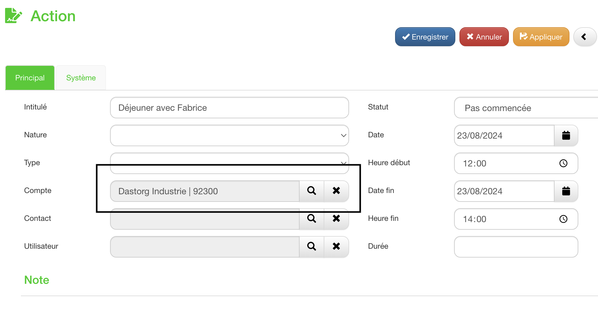
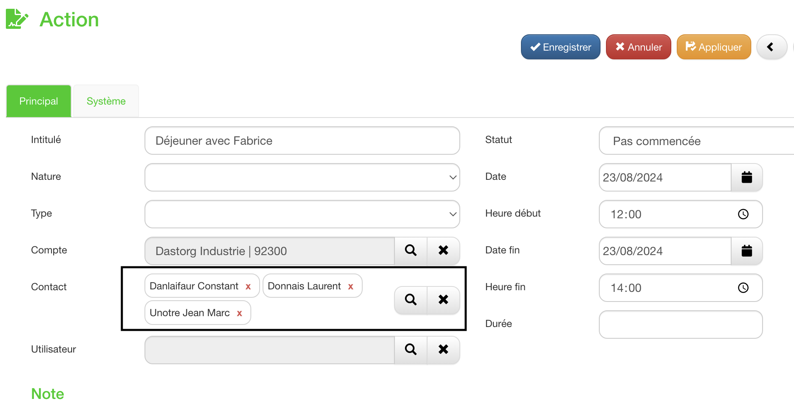

# Composants

## Les fiches

Quand vous saisissez des données dans une catégorie vous créez un nouvel enregistrement, ou ce que GoPaaS appelle une fiche. Par exemple, dans la table Contact figure la fiche Dupont, avec son nom, son adresse et un certain nombre d’informations le concernant.

## Les vues
Pour visualiser les données saisies dans la base, GoPaaS met à votre disposition un ensemble de vues entièrement personnalisables. Ces vues peuvent se présenter sous forme de tableau, liste, agenda, graphique ou encore widget. Elles sont créées à partir d’une seule table mais peuvent afficher des informations issues d’autres tables grâce aux connexions (voir ci-après). Elles peuvent être triées, filtrées et sauvegardées sous des noms différents. Les vues liées, enfin, permettent de regrouper plusieurs vues dans un onglet d’une fiche. C’est un moyen très puissant de visualiser rapidement un ensemble d’informations liées.
### Tableau

#### Les filtres avancés

Pour activer la fonction filtre avancé sur une vue, cliquez sur ![[Bouton]](images/image3.png) puis sélectionnez la colonne sur laquelle effectuer la première condition, choisir l'opérateur et la valeur recherchée.

Il est possible de cummuler plusieurs conditions en cliquant sur le bouton 

Cliquez sur le bouton  pour lancer la recherche

Cliquez sur le bouton à droite du bouton pour enregistrer la recherche sur la vue.
### Agenda

Une vue agenda dans une application vous permet de visualiser et de gérer facilement tous vos événements, tâches, et rendez-vous sur une période donnée, comme une journée, une semaine, ou un mois. C’est un outil très pratique pour avoir un aperçu clair de votre emploi du temps, éviter les chevauchements d’engagements, et mieux organiser votre temps.
### Kanban

La vue Kanban dans GoPaaS est un outil visuel qui vous permet de suivre et de gérer vos tâches de manière simple et intuitive. Elle présente les tâches sous forme de cartes organisées en colonnes, chaque colonne représentant une étape du processus (par exemple : "À faire", "En cours", "Terminé").

En déplaçant les cartes d'une colonne à l'autre, vous pouvez facilement identifier les blocages et assurer un flux de travail fluide. C’est une méthode idéale pour gérer les projets et favoriser une meilleure collaboration au sein de l'équipe.

### Vue liée

Dans une application CRM, une vue liée des contacts associés à un compte client permet de visualiser tous les contacts rattachés à ce client spécifique. Cette vue facilite la gestion des relations client en centralisant toutes les données liées à un client en un seul endroit.

## Les connexions
Cette classification des données par table aurait bien peu d'intérêt si GoPaaS ne permettait de les relier entre elles et de respecter ainsi les associations que vous faites tout naturellement, dans votre esprit, entre différents types d'information. Telle note concerne tel projet et doit être communiquée à telle personne. Une telle réunion prend place dans telle salle, avec tels collaborateurs, et mobilise telles ressources. Dans GoPaaS ces liens s'appellent des connexions ; elles vous permettent de lier les informations entre elles et donc de ne les saisir qu'une fois, de les retrouver facilement, ou encore de naviguer rapidement dans votre base ; GoPaaS vous permettra d'en rajouter ou d'en supprimer librement.
### Connexion simple

Dans GoPaaS, un **champ de type connexion** permet de lier une fiche à une autre. Par exemple, lorsque vous créez une action, ce champ vous permet de la connecter directement à un compte client existant. Cela facilite la navigation et l'organisation en liant des éléments pertinents entre eux, assurant ainsi une gestion plus cohérente des informations.

### Connexion multiple

Dans GoPaaS, un **champ de connexion multiple** permet de lier une fiche à plusieurs autres fiches. Par exemple, lorsque vous créez une action, ce champ vous permet de la connecter à plusieurs contacts simultanément. Cela est utile pour gérer des interactions impliquant plusieurs parties prenantes, en assurant que toutes les connexions pertinentes sont centralisées et accessibles depuis une seule action.