# Dashboard

## Création du dashboard Accueil

Le dashboard centralise les informations des tables Compte, Contact, Affaire et Action sous forme de widgets.

Cela permet une visualisation simplifiée et un accès rapide aux données essentielles de l'application. Lors de l'ouverture d'un widget, la vue par défaut de la table correspondante est affichée.

1. Cliquez dans le menu **Références** > **Paramètre** > **Dashboard** pour ouvrir la vue des dashboards.
2. Cliquez sur le bouton `Ajouter`.

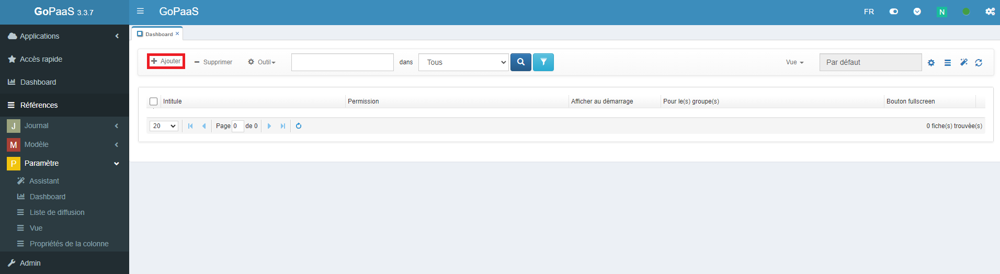

Vous accédez à l'interface de configuration du Dashboard.

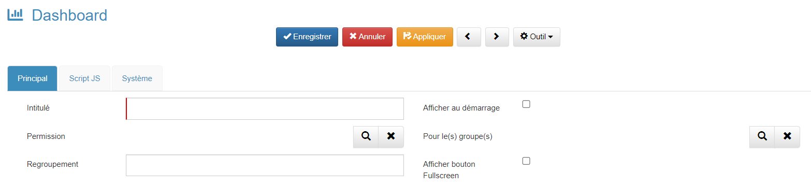

| Champs                               | Valeur                                                                                                   |
| ------------------------------------ | -------------------------------------------------------------------------------------------------------- |
| **Intitulé**                  | Nom du dashboard                                                                                         |
| **Permission**                 | Liste des groupes ayant accès au dashboard                                                              |
| **Regroupement**               | Regroupe le dashboard dans un dossier du menu `Dashboard`                                              |
| **Afficher au démarrage**     | Affiche le dashboard lors de la connexion de l'utilisateur (fonctionne avec le `Pour le(s) groupe(s)`) |
| **Pour le(s) groupe(s)**       | Liste des groupes pour lesquels le dashboard s'affichera au démarrage                                 |
| **Afficher bouton Fullscreen** | Permet d'afficher un bouton pour passer le dashboard en plein écran                                     |

Pour sélectionnez un groupe dans les permissions, cliquez sur l'icone 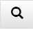.

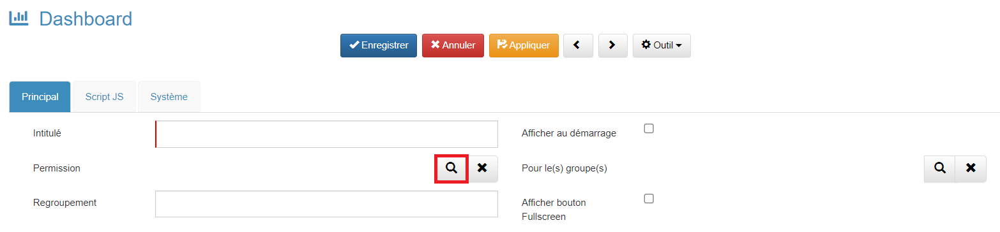

Sélectionnez le groupe qui aura accès au dashboard puis cliquez sur la flèche 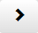.

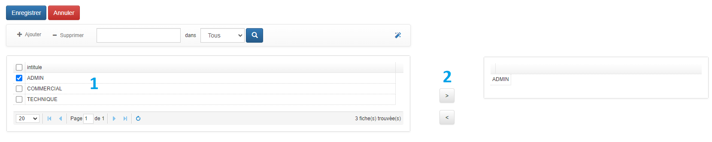

3. Cliquez sur le bouton `Enregistrer` pour appliquer les modifications.
4. Cliquez sur le bouton `Appliquer` pour enregistrer le Dashboard et pouvoir créer une ligne de dashboard.

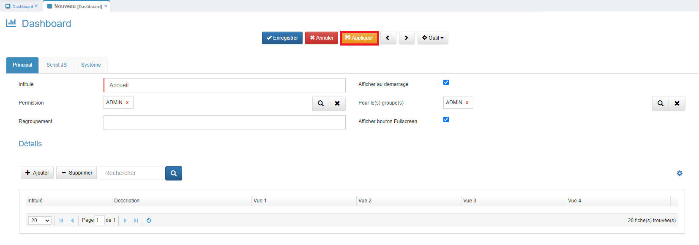

> ***Remarque :** "Afficher au démarrage", "Pour le(s) groupe(s)" et "Afficher bouton Fullscreen" sont des paramètres optionnels.*

5. Cliquez sur le bouton `Ajouter` de la section `Détails` pour ajouter une ligne de dashboard.

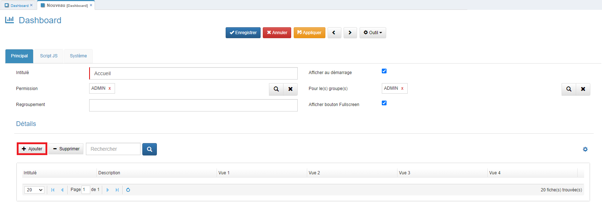

6. L'interface Dashboard Line, vous permet d'ajouter de nouvelles lignes sur le Dashboard et d'y insérer des widgets.

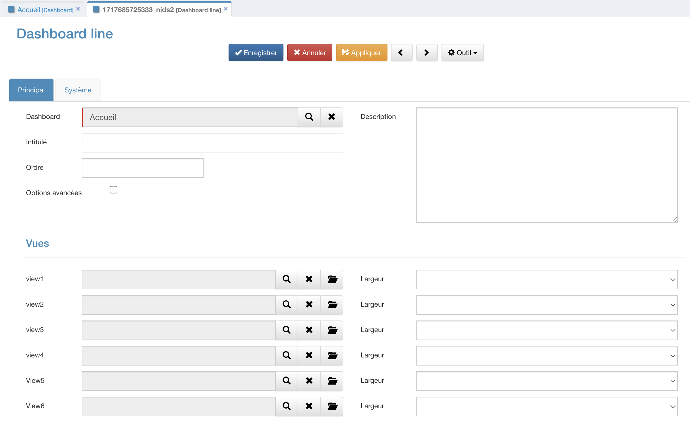

| Champs                      | Valeur                                                                                       |
| --------------------------- | -------------------------------------------------------------------------------------------- |
| **Dashboard**         | Dashboard auquel est relié la ligne de dashboard                                            |
| **Intitulé**         | Nom de la ligne de dashboard                                                                 |
| **Ordre**             | Ordre d'affichage de la ligne                                                                |
| **Options avancées** | Affiche l'onglet `HTML` qui permet de personnaliser plus en détail la ligne de dashboard  |
| **Description**       | Description de la ligne de dashboard                                                         |
| **View**              | Permet de sélectionner une vue de type**Graphique** qui apparaitra dans le dashboard  |
| **Largeur**           | Permet de sélectionner la largeur que prendra le**Widget** dans la ligne de dashboard |

7. Cliquer sur l'icone  du champ **view1**.
8. Chercher la table **compte** puis sélectionner la vue **Icone** de type **Graphique** en cliquant sur le bouton .

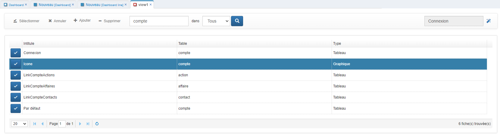

9. Cliquez sur l'icone  du champ **view2**.
10. Cherchez la table **contact** puis sélectionnez la vue **Icone** de type **Graphique** en cliquant sur le bouton .

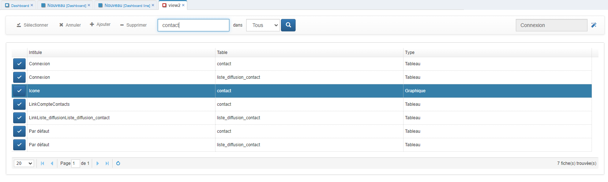

11. Cliquez sur l'icone  du champ **view3**.
12. Cherchez la table **affaire** puis sélectionnez la vue **Icone** de type **Graphique** en cliquant sur le bouton .

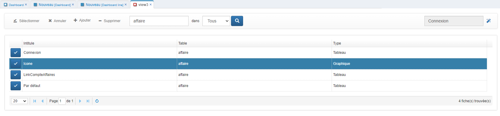

13. Cliquez sur l'icone  du champ **view4**.
14. Cherchez la table **action** puis sélectionnez la vue **Icone** de type **Graphique** en cliquant sur le bouton .

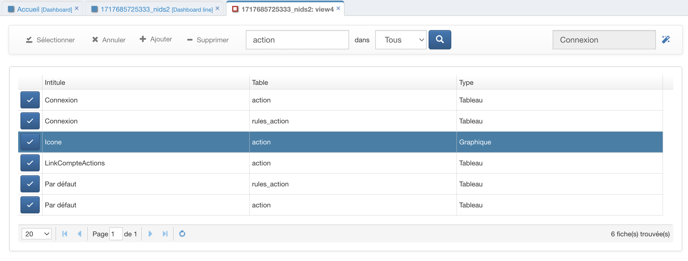

15. Sélectionnez une largeur 3 pour chaque Icone.

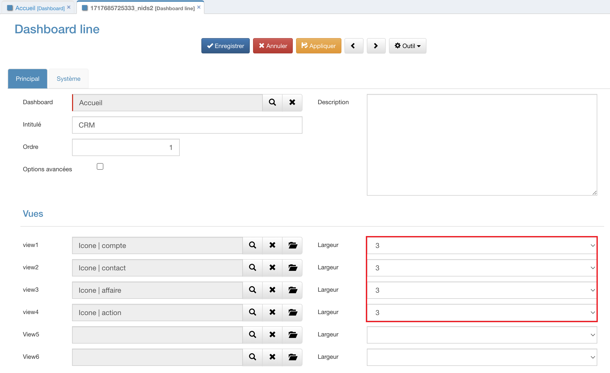

16. Cliquez sur le bouton `Enregistrer` pour appliquer les modifications de la ligne.

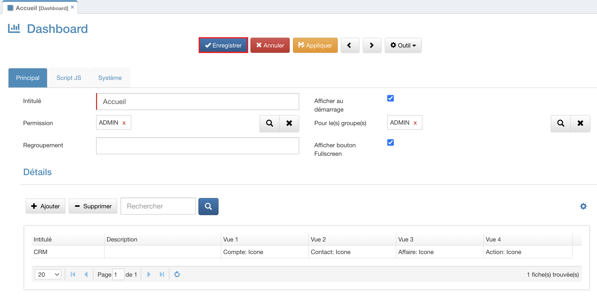

17. Cliquez sur le bouton `Enregistrer` pour appliquer les modifications du dashboard.
18. Actualisez l'application.

Pour modifier les icones des widgets, cliquez sur  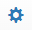.

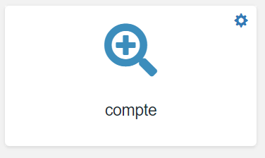

19. Cliquez sur l'onglet **Graphique** puis modifier le champ **Icône du widget** par une icone [Font Awesome](https://fontawesome.com/).

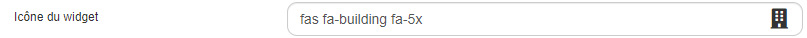

Icone **Compte** : `fas fa-building fa-5x`

Icone **Contact** : `fas fa-address-card fa-5x`

Icone **Affaire** : `fas fa-suitcase fa-5x`

Icone **Action** : `fas fa-file-signature fa-5x`

20. Cliquez sur le bouton `Enregistrer` pour appliquer les modifications de la vue.
21. Actualisez le dahsboard en cliquant sur le bouton  pour voir le résultat.

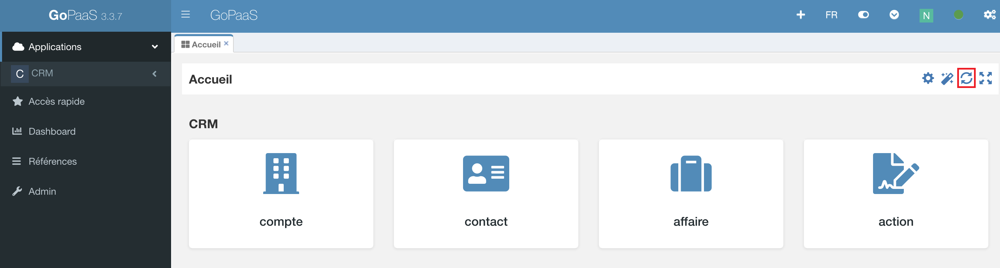

# Webreport

## Description

WebReport est un outil graphique qui vous permet d'obtenir une vue d'ensemble claire et détaillée des données sélectionnées, avec des options de calcul avancées pour une analyse approfondie et précise.

## Création d'un Webreport

Pour ajouter un WebReport dans GoPaaS vous devez créer un Dashboard ou utilisé un Dashboard existant.

1. Modifiez le dasboard en cliquant sur 
2. Une fois sur l'interface, ajouter une **nouvelle ligne de Dashboard**.

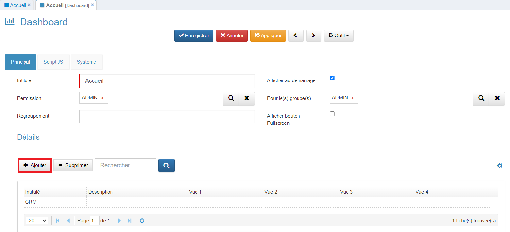

3. Donnez un Nom à cette nouvelle ligne plus cliquez sur le bouton `Appliquer` pour sauvegarder la fiche sans la fermer.

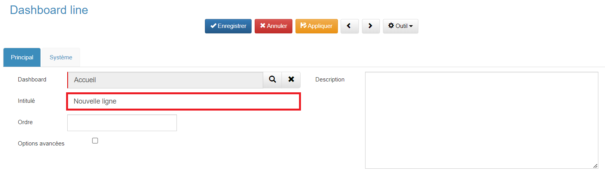

4. Cochez la case **« Options avancées »** pour afficher l’onglet **« Html »** puis l’ouvrir.

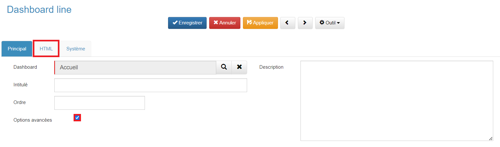

5. Dans le menu outil, cliquez sur l’option  `Ajouter un WebReport`.

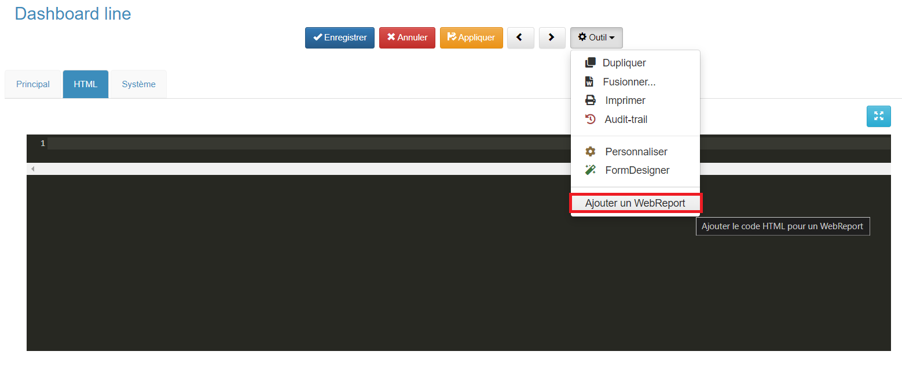

6. Cette option permet d’insérer dans le champ **« Html »** le script pour appeler le composant WebReport.

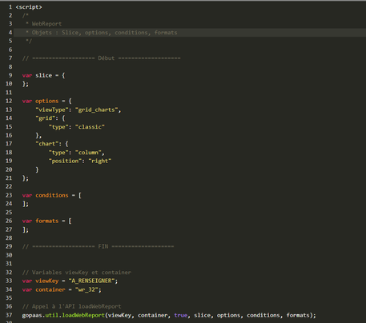

7. Les paramètres du script insérés devront être modifiés pour appeler une source de données existante ( **vue** ).
8. Rechercher la ligne suivante **« `var viewKey = "A_RENSEIGNER"` »** et remplacer la chaine **« A_RENSEIGNER »** par la **« cle »** de la vue avec la source de données souhaités. Par exemple  **« var viewKey = "Par défaut Affaire" »**.

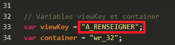

9. **Enregistrer** la ligne de dashboard et ouvrir le Dashboard pour afficher le WebReport avec la configuration par défaut.

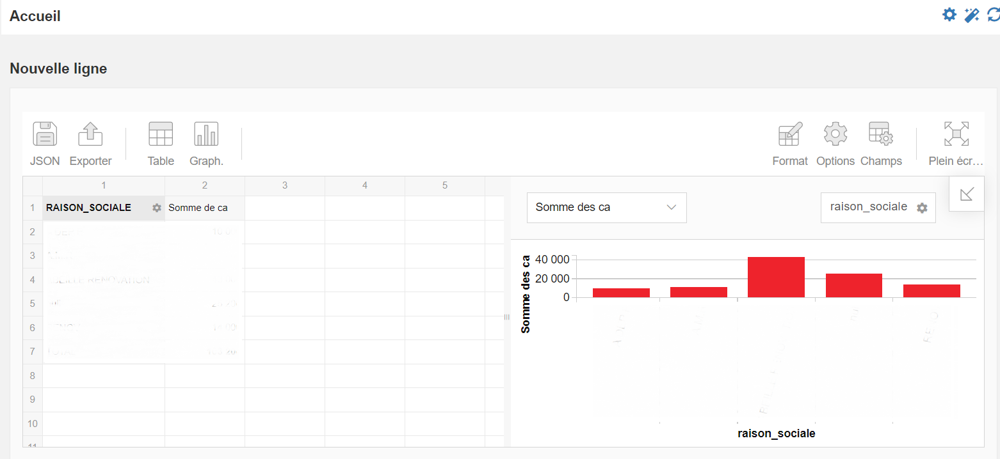

10. Cliquez sur la **flèche diagonale** en haut à droite du pivot pour modifier le WebReport en ajoutant des champs dans les lignes, colonnes, filtres, et valeurs.

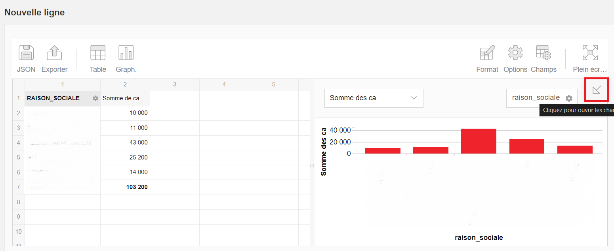

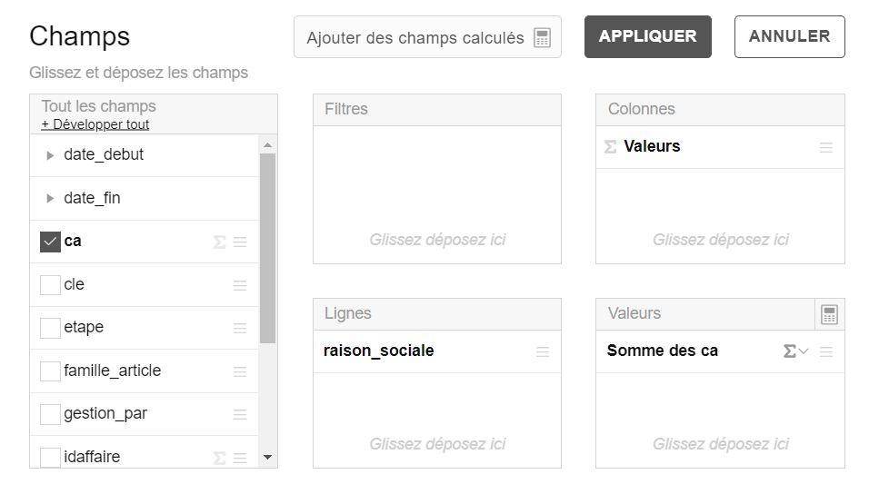

11. Configurez le WebReport selon les besoins puis cliquez sur le bouton `Enr.` pour afficher la nouvelle configuration du WebReport au  **format JSON**.

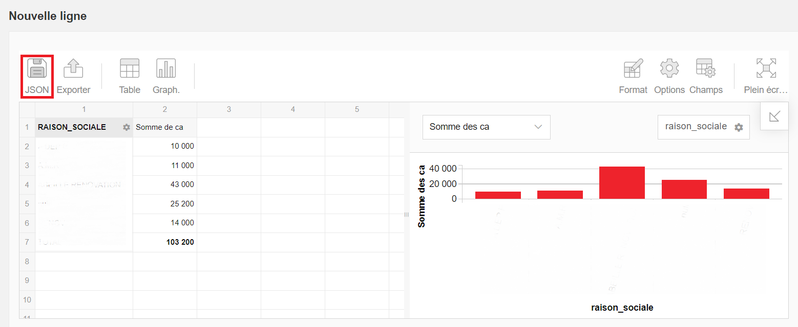

12. Cette configuration devra être **copié** afin de l'insérer dans le champ Html de la ligne de dashboard.

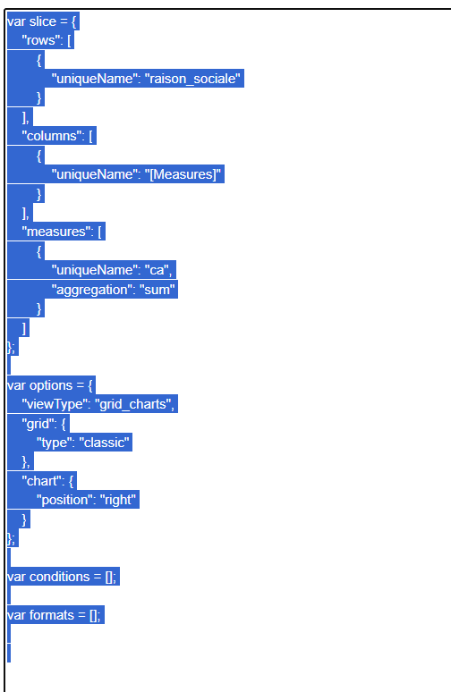

13. Ouvrir la ligne de dashboard puis l’onglet Html.

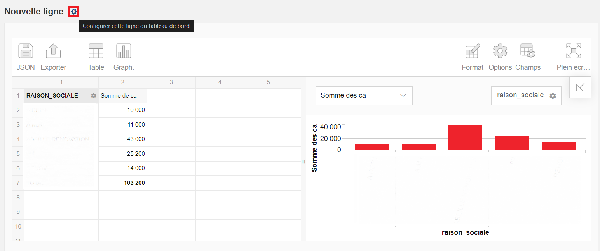

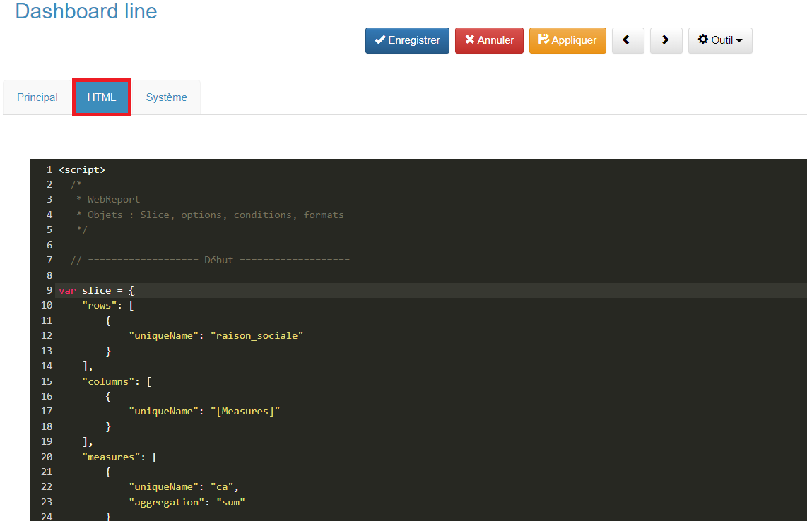

14. **Coller** pour remplacer la nouvelle configuration au format JSON entre les balises de commentaires ==Début== et ==Fin==.

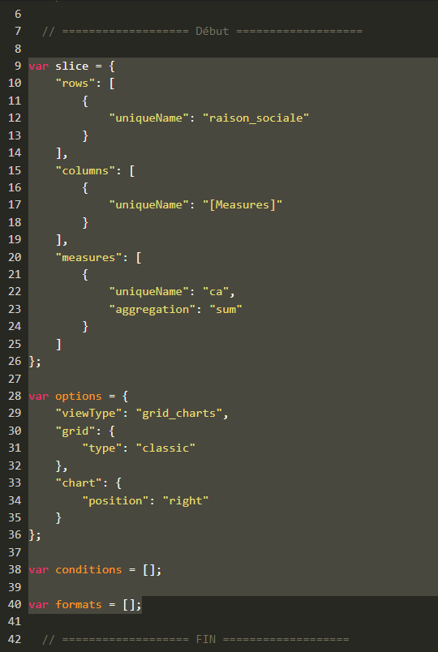

15. Cliquez sur le bouton `Enregistrer` pour sauvegarder dans la nouvelle configuration du WebReport.

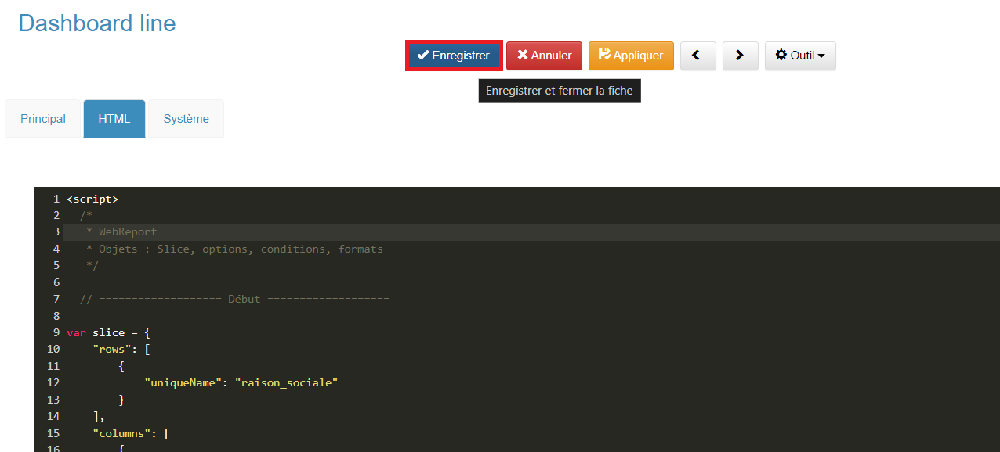

> Dans le champ Html, il est possible de modifier la configuration du WebReport en ajoutant ou modifiant les propriétés des objets  **slice** ,  **options** , **conditions** et  **formats** .
