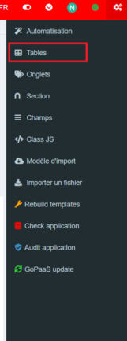
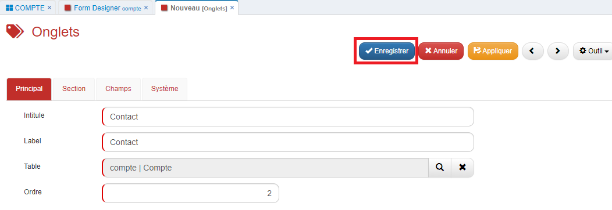

# Form Designer

## Description

Le **Form Designer** est un outil puissant qui permet d'éditer et de personnaliser l'organisation des formulaires. Cet outil, permet de créer, déplacer et modifier les champs, les onglets et les sections. Que ce soit pour ajuster la disposition ou pour ajouter de nouveaux éléments, le **Form Designer** donne un contrôle total sur la structure et le contenu des formulaires.

## Création d'une table

Pour créer une nouvelle table, suiver les étapes ci-dessous :

1. Dans le menu personnalisation de l'application   cliquer sur `Tables` pour accéder à la vue des tables.

   
2. Cliquer sur le bouton `Ajouter`.

   
3. Remplir le formulaire suivant :

   

   | Champ                                                   | Description                                                                                                                                                                                                                                                                                                                                                                                                                                                                                                                                                                                                                                                                    |
   | ------------------------------------------------------- | ------------------------------------------------------------------------------------------------------------------------------------------------------------------------------------------------------------------------------------------------------------------------------------------------------------------------------------------------------------------------------------------------------------------------------------------------------------------------------------------------------------------------------------------------------------------------------------------------------------------------------------------------------------------------------ |
   | **Intitulé**                                     | Le nom de la table en base de donnée                                                                                                                                                                                                                                                                                                                                                                                                                                                                                                                                                                                                                                          |
   | **Alias**                                         | Le nom de la table dans l'application                                                                                                                                                                                                                                                                                                                                                                                                                                                                                                                                                                                                                                          |
   | **Champs à afficher dans connexion**             | Définir les champs à afficher dans un champ de type connexion sur une autre table Séparer les champs par une virgule pour en afficher plusieurs.                                                                                                                                                                                                                                                                                                                                                                                                                                                                                                |
   | **Ordre**                                         | Ordre de la table dans la barre de navigation                                                                                                                                                                                                                                                                                                                                                                                                                                                                                                                                                                                                                                  |
   | **Icône**                                        | Icône de la table dans la barre de navigation.                                                                                                                                                                                                                                                                                                                                                                                                                                                                              |
   | **Type**                                          | Choisir l'onglet de la barre de navigation dans lequel afficher la table                                                                                                                                                                                                                                                                                                                                                                                                                                                                                                                                                                                                       |
   | **Module**                                        | Choisir le module de la barre de navigation dans lequel afficher la table                                                                                                                                                                                                                                                                                                                                                                                                                                                                                                                                                                                                      |
   | **Loading method**                                | Choisir l’option de chargement des données des fiches de la table **Synchronous** : Les données se chargent en arrière-plan et l’utilisateur peut interagir avec l’interface **Asynchronous** : Toutes les données et les interfaces sont pré-chargées et prêtes à être consultées immédiatement **Lazy** : Seul les données de l’onglet principal se chargent et l’utilisateur peut interagir avec l’interface **SmartLoad** : Les données de l’onglet principal et toutes les interfaces sont pré-chargées, prêtes à être consultées immédiatement et l’utilisateur peut interagir avec l’interface |
   | **Couleur**                                       | Choisir la couleur pour modifier la couleur des onglets et des intitulés des sections                                                                                                                                                                                                                                                                                                                                                                                                                                                                                                                                  |
   | **Afficher les vues dans la barre de navigation** | Cocher cette option permet d'afficher le menu des vues en sous-menu dans la barre de navigation                                                                                                                                                                                                                                                                                                                                                                                                                                                                                                                                                                                |
   | **Afficher dans Ajout rapide**                    | Cocher cette option permet d'afficher une option de création rapide                                                                                                                                                                                                                                                                                                                                                                                                                                                                                                                                                                                                           |
4. Cliquer sur `Enregistrer`. La table sera créée dans la base de données.
5. Se déconnecter, puis se reconnecter pour activer les permissions sur la nouvelle table et la rendre accessible dans l'application.

   
6. Dans la vue des tables, ouvrir la fiche de la table, puis dans le menu **Outil**, cliquer sur `Form Designer`.

   

## Utilisation du Form Designer

### Ajouter un onglet

1. Dans l'interface du Form Designer, cliquer sur le bouton `+ Onglet`.

   
   
2. Remplir le formulaire suivant :

   

   | Champ               | Description                                      |
   | ------------------- | ------------------------------------------------ |
   | **Intitulé**        | Nom du champ en base de données                  |
   | **Label**           | Étiquette visible pour l'onglet                  |
   | **Table**           | Nom de la table dans laquelle l'onglet se trouve |
   | **Ordre**           | Ordre de l'onglet sur la fiche                   |
3. Une fois le formulaire enregistré, cliquer sur le bouton de mise à jour pour actualiser l'interface du designer et voir apparaître les modifications.

   

### Ajouter une section

1. cliquer sur le bouton `Section` dans l'interface du Form Designer.

   
2. Remplir le formulaire suivant :

   

   | Champ                          | Description                                  |
   | ------------------------------ | -------------------------------------------- |
   | **Intitulé**                   | Nom de la section                            |
   | **Masquer titre**              | Option pour masquer le titre de la section   |
   | **Nb Colonne**                 | Nombre de colonnes dans la section           |
   | **Répartition colonne**        | Répartition des colonnes entre elles         |
   | **Table**                      | Table associée à la section                  |
   | **Onglet**                     | Onglet dans lequel la section sera affichée  |
   | **Ordre**                      | Ordre d'affichage de la section              |
   | **Réduire par défaut**         | Option pour réduire la section par défaut    |
3. Actualiser l'interface du designer pour voir apparaître la nouvelle section.

   

### Ajouter un champ

1. cliquer sur le bouton `+` pour ajouter un champ.

   
2. Remplir le formulaire suivant :

   

   | Champ                                | Description                                                                                                                                                                      |
   | ------------------------------------ | -------------------------------------------------------------------------------------------------------------------------------------------------------------------------------- |
   | **Table**                            | Table à laquelle le champ est lié                                                                                                                                                |
   | **Onglet**                           | Onglet dans lequel le champ sera affiché                                                                                                                                         |
   | **Section**                          | Section dans laquelle le champ sera affiché                                                                                                                                      |
   | **Colonne**                          | Définir le numéro de colonne, une section peut contenir au maximum 3 colonnes                                                                                                    |
   | **Ordre champ**                      | Ordre du champ dans la colonne                                                                                                                                                   |
   | **Type**                             | Typologie de champ disponible                                                                                                                                                    |
   | **Nom champ**                        | Nom du champ en base de données                                                                                                                                                  |
   | **Alias/Nom Table connectée**        | Nom de l'alias du champ ou nom de la table connecté dans la cadre d'un champ type connexion                                                                                      |
   | **Intitulé**                         | Nom du champ dans l'application.                                                                                                                                                 |
   | **Largeur intitulé**                 | Largeur du label du champ                                                                                                                                                        |
   | **Alignement intitulé**              | Alignement du label (ex : Gauche, Droite, Centre)                                                                                                                                |
3. Cliquer sur le bouton actualiser pour afficher le champ enregistré.

   
4. Il est également possible de déplacer un champ par glisser-déposer.

   

## Gestion des vues

Pour gérer les vues associées à une table, voici les étapes :

1. Accéder aux paramètres de la table, ouvrir le menu **Outil**, et cliquer sur `Ouvrir/gérer les vues`.

   

2. Le menu `Ouvrir/gérer les vues` permet d'afficher toutes les vues de la table.
   
3. Sélectionner la vue **Par défaut** et cliquer sur `Ouvrir une vue`, la vue 'par défaut' de la table s'ouvre.

   
4. Sélectionner la vue **Connexion** et cliquer sur `Ouvrir une vue`, la vue Connexion de la table s'ouvre.

   
5. Sélectionner la vue **Icône** et cliquer sur `Ouvrir une vue`, la vue Icône de la table s'ouvre.

   
