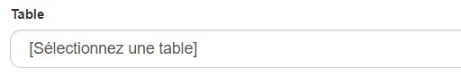
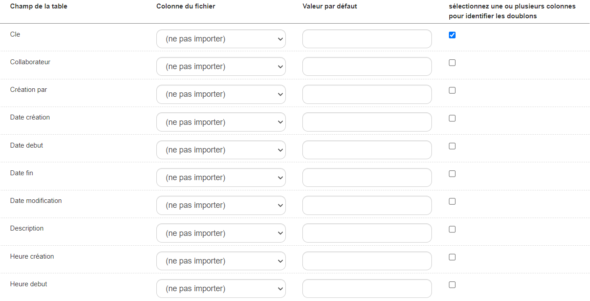
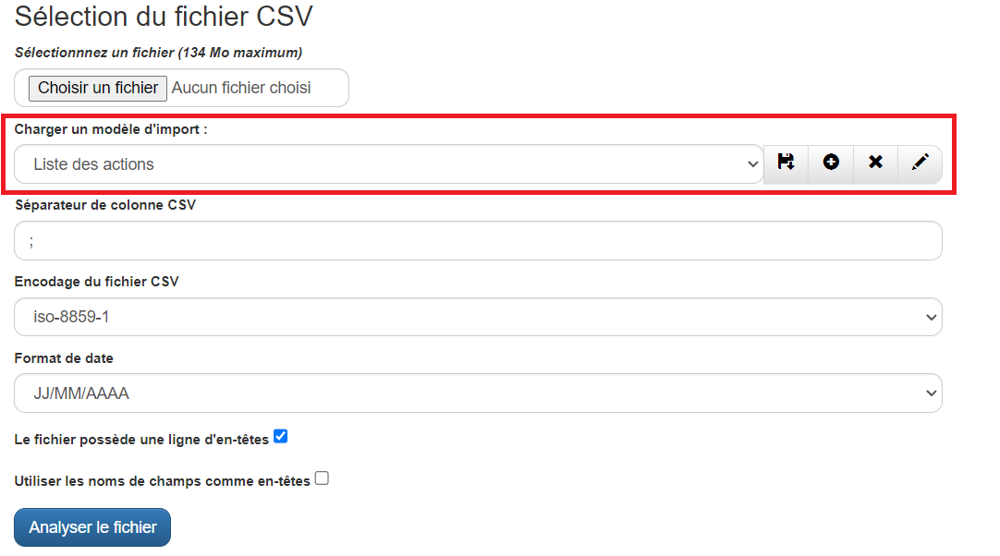
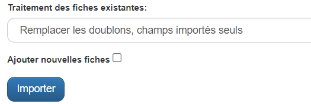

# Import / Export

## Description

L'import permet de charger des données à partir d'un fichier CSV pour les intégrer directement dans le CRM, enrichissant ainsi la base de données existante.

L'export, offre la possibilité d'extraire les données présentes dans l'application sous forme de fichier CSV, facilitant ainsi leur manipulation et leur réutilisation externe.

## Importer un fichier

1. Dans le menu personnalisation de l'application   cliquez sur `importer un fichier`.

2. Cliquez sur  pour ajouter le fichier à importer.

Plusieurs champs sont déjà renseignés sur cette fiche, ils sont modifiables selon l'utilisation :

| **Charger un modèle d'import** | Les utilisateurs peuvent créer des modèles d'import réutilisables afin d'éviter la correspondance des champs à chaque import. |
| ------------------------------------- | ---------------------------------------------------------------------------------------------------------------------------------- |
| **Séparateur de colonne CSV**  | A définir, le séparateur peut être différent selon les fichiers, par défaut c'est le point virgule.                           |
| **Encodage du fichier CSV**     | Il existe trois formes d'encodage pour l'import GoPaaS : iso-8859-1, iso-8859-15, utf-8.                                           |
| **Format de date**              | La plateforme propose également trois formats de date possible pour l'import : JJ/MM/AAAA, MM/JJ/AAAA, AAAA-MM-JJ.                |

3. Cochez l'option si le fichier contient une ligne d'en-tête (Ex: Nom, prénom, ville), si il n'en contient pas la correspondance se fera sur la première ligne de donnée.
4. Cliquez sur le bouton  pour passer à l'étape suivante.

## Faire la correspondance des champs

1. Sélectionnez la table sur laquelle vous souhaitez importer le fichier.

2. Réalisez la correspondance des champs de votre fichier avec les champs de la table.

Pour cela, en face de chaque nom de champ, cliquez dans la zone **(ne pas importer)**, puis sélectionnez le nom de colonne de votre fichier à faire correspondre.

Il est possible de renseigner une valeur par défaut dans la colonne "Valeur par défaut" et d'identifiez les doublons dans la colonne d'identification des doublons.

## Lancer l'import

Cliquer sur `Importer` pour lancer l'import.

Quand l'import est terminé un message apparaît avec un rapport d'enregistrements traités.

## Créer un modèle d'import

Afin d'éviter l'étape de la correspondance des champs à chaque import, vous avez la possibilité de créer des modèles d'import.

Ces modèles sont réutilisables à chaque import du même type de fichier.

1. Après avoir effectué une première fois la correspondance des champs, en cliquant sur le bouton  Il est possible d'enregistrer cette correspondance en tant que modèle.

Il est conseillé de lui donner un nom afin de le retrouver plus facilement lors des prochains imports.

2. Pour charger un modèle d'import, sélectionnez le dans la liste déroulante puis cliquer sur le bouton  . Si le fichier correspond bien au modèle, la correspondance se fera automatiquement.

Il est possible de modifier les correspondances puis d'enregistrer à nouveau le modèle sous un autre nom en cliquant sur  **.**

3. Cliquez sur  pour supprimer le modèle, ou sur  pour le renommer.

## Gérer les doublons
 1. Identifier les doublons

Pour identifier les doublons, cliquer sur la case à cocher dans la colonne "sélectionnez une ou plusieurs colonnes pour identifier les doublons".
Par exemple, cliquer sur la case à cocher de la ligne clé, pour identifier les doublons sur la clé.

 2. Traiter les doublons

En dessous de la partie correspondance des champs, il existe une option permettant de gérer les actions à mettre en place face aux potentiels doublons.

1. Cliquez sur la liste déroulante pour définir l'action à mettre en place lors de l'import :

| Action                                           | Description                                                                      |
|--------------------------------------------------|----------------------------------------------------------------------------------|
| Remplacer les doublons, champs importés seuls    | Remplace les doublons uniquement dans les champs spécifiés pour l'import.        |
| Remplacer les doublons, tous champs              | Remplace tous les doublons présents dans l'ensemble des champs lors de l'import. |
| Ne pas importer les doublons                     | Ignore complètement les doublons et ne les importe pas.                          |

3. Sélectionnez l'option " **Ajouter nouvelles fiches** " si vous désirez incorporer de nouvelles fiches durant l'importation.

Ne pas oublier de sélectionner sur quels champs identifier les doublons dans la partie "correspondance des champs".

## Intégrité des données

Dans les valeurs par défaut des champs, vous ajouter des codes de champs pour contrôler l'intégrité des données qui vont être importées.

Le contrôle d'intégrité se fait à l'aide de REGEX.

Par exemple pour contrôler le format email lors d'un import il faudra insérer le code suivant :

<pre><button class="copy-btn">Copier</button><code class="language-php hljs">$$REGEX("/^[_a-z0-9-]+(\.[_a-z0-9-]+)*@[a-z0-9-]+(\.[a-z0-9-]+)*(\.[a-z]{2,})$/i")</code></pre>

le format téléphone lors d'un import il faudra insérer le code suivant :

<pre><button class="copy-btn">Copier</button><code class="language-php hljs">$$REGEX("/^(?:\+33\s|0)[1-9](?:\s\d{2}){4}$/")</code></pre>

La pattern REGEX est à insérer entre guillemet sous la forme "/PATTERN/"

Vous pouvez également contrôler les valeurs qui seront insérées : Dans une liste déroulante avec le code suivant :

<pre><button class="copy-btn">Copier</button><code class="language-php hljs">$$STRICT_VALUES_LIST</code></pre>

Dans une connexion avec le code suivant :

<pre><button class="copy-btn">Copier</button><code class="language-php hljs">$$STRICT_VALUES_CONNECTION("utilisateur") où utilisateur est la table connectée</code></pre>
