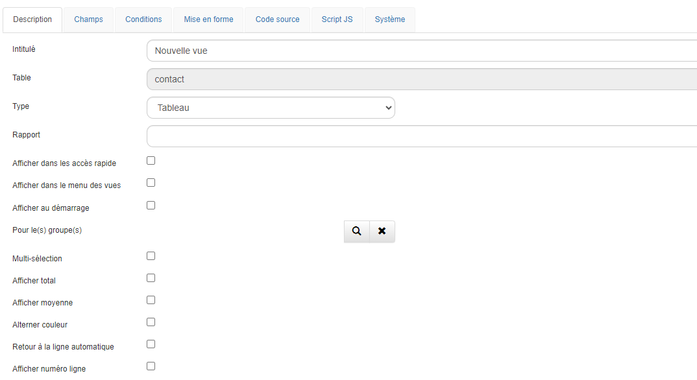

# Les vues

## Description

Pour visualiser les données saisies dans la base, GoPaaS met à disposition un ensemble de vues entièrement personnalisables. Ces vues peuvent se présenter sous forme de tableau, agenda, kanban, webreport, graphique ou encore widget.

## Créer une vue

Les vues peuvent être adaptées pour répondre à des besoins spécifiques. Il est possible de mettre en forme la vue avec des codes couleurs, des tris et des régroupement. Chaque type de vue (Tableau, Agenda, Graphique, ...) offre des options personnalisées permettant une flexibilité accrue.

Cliquer sur le menu "Vue" puis sélectionner `Ajouter`.

   

### Tableau

Renseigner les champs suivants :

| Champ                                            | Description                                                                                                                                  |
| ------------------------------------------------ | -------------------------------------------------------------------------------------------------------------------------------------------- |
| **Intitulé**                              | Nom de la vue.                                                                                                                               |
| **Table**                                  | Table connectée.                                                                                                 |
| **Type**                                   | Type de vue : Tableau, Agenda, Graphique, WebReport, Pivot, Kanban.                                                                          |
| **Rapport**                                | Indiquer si la vue doit être affichée dans un rapport.                                                                                     |
| **Afficher dans les accès rapide**        | Permet d'afficher la vue dans l'Accès rapide  de la barre de navigation. |
| **Afficher dans le menu des vues**         | Permet d'afficher la vue dans le menu des vues.                                                                                              |
| **Afficher au démarrage**                 | Option pour ouvrir la vue automatiquement au lancement de l'application.                                                                     |
| **Pour le(s) groupe(s)**                   | Fonctionne avec l'option "Afficher au démarrage".                                                                                           |
| **Multi-sélection**                       | Active la sélection multiple sur la table.                                                                                                  |
| **Afficher total**                         | Affiche le total des colonnes dans la dernière ligne du tableau.                                                                            |
| **Afficher moyenne**                       | Affiche la moyenne des colonnes dans la dernière ligne du tableau.                                                                          |
| **Alterner couleur**                       | Alterne la couleur des lignes (blanc/gris).                                                                                                  |
| **Retour à la ligne automatique**         | Permet de gérer les retours à la ligne dans les champs texte (CKEditor).                                                                   |
| **Afficher numéro de ligne**              | Affiche un numéro de ligne dans la vue.                                                                                                     |
| **Afficher le mode modification**          | Active l'utilisation du mode “Edit View”.                                                                                                  |
| **Hauteur Max**                            | Définit la hauteur maximale de la vue.                                                                                                      |
| **Afficher barre défilement horizontale** | Active une barre de défilement horizontale.                                                                                                 |
| **Figer colonne**                          | Fige la largeur des colonnes à partir de la gauche.                                                                                         |
| **Nombre de fiches par page par défaut**  | Définit le nombre de fiches affichées par page.                                                                                            |
| **Permissions**                            | Gère les permissions d'accès à la vue.                                                                                                    |
| **Description**                            | Permet d'ajouter une description pour la vue.                                                                                                |

## Agencer les champs

Dans l'onglet **Champs** sélectionner les champs à faire apparaître dans la vue.

  

1. La liste des tables disponibles dans l'application.
2. Liste des champs de la table sélectionnée.
3. Utiliser les flèches pour ajouter un champ à la vue (flèche de droite) ou pour le retirer (flèche de gauche).
4. Les champs sélectionnés pour la vue. Il est possible de réorganiser l'ordre d'affichage par glisser-déposer.

> **Astuce :** Il est possible de sélectionner plusieurs champs en utilisant le raccourci CTRL + CLIC.

## Propriétés de la colonne

Pour acccéder aux propriétés du champ dans la vue, double-cliquer sur un des champs dans la colonne de droite. Cela permet d'apporter des modifications spécifiques telles que l'ajustement de la largeur de la colonne ou l'alignement du contenu.

Description des propriétés :

| Champ                                  | Description                                                                                                                                                                                                                                                   |
| -------------------------------------- | ------------------------------------------------------------------------------------------------------------------------------------------------------------------------------------------------------------------------------------------------------------- |
| **Table**                      | Nom de la table en base de données.                                                                                                                                                                                             |
| **Champ**                      | Nom du champ en base de données.                                                                                                                                                                                             |
| **Alias**                      | Alias de la colonne. (Modifiable)                                                                                                                                                                                                                            |
| **Intitulé**                      | Intiulé de la colonne dans la vue. (Modifiable)                                                                                                                                                                                                                           |
| **Largeur**                      | Définir la largeur de la colonne.                                                                                                                                                                                                                            |
| **Format**                       | Personnaliser le format du champ. Les options incluent Texte, Date, Nombre, HTML, Gauge, Rating, Smileys, SQL, et SQLNumber.                                                                                                                                  |
| **Code**                         | Utiliser ce champ pour inclure des balises HTML ou des requêtes SQL, en fonction du format sélectionné.                                                                                                                                                    |
| **Alignement**                   | Définit l'alignement du texte dans la colonne (left, center ou right). Par défaut, l'alignement est à gauche.                                                                                                                                              |
| **Style**                        | Appliquer du style personnalisé à la colonne. Par exemple :`[{"value": "Client", "style":"font-size:8px;background-color:#ff0000;color:#fff;font-weight:bold;"}, {"value": "Prospect", "style":"background-color:green;color:#fff;font-weight:normal;"}]` |
| **Visible**                      | Masquer le champ dans la vue en décochant cette option.                                                                                                                                                                                                      |
| **Masquer sur mobile**           | Masque le champ sur les appareils mobiles.                                                                                                                                                                                                                    |
| **Masquer intitulé sur mobile** | Masque l'intitulé du champ sur les appareils mobiles.                                                                                                                                                                                                        |
| **Afficher en ligne sur mobile** | Affiche les données sur une seule ligne sur les appareils mobiles.**NB :** Le mode mobile doit être réglé sur "List".                                                                                                                               |
| **Autoriser modification**       | Permet la modification du champ dans le mode EditView.                                                                                                                                                                                                        |

## Ajouter des conditions

  

1. La liste des tables disponibles dans l'application.
2. Liste des champs de la table sélectionnée.
3. Utiliser les flèches pour ajouter un champ (flèche de droite) ou le retirer (flèche de gauche).
4. Les champs sélectionnés pour les conditions.

## Mise en forme

Dans l'onglet **Mise en forme**, il est possible de trier les données de votre vue, par exemple pour regrouper des actions par statut ou trier des comptes par ordre alphabétique.

  

1. Utiliser les tris (de 1 à 5) pour classer les enregistrements en fonction des champs sélectionnés dans l'onglet Champs.
2. Choisisser l'ordre croissant (ASC) ou décroissant (DESC).
3. Sélectionner le champ pour effectuer le regroupement.

**NB :** Une option est disponible pour condenser le regroupement à l'ouverture de la vue.

### Agenda

#### Étape 1 : Création des tables

1. **Table Action** : Créer la table **Action** avec les champs suivants :
   - `Intitulé` (texte)
   - `Date début` (date)
   - `Date fin` (date)
   - `Heure début` (heure)
   - `Heure fin` (heure)
   - `Description` (mémo)
   - `Collaborateur` (connexion vers la table Collaborateur)

2. **Table Collaborateur** : Créer la table **Collaborateur** avec les champs suivants :
   - `Actif` (checkbox)
   - `Nom` (texte)
   - `Prénom` (texte)
   - `Email` (email)
   - `Téléphone` (texte)
   - `Utilisateur` (connexion vers la table utilisateur)

### Instructions détaillées

Pour commencer, il est nécessare de créer les deux tables avec les champs mentionnés ci-dessus. S'assurer que les champs **Collaborateur** et **Utilisateur** pointent correctement vers leurs tables respectives. Il est important que ces champs soient de type 'connexion' afin de créer les relations nécessaires entre les tables.

#### Étape 2 : Création des vues

### Vue Collaborateur agenda (Table `Collaborateur`) :

- **Dupliquer la vue existante :**
  Dupliquer la vue par défaut de la table **Collaborateur**, qui contient les champs créés précédemment. Cela permet de conserver la structure tout en modifiant les paramètres nécessaires pour l'agenda.

  - Ouvrer la vue par défaut et cliquer sur .

    
    <!-- -->

   - Une fois dans les paramètres de la vue, cliquer sur le menu **Outil** et sélectionner **Dupliquer**.
      
      
    <!-- -->

- **Personnalisation de la vue :**
  Dans la vue dupliquée, personnaliser les colonnes à afficher et ajuster l'affichage en fonction de vos besoins. Il est possible d'ajouter des filtres ou des conditions pour organiser l'affichage des collaborateurs.

   
    <!-- -->

### Vue Agenda action collaborateur :

- **Dupliquer la vue existante :**
  Dupliquer la vue par défaut de la table **Action**, qui contient les champs créés précédement. Cette vue sera utilisée pour un affichage sous forme de calendrier.

  - Ouvrer la vue par défaut et cliquer .
  
    
    <!-- -->

   - Une fois dans les paramètres de la vue, cliquer dans le menu **Outil** et cliquer sur **Dupliquer**.
      
      
    <!-- -->

- **Changer le type de vue :**
  - Après avoir dupliqué la vue, la nommer **Agenda action collaborateur** et changer son type pour **Agenda**.

      
    <!-- -->

- **Configuration des champs :**
  Cliquer sur l'onglet **Agenda** et configurer les champs comme suit :

  | **Option**                      | **Description**                                                                 |
  |----------------------------------|---------------------------------------------------------------------------------|
  | **Titre**                        | Sélectionner le champ **Intitulé**. Ce champ sera utilisé comme le titre de chaque événement dans l’agenda. |
  | **Date début**                   | Sélectionner le champ **Date début** pour définir quand chaque événement commence. |
  | **Heure début**                  | Sélectionner le champ **Heure début** pour préciser l'heure de début de chaque événement. |
  | **Date fin**                     | Sélectionner le champ **Date fin** pour indiquer quand chaque événement se termine. |
  | **Heure fin**                    | Sélectionner le champ **Heure fin** pour préciser l'heure de fin. |
  | **Description**                  | Sélectionner le champ **Description** pour afficher les détails supplémentaires de chaque événement. |
  | **Afficher comme un planning**   | Cocher cette case si afficher l’agenda sous forme de planning est souhaité. |
  | **Format vertical**              | Cocher cette case si un affichage vertical du calendrier est préféré. |
  | **Masquer le week-end**          | Cocher cette case si les événements du week-end ne doivent pas être affichés. |
  | **Afficher numéro de semaine**   | Activer cette option pour afficher les numéros de semaine dans l'agenda. |
  | **Table de collaboration**       | Sélectionner **Collaborateur Agenda** pour lier chaque action ou événement à un collaborateur spécifique. |

    
    <!-- -->

### Résultat

Ouvrer la vue que vous avez créée pour visualiser les actions sous forme d'agenda.

### Kanban

La vue KanBan permet de changer le statut des actions rapidement à l'aide de glisser-déposer.

#### Étape 1 : Dupliquer une vue

1. **Dupliquer une vue :**
   - Dupliquer la vue par défaut des actions et la nommer : **Kanban - actions**.

2. **Changer le type de la vue :**
   - Pour cela, sélectionner **Kanban** dans le champ **Type** de la vue.

#### Étape 2 : Configurer la vue

   - Cliquer sur l'onglet **Kanban** pour paramétrer l'affichage.

  
   
   | **Étape**                          | **Description**                                                             |
|------------------------------------|-----------------------------------------------------------------------------|
| 1| Choisir le champ pour regrouper les fiches.                                  |
| 2| Fournir une chaîne JSON listant les valeurs de regroupement dans l'ordre souhaité. Exemple: `{"VALUE1","VALUE2",...}`  |
| 3 | Fournir une chaîne JSON pour les couleurs à appliquer. Exemple:  `{"VALUE1": "#F65454","VALUE2" : "#F69654", ...}`               |

#### Résultat

  

### WebReport

#### Étape 1 : Dupliquer la vue des factures

1. **Dupliquer la vue des factures :**
   - Dupliquer la vue par défaut des factures et la nommer : **WR - Analyse Facture**.

2. **Changer le type de la vue :**
   - Pour cela, sélectionner **WebReport** dans le champ **Type** de la vue et l'enregistrer.

#### Étape 2 : Configurer la vue WebReport

1. **Accéder à la vue WebReport :**
   - Depuis le menu de gauche, cliquer dans le module **Référence > Paramètre > Vue**.
   - Rechercher le nom de la vue WebReport (ex. **WR - Analyse Facture**) puis l'ouvrir.

2. **Configurer l'affichage :**
   - Cliquer sur **Champs** pour modifier l'affichage des données.

   - Exemple de configuration dans le cas d'une analyse de la facturation :
    

   - S'assurer que les champs nécessaires sont déjà présents dans la vue. Pour ajouter des champs, cliquer sur **Edit**.
   - Après avoir configuré l'affichage selon les besoins, cliquer sur **Save** pour sauvegarder la configuration.
   
#### Résultat

Une fois le WebReport configuré, voici un exemple de résultat :

### Graphique

#### Étape 1 : Dupliquer une vue

1. **Dupliquer une vue :**
   - Dupliquer la vue par défaut des affaires et la nommer : **Analyse - Affaires**.

2. **Changer le type de la vue :**
   - Pour cela, sélectionner **Graphique** dans le champ **Type** de la vue.

#### Étape 2 : Configurer la vue Graphique

   - Cliquer sur l'onglet **Graphique** pour modifier l'affichage.

  
   
   | Champ                   | Description                                                                                                      |
|-----------------------------|----------------------------------------------------------------------------------------------------------------------|
| Type de graphique                       | Type du graphique (Column, Bar, Line, Pie, Donut, Gauge, TreeMap, Table, Widget, Image, Icon).                                                                                                  |
| Titre                       | Titre du graphique.                                                                                                  |
| Champ Valeur               | Champ à sélectionner pour le calcul du pourcentage dans le tableau.                               |
| Type calcul                | Choix du type de calcul : Somme, Nombre, Moyenne, Max ou Min.                                                       |
| Sous-titre                 | Sous-titres du graphique.                                                                                            |                                                                                                                    |
| Regroupement               | Permet de grouper le résultat sur un champ.                                                                          |
| Couleur de fond du widget  | Permet d'appliquer une couleur de fond, dans le cas d'un widget, mais non utilisé dans cet exemple.                                                       |
| En savoir plus             | Permet d'ouvrir une nouvelle vue, dans le cas d'un widget, mais non utilisé dans cet exemple.                                                                                |

#### Résultat

  

## Dupliquer une vue

Pour créer une nouvelle vue, il est possible de dupliquer une vue existante et modifier ses paramètres.

Depuis la vue par défaut, cliquer sur  ->  -> **Dupliquer**.

  

Modifier le nom de la nouvelle vue, puis cliquer sur `Appliquer` pour commencer le paramétrage.
