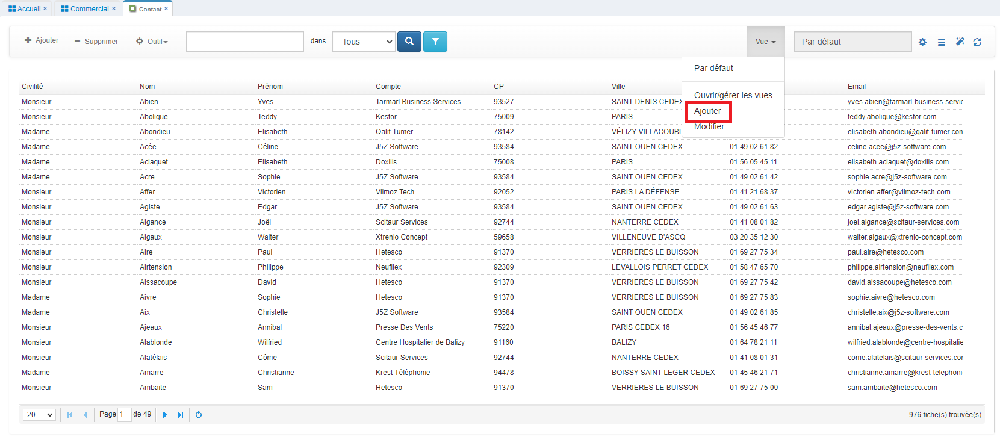

# Les vues

## Description

Pour visualiser les données saisies dans la base, GoPaaS met à disposition un ensemble de vues entièrement personnalisables. Ces vues peuvent se présenter sous forme de tableau, agenda, kanban, webreport, graphique ou encore widget.

## Créer une vue

Les vues peuvent être adaptées pour répondre à des besoins spécifiques. Il est possible de mettre en forme la vue avec des codes couleurs, des tris et des régroupement. Chaque type de vue (Tableau, Agenda, Graphique, ...) offre des options personnalisées permettant une flexibilité accrue.

Cliquer sur le menu "Vue" puis sélectionner `Ajouter`.

   

### Tableau

Renseigner les champs suivants :

| Champ                                            | Description                                                                                                                                  |
| ------------------------------------------------ | -------------------------------------------------------------------------------------------------------------------------------------------- |
| **Intitulé**                              | Nom de la vue.                                                                                                                               |
| **Table**                                  | Table connectée.                                                                                                 |
| **Type**                                   | Type de vue : Tableau, Agenda, Graphique, WebReport, Pivot, Kanban.                                                                          |
| **Rapport**                                | Indiquer si la vue doit être affichée dans un rapport.                                                                                     |
| **Afficher dans les accès rapide**        | Permet d'afficher la vue dans l'Accès rapide  de la barre de navigation. |
| **Afficher dans le menu des vues**         | Permet d'afficher la vue dans le menu des vues.                                                                                              |
| **Afficher au démarrage**                 | Option pour ouvrir la vue automatiquement au lancement de l'application.                                                                     |
| **Pour le(s) groupe(s)**                   | Fonctionne avec l'option "Afficher au démarrage".                                                                                           |
| **Multi-sélection**                       | Active la sélection multiple sur la table.                                                                                                  |
| **Afficher total**                         | Affiche le total des colonnes dans la dernière ligne du tableau.                                                                            |
| **Afficher moyenne**                       | Affiche la moyenne des colonnes dans la dernière ligne du tableau.                                                                          |
| **Alterner couleur**                       | Alterne la couleur des lignes (blanc/gris).                                                                                                  |
| **Retour à la ligne automatique**         | Permet de gérer les retours à la ligne dans les champs texte (CKEditor).                                                                   |
| **Afficher numéro de ligne**              | Affiche un numéro de ligne dans la vue.                                                                                                     |
| **Afficher le mode modification**          | Active l'utilisation du mode “Edit View”.                                                                                                  |
| **Hauteur Max**                            | Définit la hauteur maximale de la vue.                                                                                                      |
| **Afficher barre défilement horizontale** | Active une barre de défilement horizontale.                                                                                                 |
| **Figer colonne**                          | Fige la largeur des colonnes à partir de la gauche.                                                                                         |
| **Nombre de fiches par page par défaut**  | Définit le nombre de fiches affichées par page.                                                                                            |
| **Permissions**                            | Gère les permissions d'accès à la vue.                                                                                                    |
| **Description**                            | Permet d'ajouter une description pour la vue.                                                                                                |

## Agencer les champs

Dans l'onglet **Champs** sélectionner les champs à faire apparaître dans la vue.

  

1. La liste des tables disponibles dans l'application.
2. Liste des champs de la table sélectionnée.
3. Utiliser les flèches pour ajouter un champ à la vue (flèche de droite) ou pour le retirer (flèche de gauche).
4. Les champs sélectionnés pour la vue. Il est possible de réorganiser l'ordre d'affichage par glisser-déposer.

> **Astuce :** Il est possible de sélectionner plusieurs champs en utilisant le raccourci CTRL + CLIC.

## Propriétés de la colonne

Pour acccéder aux propriétés du champ dans la vue, double-cliquer sur un des champs dans la colonne de droite. Cela permet d'apporter des modifications spécifiques telles que l'ajustement de la largeur de la colonne ou l'alignement du contenu.

Description des propriétés :

| Champ                                  | Description                                                                                                                                                                                                                                                   |
| -------------------------------------- | ------------------------------------------------------------------------------------------------------------------------------------------------------------------------------------------------------------------------------------------------------------- |
| **Table**                      | Nom de la table en base de données.                                                                                                                                                                                             |
| **Champ**                      | Nom du champ en base de données.                                                                                                                                                                                             |
| **Alias**                      | Alias de la colonne. (Modifiable)                                                                                                                                                                                                                            |
| **Intitulé**                      | Intiulé de la colonne dans la vue. (Modifiable)                                                                                                                                                                                                                           |
| **Largeur**                      | Définir la largeur de la colonne.                                                                                                                                                                                                                            |
| **Format**                       | Personnaliser le format du champ. Les options incluent Texte, Date, Nombre, HTML, Gauge, Rating, Smileys, SQL, et SQLNumber.                                                                                                                                  |
| **Code**                         | Utiliser ce champ pour inclure des balises HTML ou des requêtes SQL, en fonction du format sélectionné.                                                                                                                                                    |
| **Alignement**                   | Définit l'alignement du texte dans la colonne (left, center ou right). Par défaut, l'alignement est à gauche.                                                                                                                                              |
| **Style**                        | Appliquer du style personnalisé à la colonne. Par exemple :`[{"value": "Client", "style":"font-size:8px;background-color:#ff0000;color:#fff;font-weight:bold;"}, {"value": "Prospect", "style":"background-color:green;color:#fff;font-weight:normal;"}]` |
| **Visible**                      | Masquer le champ dans la vue en décochant cette option.                                                                                                                                                                                                      |
| **Masquer sur mobile**           | Masque le champ sur les appareils mobiles.                                                                                                                                                                                                                    |
| **Masquer intitulé sur mobile** | Masque l'intitulé du champ sur les appareils mobiles.                                                                                                                                                                                                        |
| **Afficher en ligne sur mobile** | Affiche les données sur une seule ligne sur les appareils mobiles.**NB :** Le mode mobile doit être réglé sur "List".                                                                                                                               |
| **Autoriser modification**       | Permet la modification du champ dans le mode EditView.                                                                                                                                                                                                        |

## Ajouter des conditions

  

1. La liste des tables disponibles dans l'application.
2. Liste des champs de la table sélectionnée.
3. Utiliser les flèches pour ajouter un champ (flèche de droite) ou le retirer (flèche de gauche).
4. Les champs sélectionnés pour les conditions.

## Mise en forme

Dans l'onglet **Mise en forme**, il est possible de trier les données de votre vue, par exemple pour regrouper des actions par statut ou trier des comptes par ordre alphabétique.

  

1. Utiliser les tris (de 1 à 5) pour classer les enregistrements en fonction des champs sélectionnés dans l'onglet Champs.
2. Choisisser l'ordre croissant (ASC) ou décroissant (DESC).
3. Sélectionner le champ pour effectuer le regroupement.

**NB :** Une option est disponible pour condenser le regroupement à l'ouverture de la vue.

### Agenda

### Kanban

### WebReport

### Graphique

## Dupliquer une vue

Pour créer une nouvelle vue, il est possible de dupliquer une vue existante et modifier ses paramètres.

Depuis la vue par défaut, cliquer sur  ->  -> **Dupliquer**.

  

Modifier le nom de la nouvelle vue, puis cliquer sur `Appliquer` pour commencer le paramétrage.
