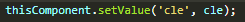
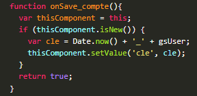
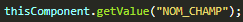
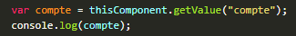
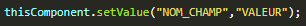
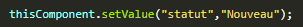
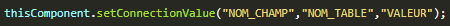
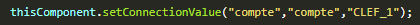

# Script JS - onSave

## Description

Le thème abordé est l'utilisation de fonctions pour assigner, récupérer et gérer des valeurs dans un programme, ainsi que la connexion entre différents éléments.

### Champ Cle

La création de la clé d'une fiche se crée de la façon suivante :

Enfin il est nécessaire d'insérer la valeur générée dans le champ clef de notre fiche :

De facon général, la mise en place de clef de fait automatiquement dans la fonction onSave :

### Fonctionnalité getValue

Exemple :

### Fonctionnalité setValue

Exemple :

### Fonctionnalité addItem

### Fonctionnalité setConnectionValue

Exemple :
