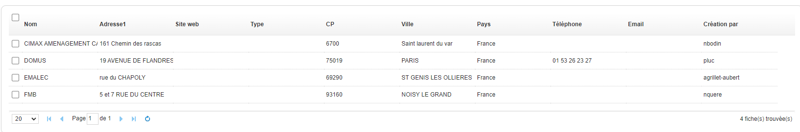
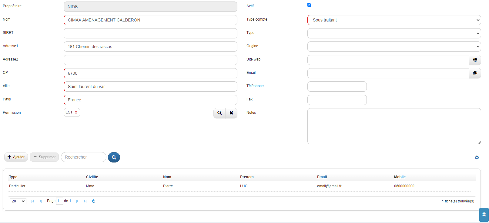
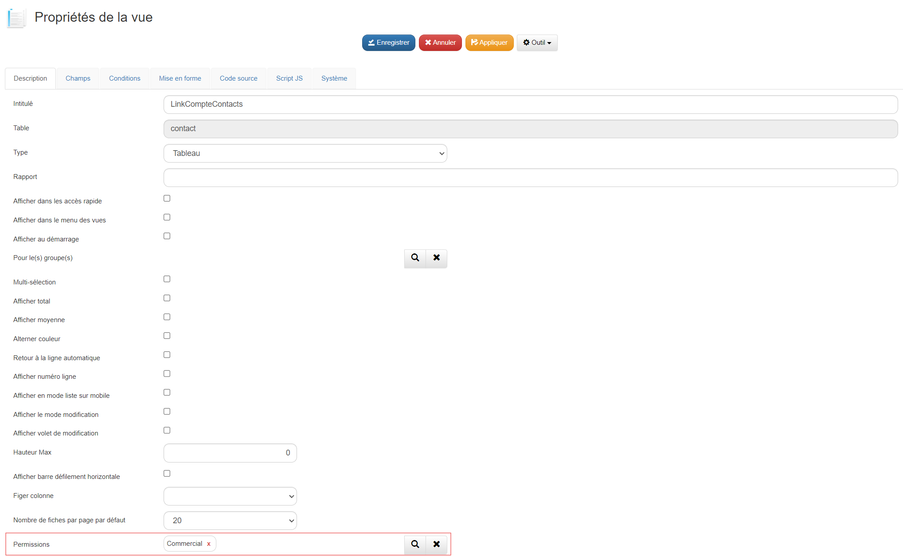

# Comment gérer des permissions dans GoPaaS ?

## Description

La gestion des permissions permet de définir et de contrôler les droits d'accès en fonction des attributs des utilisateurs. Cette approche assure que les utilisateurs ont accès uniquement aux informations spécifiques à leur rôle, ce qui améliore la sécurité et la pertinence des données traitées.

### Configuration de permissions "Standard" sur la table compte

Nous allons mettre en place des permissions sur la table compte permettant la création, la lecture et la modification d'une fiche, tout en interdisant la supression d'une fiche.

### Étape 1 : Création des groupes

1. **Accéder au menu Admin :**
   - Allez dans **Admin** (menu de gauche).
   - Cliquez sur **Groupes**.

2. **Créer le groupe :**
   - Cliquez sur **Ajouter**.
   - Remplissez le champ **Intitulé** avec le nom du groupe : **COMMERCIAL**.
   - Dans la section **Permissions** :

        - **Module(s)** : Sélectionnez le(s) module(s) disponible(s) pour le groupe, par exemple : CRM.
        - **Accès rapide** : Cochez la case si le groupe peut y accéder.
        - **Dashboard** : Cochez la case si le groupe peut y accéder.
        - **Référence** : Cochez la case si le groupe peut y accéder.
        - **Ajout rapide** : Cochez la case si le groupe peut y accéder.

   - Cliquez sur **Enregistrer**.

### Étape 2 : Attribution des groupes aux utilisateurs

1. **Accéder au menu Utilisateur :**
   - Allez dans **Admin** (menu de gauche).
   - Cliquez sur **Utilisateur**.

2. **Associer les utilisateurs aux groupes :**
   - Pour chaque utilisateur concerné, double-cliquez sur l'utilisateur.
   - Dans la section **Groupe** (multi-connexion), associez le groupe **COMMERCIAL**.
   - Enregistrez la fiche utilisateur.
   - Assurez-vous d'avoir au moins quatre utilisateurs, chacun associé à un groupe différent.

### Étape 3 : Création des permissions pour la fiche compte

1. **Accéder au menu Permissions :**
   - Allez dans **Admin** (menu de gauche).
   - Cliquez sur **Permissions**.

2. **Ajouter les permissions :**
   - Cliquez sur **Ajouter**.
   - Remplissez les champs comme suit :

| **Champ**                 | **Valeur**                        |
|---------------------------|-----------------------------------|
| **Table**                 | compte                            |
| **Type**                  |                                   |
| **Champ à utiliser**      | creation_par                      |
| **Partage**               |                                   |
| **Création**              | ADMIN,COMMERCIAL                  |
| **Lecture**               | ADMIN,COMMERCIAL                  |
| **Modification**          | ADMIN,COMMERCIAL                  |
| **Suppression**           | ADMIN                             |
| **Import**                | ADMIN                             |
| **Export**                | ADMIN                             |
| **Modification en masse** | ADMIN                             |

3. **Enregistrer les permissions :**
   - Cliquez sur **Enregistrer**.

### Étape 4 : Se déconnecter et se reconnecter

1. **Actualisation des permissions :**
   - Déconnectez-vous de votre session.
   - Demandez aux utilisateurs concernés de se déconnecter et de se reconnecter pour que les nouvelles permissions soient prises en compte.

### Résultat

### Configuration de permissions "Sélective" sur la table contact

Nous allons mettre en place des permissions sur la table contact permettant la création, la lecture et la modification d'une fiche uniquement par le commercial l'ayant créé, tout en interdisant la supression d'une fiche pour tout commercial.

### Étape 1 : Création des groupes

1. **Accéder au menu Admin :**
   - Allez dans **Admin** (menu de gauche).
   - Cliquez sur **Groupes**.

2. **Créer le groupe :**
   - Cliquez sur **Ajouter**.
   - Remplissez le champ **Intitulé** avec le nom du groupe : **COMMERCIAL**.
   - Dans la section **Permissions** :

        - **Module(s)** : Sélectionnez le(s) module(s) disponible(s) pour le groupe, par exemple : CRM.
        - **Accès rapide** : Cochez la case si le groupe peut y accéder.
        - **Dashboard** : Cochez la case si le groupe peut y accéder.
        - **Référence** : Cochez la case si le groupe peut y accéder.
        - **Ajout rapide** : Cochez la case si le groupe peut y accéder.

   - Cliquez sur **Enregistrer**.

### Étape 2 : Attribution des groupes aux utilisateurs

1. **Accéder au menu Utilisateur :**
   - Allez dans **Admin** (menu de gauche).
   - Cliquez sur **Utilisateur**.

2. **Associer les utilisateurs aux groupes :**
   - Pour chaque utilisateur concerné, double-cliquez sur l'utilisateur.
   - Dans la section **Groupe** (multi-connexion), associez le groupe **COMMERCIAL**.
   - Enregistrez la fiche utilisateur.
   - Assurez-vous d'avoir au moins quatre utilisateurs, chacun associé à un groupe différent.

### Étape 3 : Création des permissions pour la fiche contact

1. **Accéder au menu Permissions :**
   - Allez dans **Admin** (menu de gauche).
   - Cliquez sur **Permissions**.

2. **Ajouter les permissions :**
   - Cliquez sur **Ajouter**.
   - Remplissez les champs comme suit :

| **Champ**                 | **Valeur**                        |
|---------------------------|-----------------------------------|
| **Table**                 | contact                           |
| **Type**                  | User                              |
| **Champ à utiliser**      | creation_par                      |
| **Partage**               | Privé                             |
| **Création**              | ADMIN,COMMERCIAL                  |
| **Lecture sélective**     | ADMIN,COMMERCIAL                  |
| **Modification sélective**| ADMIN,COMMERCIAL                  |
| **Suppression**           |                                   |
| **Import**                | ADMIN                             |
| **Export**                | ADMIN                             |
| **Modification en masse** | ADMIN                             |

3. **Enregistrer les permissions :**
   - Cliquez sur **Enregistrer**.

### Étape 4 : Se déconnecter et se reconnecter

1. **Actualisation des permissions :**
   - Déconnectez-vous de votre session.
   - Demandez aux utilisateurs concernés de se déconnecter et de se reconnecter pour que les nouvelles permissions soient prises en compte.

### Résultat

- Depuis une session **COMMERCIAL** :

### Configuration de permissions dans une vue

### Configuration de permissions dans un dashboard

### Configuration de permissions sur un champ

