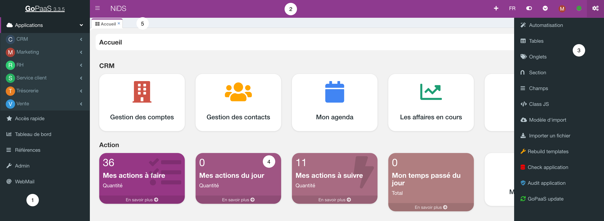
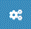

# Présentation

## Environnement

GoPaaS fonctionne comme une application web monopage (en anglais single-page application ou SPA), une application web accessible via une page web unique.
Le but est d'éviter le chargement d'une nouvelle page à chaque action demandée, et de fluidifier ainsi l'expérience utilisateur.
Chaque fiche GoPaaS est créée à partir de modèle et stockée en cache dans le navigateur pour optimiser les temps de réponse avec le serveur avec lequel il échange des données.
L'interface utilisateur n'a pas besoin d'être re télécharger du serveur à chaque ouverture. 

1. **La barre de navigation**

2. **La barre d'outils**

3. **La barre de personnalisation**

4. **L'espace principal**

5. **Les onglets de navigation**

### La barre de navigation

La barre de navigation est l'espace situé à gauche de l'écran, sur laquelle se placent des boutons correspondant aux vues. En cliquant sur l'un de ces boutons, vous ouvrez la vue sélectionnée.

La vue est représentée par une icône et un titre qui vous permet de l'identifier rapidement. La barre de navigation est totalement paramétrable. Vous décidez quelles vues y faire figurer et dans quelle rubrique (Application, Accès rapide, Dashboard ou Référence); vous choisissez les icônes et leur titre.

#### Applications

Application configure les modules qui constituent votre application. Quand vous cliquez sur un module, les tables applicatives qui constituent ce module apparaissent, dans lesquelles sont saisies les informations que vous partagez avec vos collaborateurs. 

Cette liste dépend entièrement des choix faits lors de la création de la table et peuvent être modifiés à tout moment, en modifiant le paramétrage de la table concernée. Lorsque vous cliquez sur une de ces tables vous ouvrez la vue « Par défaut » de cette table ou les vues que vous avez sélectionné comme "**Afficher dans le menu des vues**" . Bien que la vue par défaut soit paramétrable comme toutes les autres, elle a pour but d’afficher tous les enregistrements de la table.

#### Accès rapide

Dans cette liste figure toutes les vues pour lesquelles l’option "**Afficher dans les raccourcis**" a été cochée. Il suffit de cliquer sur le titre de la vue dans la liste pour ouvrir cette vue dans un nouvel onglet.

#### Dashboard

Le Dashboard permet de rassembler sur une seule page un ensemble de vues, analyses et graphiques permettant de piloter les données de votre application.

#### Référence

Il s’agit de la liste des tables de références de votre application, celles auxquelles font appel les tables applicatives.

#### Admin

Dans cette liste sont regroupées les principales fonctions d’administration de l’application.

### La barre d'outils

**La barre d'outils** regroupe plusieurs boutons :

  Ce bouton permet de réduire la barre de navigation.

 Ce bouton permet d’ouvrir la barre de personnalisation pour accéder au paramétrage des tables, des champs, pour personnaliser plus avant votre application. Il inclut aussi la fonction d’import des données, et de mise à jour de l’environnement GoPaaS.

 Ce bouton sert à attribuer une action par défaut qui sera exécutée rapidement, comme la création d'une nouvelle tâche, simplifiant ainsi le processus pour les utilisateurs en offrant un raccourci pratique.

 Ce bouton "FR" permet de sélectionner la langue de votre application. Les autres options disponibles dans le menu, telles que "EN" pour l'anglais, "DE" pour l'allemand, "ES" pour l'espagnol, "IT" pour l'italien et "PT" pour le portugais. 

 Ce bouton permet d'accéder au menu contextuel pour la gestion des onglets actifs sur GoPaaS. Les options présentées sont "Fermer les autres onglets", "Fermer les onglets sur la gauche", "Fermer les onglets sur la droite", et "Fermer tous les onglets". Cela offre à l'utilisateur une manière rapide et facile de contrôler et d'organiser ses onglets ouverts. 

 Ce bouton permet d'afficher un panneau de gestion des onglets dans votre application GoPaaS, où l'utilisateur peut visualiser à la fois les onglets actuellement ouverts et ceux qui ont été récemment fermés. Les onglets ouverts sont listés avec des options pour naviguer directement vers eux, tandis que les onglets récemment fermés sont présentés avec l'heure de fermeture pour un accès rapide si l'utilisateur souhaite les rouvrir.

 Ce bouton permet d'accéder aux options du profil utilisateur. Il offre des liens pour voir et éditer le profil de l'utilisateur, changer le mot de passe, et se déconnecter de la session actuelle. 

 Ce bouton permet de synchroniser des données du mode hors connexion. Les boutons indiquent "Synchro IN" pour importer des données, "Synchro OUT" pour exporter des données, "Sauvegarder" pour enregistrer les données actuelles, "Restaurer" pour revenir à un état antérieur des données, et "Switch" pour changer de mode ou de profil. C'est un outil pratique pour gérer des données lorsqu'on n'a pas accès à Internet.

## La barre de personnalisation

GoPaaS est personnalisable et peut être adapté pour répondre aux besoins d’une entreprise ou d’un utilisateur individuel. Il permet de recréer dans une base les associations que vous faites naturellement entre les différents types d’informations qui vous parviennent.

## Automatisation
Retrouvez la liste des toutes les automatisations présentes dans votre application.

GoPaaS met en œuvre une technologie unique d’automatisation qui permet de robotiser un certain nombre de tâches ou de procédures.

Par exemple, GoPaaS peut générer une fiche de relance suite à l’appel d’un client, envoyer un email à tous les participants d’une réunion, ou signaler automatiquement à un client que son contrat arrive à échéance.

GoPaaS propose deux types de déclancheur d'automatisation pour répondre à la majorité des besoins des utilisateurs.
- A l'enregistrement d'une fiche
- Le temps qui s'écoule (ex : Toutes les X minutes)

### Tables
Retrouvez la liste des toutes les tables présentes dans votre application.

Une table dans GoPaaS est une structure organisée en lignes et en colonnes, utilisée pour stocker des données. Chaque ligne (ou enregistrement) représente une entrée unique, tandis que chaque colonne (ou champ) représente un type de donnée spécifique (comme un nom, un âge, une date, etc.). Par exemple, dans une table de compte client, chaque ligne représente un compte client, et les colonnes pourraient inclure le nom du client, son adresse, et son numéro de téléphone.
### Onglets
Retrouvez la liste des tous les onglets présents dans votre application.

Dans GoPaaS, un onglet est une partie d'une fiche qui regroupe plusieurs sections, chacune contenant des colonnes et des champs spécifiques. Chaque onglet permet de structurer et d'organiser les informations ou les fonctionnalités liées à un aspect particulier de la fiche. En cliquant sur un onglet, l'utilisateur accède à un ensemble de sections organisées de manière logique, facilitant ainsi la navigation entre différentes catégories de données ou d'options disponibles dans la fiche.

### Sections
Retrouvez la liste de toutes les sections de votre application.

Une section est une subdivision au sein d'un onglet d'une fiche. Chaque section regroupe des colonnes qui, à leur tour, contiennent des champs spécifiques. Les sections permettent de regrouper logiquement des ensembles de données ou de fonctionnalités au sein d'un onglet, facilitant la navigation et la gestion des informations sur les fiches.

### Champs
Retrouvez la liste de tous les champs de votre application.

Dans GoPaaS, un champ est l'unité de base de données située au sein d'une colonne dans une section d'un onglet sur une fiche. Un champ représente un point d'entrée pour une information spécifique, comme un nom, une date, un chiffre, ou tout autre type de donnée. Il permet aux utilisateurs d'interagir directement avec les informations enregistrées dans la fiche. Les champs sont essentiels pour la saisie, la modification, et la visualisation des données dans GoPaaS.
### Class JS
Retrouvez la liste de toutes les classes JS  de votre application.

GoPaaS permet l'injection de code JavaScript pour personnaliser l'interface utilisateur, offrant ainsi une grande flexibilité dans l'adaptation de l'application aux besoins spécifiques de l'entreprise. 

En complément, GoPaaS propose un système de classes JavaScript, conçu pour structurer et organiser le développement. Ce système de classes simplifie la gestion du code, améliore la réutilisabilité des composants, et facilite la maintenance des personnalisations.

### Modèle d'import
Retrouvez tous les modèles d'import de votre application

GoPaaS offre un système de modèles d'import qui permet aux utilisateurs de créer et de gérer des modèles prédéfinis pour l'importation de données. Ce système facilite la réutilisation des modèles, permettant de standardiser et d'automatiser les processus d'importation de données à partir de diverses sources. En créant des modèles d'import personnalisés, les utilisateurs peuvent définir des mappings spécifiques, des formats de données, et des règles d'intégration.
### Importer un fichier
Accedez au module d'import depuis ce menu
### Rebuild template
Cette option permet de reconstruire les templates de l'application. Ce mécanisme permet de visualiser en temps réel les développements apportés à l'interface utilisateur.

Cliquez simplement pour déclencher la mise à jour des templates.
### Check application 
GoPaaS intégre un centre de contrôle dédié à la surveillance de l'application, conçu pour détecter et signaler toute anomalie ou problème potentiel. Ce centre de contrôle fournit une vue d'ensemble des performances, des erreurs, et des alertes en temps réel, permettant aux administrateurs de surveiller l'état de l'application.

Cliquez simplement pour déclencher l'ouverture du centre de contrôle.

### Audit application
GoPaaS propose un système d'audit intégré qui permet de surveiller et d'évaluer les performances de l'application. Ce système d'audit fournit des rapports détaillés et des analyses sur divers aspects du fonctionnement de l'application, tels que la vitesse de traitement, la consommation de ressources, et l'efficacité des processus.

Cliquez simplement pour déclencher l'ouverture du centre d'audit.

### GoPaaS update
GoPaaS dispose également d'un système GoPaaS Update qui facilite le processus de mise à jour de l'application. Ce système permet de lancer et de gérer les mises à jour de manière fluide et centralisée, garantissant que les dernières fonctionnalités, améliorations de sécurité et corrections de bogues soient intégrées rapidement.

Cliquez simplement pour déclencher l'ouverture du centre de mise à jour.