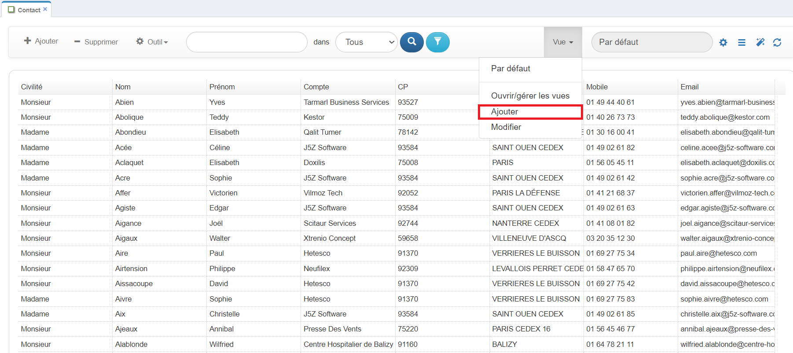
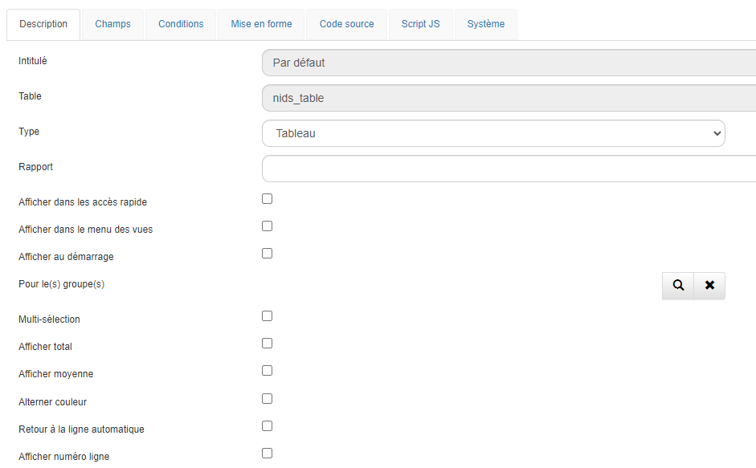
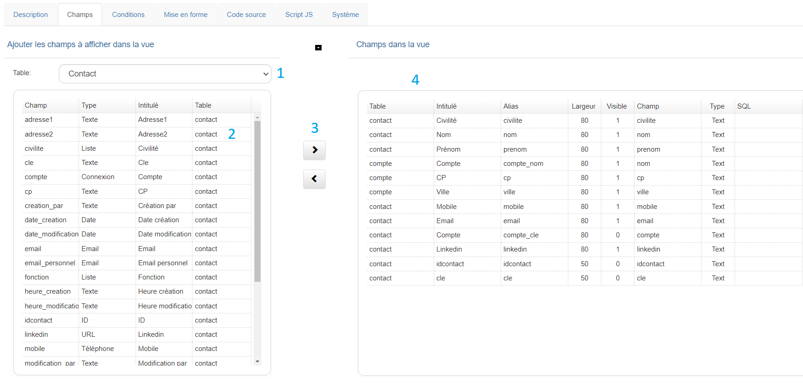
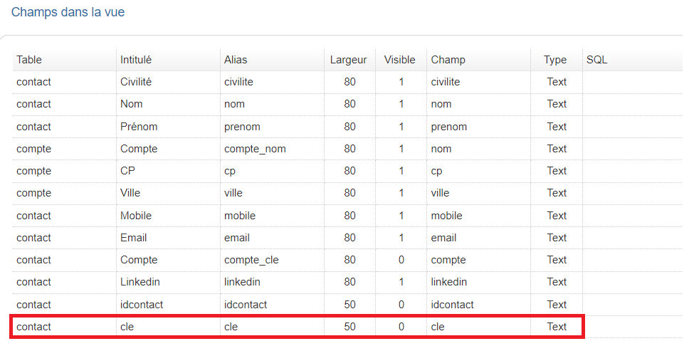
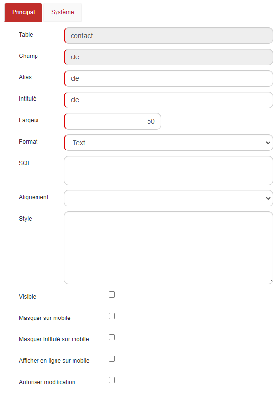
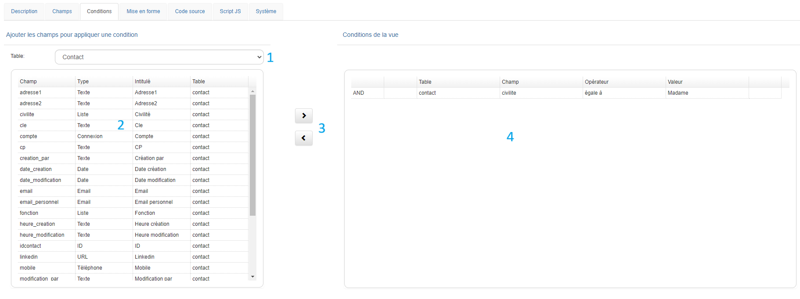
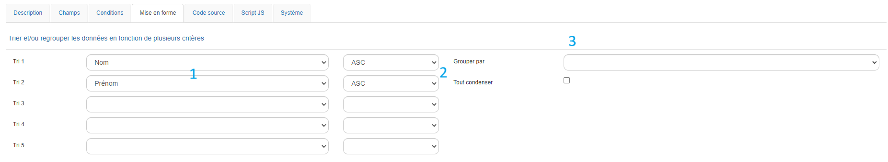
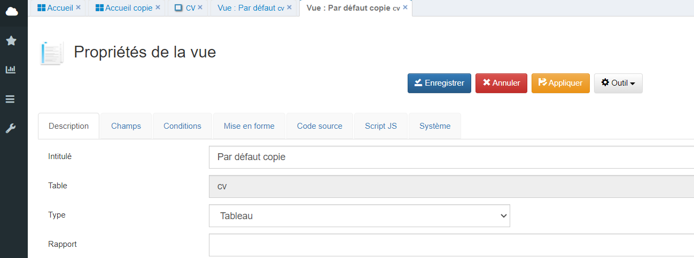

# Les vues

## Description

Les vues sont des représentations sous forme de tableaux des données présentes dans la base de données. Chaque vue est constituée de colonnes et de valeurs reflétant les informations stockées.

## Créer une vue

Les vues peuvent être adaptées pour répondre à des besoins spécifiques, tels que la modification des couleurs, l'ordre d'affichage, les conditions d'affichage et les champs inclus. Chaque type de vue (Tableau, Agenda, Graphique, Pivot) offre des options personnalisées permettant une flexibilité accrue.

1. Pour ajouter une nouvelle vue, accédez au menu "Vue" puis cliquez sur le bouton **Ajouter** pour commencer le paramétrage.

Vous arriverez alors sur la fiche de personnalisation des vues, composée de plusieurs onglets.

1. Commencez par cliquer sur l'onglet **Description** pour initialiser le paramétrage.

Pour configurer correctement la vue, il est recommandé de renseigner les champs suivants :

| Champ                                            | Description                                                                                                                                  |
| ------------------------------------------------ | -------------------------------------------------------------------------------------------------------------------------------------------- |
| **Intitulé**                              | Nom de la vue.                                                                                                                               |
| **Table**                                  | Table SQL à laquelle la vue est connectée.                                                                                                 |
| **Type**                                   | Type de vue : Tableau, Agenda, Graphique, WebReport, Pivot, Kanban.                                                                          |
| **Rapport**                                | Indiquer si la vue doit être affichée dans un rapport.                                                                                     |
| **Afficher dans les accès rapide**        | Permet d'afficher la vue dans l'Accès rapide  de la barre de navigation. |
| **Afficher dans le menu des vues**         | Permet d'afficher la vue dans le menu des vues.                                                                                              |
| **Afficher au démarrage**                 | Option pour ouvrir la vue automatiquement au lancement de l'application.                                                                     |
| **Pour le(s) groupe(s)**                   | Fonctionne avec l'option "Afficher au démarrage".                                                                                           |
| **Multi-sélection**                       | Active la sélection multiple sur la table.                                                                                                  |
| **Afficher total**                         | Affiche le total des colonnes dans la dernière ligne du tableau.                                                                            |
| **Afficher moyenne**                       | Affiche la moyenne des colonnes dans la dernière ligne du tableau.                                                                          |
| **Alterner couleur**                       | Alterne la couleur des lignes (blanc/gris).                                                                                                  |
| **Retour à la ligne automatique**         | Permet de gérer les retours à la ligne dans les champs texte (CKEditor).                                                                   |
| **Afficher numéro de ligne**              | Affiche un numéro de ligne dans la vue.                                                                                                     |
| **Afficher le mode modification**          | Active l'utilisation du mode “Edit View”.                                                                                                  |
| **Hauteur Max**                            | Définit la hauteur maximale de la vue.                                                                                                      |
| **Afficher barre défilement horizontale** | Active une barre de défilement horizontale.                                                                                                 |
| **Figer colonne**                          | Fige la largeur des colonnes à partir de la gauche.                                                                                         |
| **Nombre de fiches par page par défaut**  | Définit le nombre de fiches affichées par page.                                                                                            |
| **Permissions**                            | Gère les permissions d'accès à la vue.                                                                                                    |
| **Description**                            | Permet d'ajouter une description pour la vue.                                                                                                |

> **Conseil :** Pour optimiser les performances, il est déconseillé de cocher toutes les options disponibles.

## Agencer les champs

1. Ensuite, rendez-vous dans l'onglet **Champs** pour sélectionner les champs que vous souhaitez voir apparaître dans votre vue.

1. La liste des tables affiche toutes les tables disponibles dans l'application.
2. Les champs de la table sélectionnée apparaissent ici.
3. Utilisez les flèches pour ajouter un champ à la vue (flèche de droite) ou pour le retirer (flèche de gauche).
4. Les champs sélectionnés pour la vue. Vous pouvez réorganiser l'ordre d'affichage par glisser-déposer.

> **Astuce :** Pour ajouter ou retirer un champ, sélectionnez-le et déplacez-le à l'aide des flèches.

## Propriétés de la colonne

En double-cliquant sur un des champs dans la colonne de droite, vous accéderez aux propriétés du champ dans la vue. Cela vous permet d'apporter des modifications spécifiques telles que l'ajustement de la largeur de la colonne ou l'alignement du contenu.

Les champs suivants sont disponibles par défaut :

- **Table**
- **Champ**
- **Alias**
- **Intitulé**

Vous pouvez également personnaliser les propriétés suivantes :

| Champ                                  | Description                                                                                                                                                                                                                                                   |
| -------------------------------------- | ------------------------------------------------------------------------------------------------------------------------------------------------------------------------------------------------------------------------------------------------------------- |
| **Largeur**                      | Définir la largeur de la colonne.                                                                                                                                                                                                                            |
| **Format**                       | Personnalisez le format du champ. Les options incluent Texte, Date, Nombre, HTML, Gauge, Rating, Smileys, SQL, et SQLNumber.                                                                                                                                  |
| **Code**                         | Utilisez ce champ pour inclure des balises HTML ou des requêtes SQL, en fonction du format sélectionné.                                                                                                                                                    |
| **Alignement**                   | Définit l'alignement du texte dans la colonne (left, center ou right). Par défaut, l'alignement est à gauche.                                                                                                                                              |
| **Style**                        | Appliquez du style personnalisé à la colonne. Par exemple :`[{"value": "Client", "style":"font-size:8px;background-color:#ff0000;color:#fff;font-weight:bold;"}, {"value": "Prospect", "style":"background-color:green;color:#fff;font-weight:normal;"}]` |
| **Visible**                      | Masquez le champ dans la vue en décochant cette option.                                                                                                                                                                                                      |
| **Masquer sur mobile**           | Masque le champ sur les appareils mobiles.                                                                                                                                                                                                                    |
| **Masquer intitulé sur mobile** | Masque l'intitulé du champ sur les appareils mobiles.                                                                                                                                                                                                        |
| **Afficher en ligne sur mobile** | Affiche les données sur une seule ligne sur les appareils mobiles.**NB :** Le mode mobile doit être réglé sur "List".                                                                                                                               |
| **Autoriser modification**       | Permet la modification du champ dans le mode EditView.                                                                                                                                                                                                        |

## Ajouter des conditions

1. La liste des tables affiche toutes les tables disponibles dans l'application.
2. Les champs de la table sélectionnée apparaissent ici.
3. Utilisez les flèches pour ajouter un champ (flèche de droite) ou le retirer (flèche de gauche).
4. Les champs sélectionnés pour les conditions.

## Trier et mettre en forme

Dans l'onglet **Mise en forme**, vous pouvez trier les données de votre vue, par exemple pour organiser des actions par statut ou trier des comptes par ordre alphabétique.

1. Utilisez les tris (de 1 à 5) pour classer les enregistrements en fonction des champs sélectionnés dans l'onglet Champs.
2. Choisissez l'ordre croissant ou décroissant.
3. Sélectionnez le champ pour effectuer le regroupement.

## Dupliquer une vue

Il est possible de dupliquer une vue existante et de modifier ses paramètres pour créer une nouvelle vue.

Depuis la vue par défaut, cliquez sur  ->  -> **Dupliquer**.

Modifiez ensuite le nom de la nouvelle vue, puis cliquez sur  pour commencer le paramétrage.
