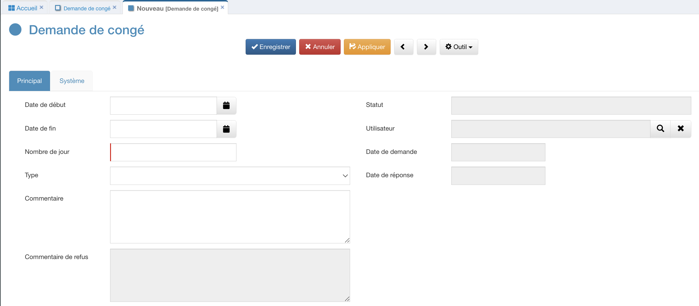
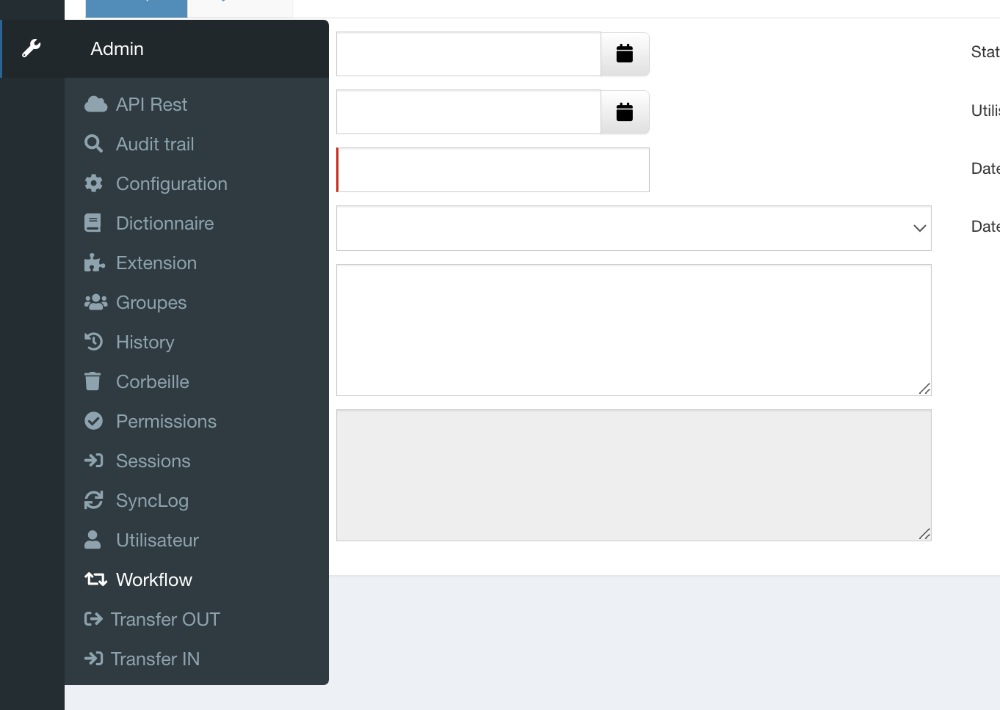
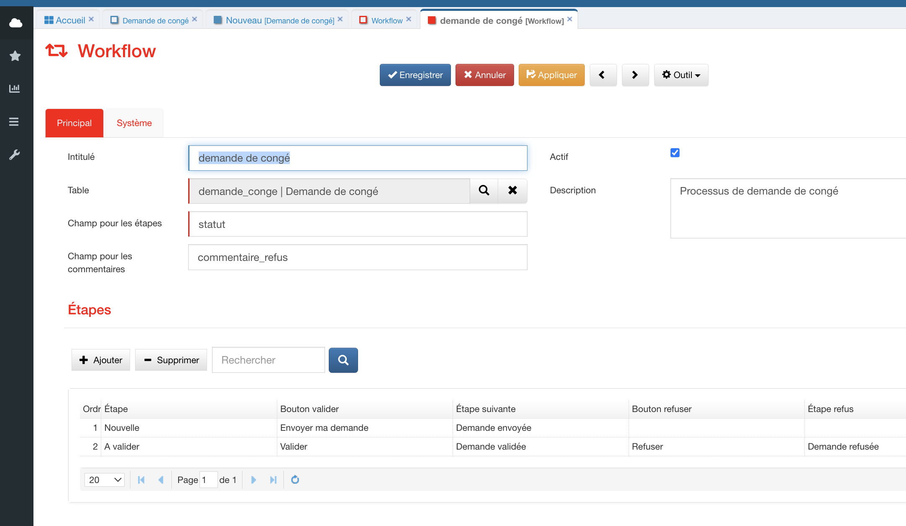
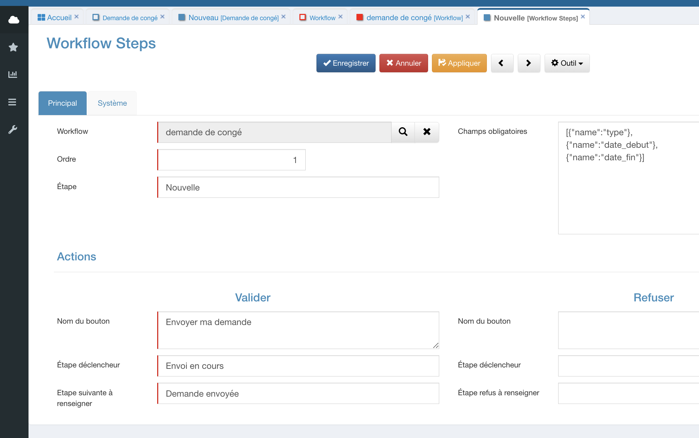
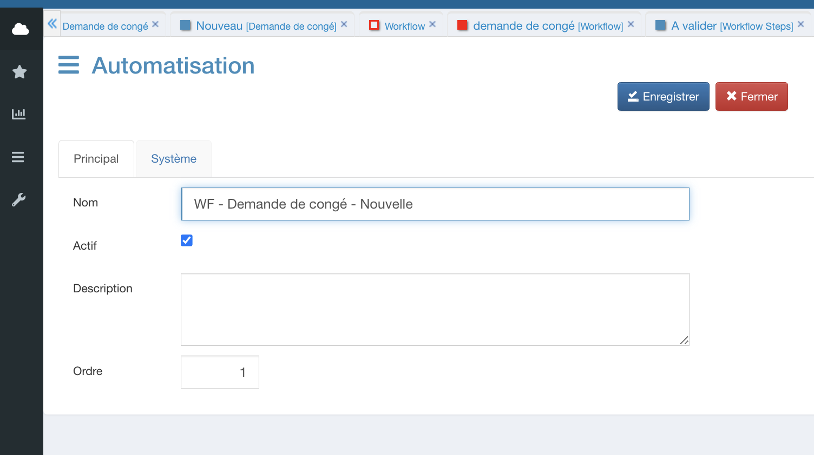
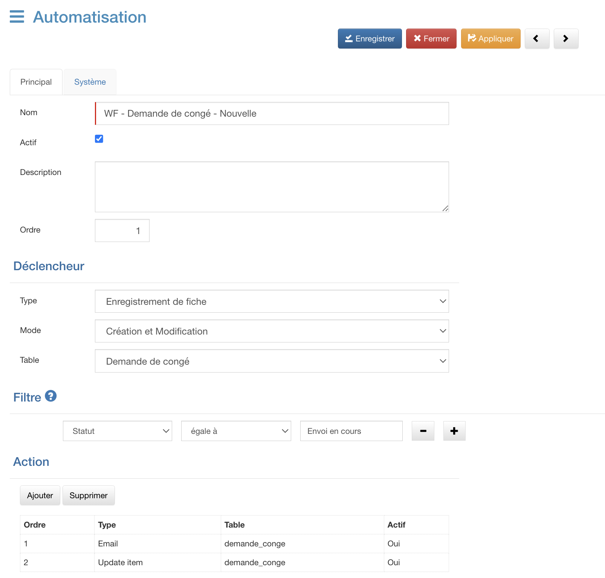
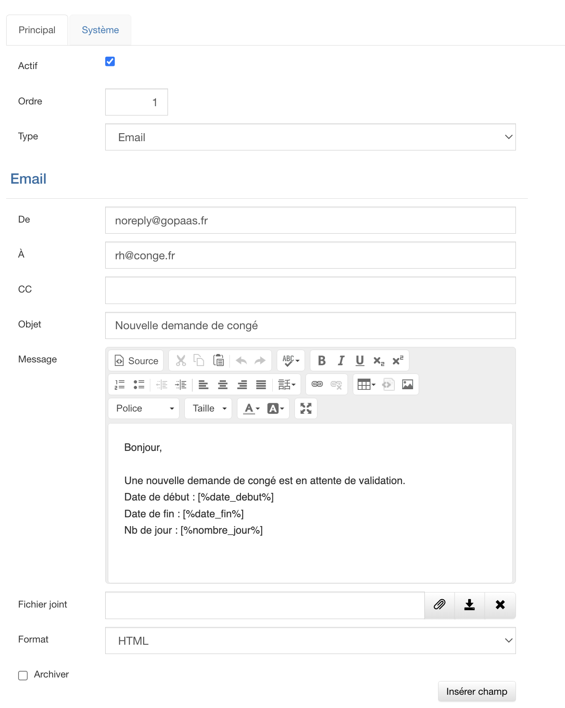
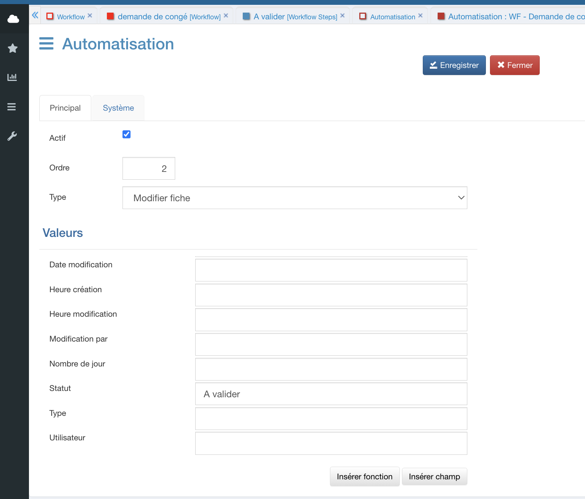

# Workflow
GoPaaS est équipé d'un designer de workflow intuitif qui vous permet de modéliser et d'automatiser vos processus métier en quelques clics. Grâce à cet outil, vous pouvez facilement définir des étapes, assigner des actions, et orchestrer des flux de travail complexes pour améliorer l'efficacité et la cohérence dans vos opérations quotidiennes.

## Objectifs
Dans cette formation, vous apprendrez à créer un workflow de gestion de congé dans GoPaaS. Ce workflow automatisera l'ensemble du processus de demande de congé, depuis la soumission par l'employé jusqu'à l'approbation par le manager. Vous configurerez les étapes clés, telles que la soumission de la demande, la validation ou le refus par le responsable, et la notification de la décision à l'employé
## Pré-requis
Pour pouvoir utiliser un workflow sur une table, il y a deux paramètres à prendre en compte.

* Il est impératif de définir un champ "Étape" pour superviser les diverses phases du workflow. Ce champ doit être obligatoire et configuré exclusivement en format liste en mode lecture seule.

* Il serait pertinent de spécifier un champ "Commentaires workflow" de type "mémo", avec un accès en lecture seule, pour enregistrer les commentaires en cas de rejet. Ce champ reste facultatif.

## Création de la table

Dans le menu de personnalisation :
- Cliquer sur le menu `Tables` pour afficher la vue avec la liste de toutes les tables.
- Cliquer ensuite sur le bouton `Ajouter`.

Renseigner les champs suivant:

| Champ    | Valeur                               |
|----------|--------------------------------------|
| Intitulé | demande_conge |
| Alias    | Demande de congé |
| Champs à afficher dans connexion    | cle |
| Icone    | Icone [Font Awesome](https://fontawesome.com/) qui permet de personnaliser la table  |
| Type    | **Application** |
| Module    | **CRM** |

* Enregistrer la table **Demande de congé**.

* Pour ouvrir la nouvelle table, il est nécessaire de vous déconnecter de GoPaaS et de vous reconnecter.

### Création des champs

 

Utilisez le formdesigner pour créer les nouveaux champs, il est accessbible depuis le menu `outil` de la table demande de congé.

Ajoutez les champs suivants : 

| Nom des champs | Type                          |
|----------------|-------------------------------|
| Date de début          | Date `Obligatoire`           |
| Date de fin       | Date `Obligatoire`                        |
| Nombre de jour       | Nombre `Obligatoire`                         |
| Type       | Liste Valeur de la liste : - Payé - Sans solde - Arrêt maladie - Maternité / Paternité - Formation                     |
| Commentaire             | Memo           |
| Commentaire de refus          | Memo  `Lecture seule`          |
| Statut           | Liste `Lecture seule` Valeur de la liste : - Nouvelle - A valider - Validée - Refusée       |
| Utilisateur    | Connexion `Table utilisateur` |
| Date de demande    | Date |
| Date de réponse    | Date |

## Création du workflow

Pour créer un nouveau workflow, rendez vous dans la barre de navigation > Admin > Workflow.
Cliquer sur `ajouter`.

 

 Renseignez les champs de l'onglet principal

| Champ                      | Description                                   |
|----------------------------|-----------------------------------------------|
| Intitulé                   | Demande de congé                               |
| Table                      | Sélectionnez la table **demande de congé**                              |
| Champ pour les étapes      |  statut       |                          |
| Champ pour les commentaires| commentaire_refus |
| Actif                      | Cocher la case              |
| Description                | Processus de demande de congé            |

Une fois renseigné, cliquer sur `appliquer` pour continuer.

 ### Définir les étapes du workflow

 

 Ce workflow sera composé de 2 étapes : 
 - Envoi de la demande
 - Réponse à la demande

 #### Envoi de la demande
 Pour créer cette étape de workflow, cliquer sur le bouton `Ajouter` dans la vue liée des étapes.

 Renseignez les champs de l'onglet principal

| Champ                      | Description                                   |
|----------------------------|-----------------------------------------------|
| Ordre                   | 1                               |
| Etape                      | Nouvelle                              |
| Champs obligatoires                      | [{"name":"type"},{"name":"date_debut"},{"name":"date_fin"}]                              |
| Nom du bouton    |  Envoyer ma demande       |                          |
| Etape déclencheur | Envoi en cours|
| Etape suivante à renseigner                      | Demande envoyée             |

Cliquez sur `Enregistrer`

 #### Réponse à la demande
 Répéter l'opération précédente en renseigant les champs suivants

 

| Champ                      | Description                                   |
|----------------------------|-----------------------------------------------|
| Ordre                   | 2                               |
| Etape                      | A valider                             |
| **Bouton Valider**
| Nom du bouton    |  Valider       |                          |
| Etape déclencheur | Validation en cours|
| Etape suivante à renseigner                      | Demande Validée  
| **Bouton Refuser**
| Nom du bouton    |  Refuser       |                          |
| Etape déclencheur | Refus en cours|
| Etape suivante à renseigner                      | Demande Refusée  

Cliquez sur `Enregistrer`

## Ajout des automatismes

Afin de déclencher correctement le workflow il faut utiliser un automatisme spécifique pour chacune des étapes du processus.

Le workflow contient deux étapes avec une étape à 2 choix. Il est donc nécessaire de créer 3 étapes minimum.
- Automatisme d'envoi de la demande
- Automatisme de validation de la demande
- Automatisme de refus de la demande

Rendez-vous dans le menu paramétrage en haut à droite de l’écran > Automatisation puis cliquez sur ajouter pour créer un nouvel automatisme.

Cliquez sur `Ajouter` pour créer une nouvelle fiche et renseigner les champs de l'onglet principal.

| Champ                      | Description                                   |
|----------------------------|-----------------------------------------------|
| Nom                   | WF - Demande de congé - Nouvelle                               |
| Actif                      | 1                              |
| Description                      |                               |
| Ordre    |  1      |                          |

Cliquez sur `Enregistrer` puis ouvrez de nouveau la fiche pour ajouter le paramétrage.

### Déclencheur
| Champ                      | Description                                   |
|----------------------------|-----------------------------------------------|
| Type                   | Enregistrement de fiche                               |
| Mode                      | Création et Modification                             |
| Table                      |Demande de congé                               |

### Filtre
| Champ                      | Description                                   |
|----------------------------|-----------------------------------------------|
| Statut                   | Envoi en cours                              |

### Action
#### Email
Dans la vue liée des actions, cliquez sur `Ajouter` pour créer une nouvelle action puis sélectionnez le type **Email**.

Renseignez les champs suivant
| Champ                      | Description                                   |
|----------------------------|-----------------------------------------------|
| De                   | Adresse de l'expéditeur (noreply@gopaas.fr)
| À                   | Adresse du destinataire (rh@conge.fr)
| CC                   | Destinataire en copie
| Objet                   | Nouvelle demande de congé
| Message                   | Bonjour, une nouvelle demande de congé est en attente de validation. Date de début : [%date_debut%] Date de fin : [%date_fin%]Nb de jour : [%nombre_jour%]
| Fichier joint                   | 
| Format                   | HTML
> Le format doit impérativement être en HTML

Cliquez sur `Enregistrer`
#### Update item
Dans la vue liée des actions, cliquez sur `Ajouter` pour créer une nouvelle action puis sélectionnez le type **Modifier fiche**.

 
 Dans la section **Valeurs**, renseignez les champs suivants
 
 | Champ                      | Description                                   |
|----------------------------|-----------------------------------------------|
| Date de demande                  | $$curdate() - Ce code indique la date du jour
| À                   | Adresse du destinataire (rh@conge.fr)
| Statut                   | A valider

Cliquez sur `Enregistrer`