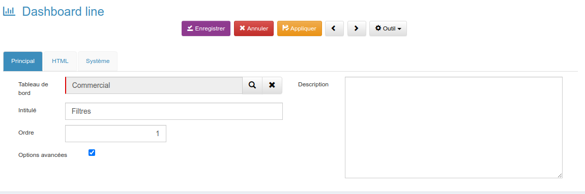

<!-----

You have some errors, warnings, or alerts. If you are using reckless mode, turn it off to see inline alerts.
* ERRORs: 0
* WARNINGs: 0
* ALERTS: 2

Conversion time: 1.35 seconds.


Using this Markdown file:

1. Paste this output into your source file.
2. See the notes and action items below regarding this conversion run.
3. Check the rendered output (headings, lists, code blocks, tables) for proper
   formatting and use a linkchecker before you publish this page.

Conversion notes:

* Docs to Markdown version 1.0β35
* Tue Mar 19 2024 02:12:34 GMT-0700 (PDT)
* Source doc: FAQ GoPaaS
* Tables are currently converted to HTML tables.
* This document has images: check for >>>>>  gd2md-html alert:  inline image link in generated source and store images to your server. NOTE: Images in exported zip file from Google Docs may not appear in  the same order as they do in your doc. Please check the images!


WARNING:
You have 10 H1 headings. You may want to use the "H1 -> H2" option to demote all headings by one level.

----->


<h1>

</h1>


<h1>FAQ</h1>


[TOC]


<h1></h1>


<h1>Formulaire</h1>


<h2>Masquer un élément de la fiche</h2>


Déclarer la condition, ici le script se fait sur les utilisateurs du groupe Technique uniquement 


```
	if (UTILISATEUR['groupe'].toLowerCase() === 'technique') { ou UTILISATEUR["groupe"].indexOf("TECHNIQUE") >= 0
    	thisComponent.ui.find('#tab2500').hide();
    	thisComponent.ui.find('#section_1222').hide();
    	thisComponent.ui.find('#ticket').closest('.form-group').hide();
    	thisComponent.ui.find('#site').closest('.form-group').hide();
    	thisComponent.ui.find('#compte').closest('.form-group').hide();
    	thisComponent.ui.find('#contact').closest('.form-group').hide();
	}
```


**Cacher un onglet :**


```
thisComponent.ui.find('#tab2500').hide();
//Remplacer le "2500" par l 'ID de l'onglet.
```


```
Cacher une section :
thisComponent.ui.find('#section_1222').hide();
//Remplacer le "1222" par l'ID de la section.
```


**Cacher un champ :**


```
thisComponent.ui.find('#site').closest('.form-group').hide();
//Remplacer le "site" par le nom du champ.
```


<h2></h2>


<h2>Ajouter un bouton</h2>


Depuis le script de ma table, j'ajoute dans la fonction onLoad :


```
thisComponent.ui.find("#section_0000").append("<button id='btn_NomBouton' type='button' class='btn btn-warning' style='float: left; margin-left: 15px;' title='Description du bouton'><span class='icône'></span><span class='trn'>Nom du Bouton</span></button>");
	thisComponent.ui.find("#btn_NomBouton").on('click', function () {
    // code à exécuter au click du bouton
});
```


<h2>Supprimer les caractères accentué ou apostrophe pour créer ma Clé</h2>


```
var rules = {
        'a': /[àáâãäå]+/g,
        'ae': /[æ]+/g,
        'c': /[ç]+/g,
        'e': /[èéêë]+/g,
        'i': /[ìíîï]+/g,
        'n': /[ñ]+/g,
        'o': /[òóôõö]+/g,
        'oe': /[œ]+/g,
        'u': /[ùúûü]+/g,
        'y': /[ýÿ]+/g,
        '_': /[\s\\]+/g,
        ' ': /["']+/g
};

function remplacerTousLesCaractèresDésagréables( s ) {
     s = s.toLowerCase();
     for (var r in rules) s = s.replace(rules[r], r);
     return s;
}
 
var cle=remplacerTousLesCaractèresDésagréables(this.getValue("nom")+'-'+this.getValue('cp')+'-'+this.getValue('ville'));
```


<h2>Déclencher un évènement sur le clic d’un onglet</h2>


```
thisComponent.ui.find("@ID_ONGLET").on('click',function(){
    // Code à insérer
});
```


Exemple


```
thisComponent.ui.find('#tab2501').on('click',function(){
    console.log('Evènement sur ouverture de l'onglet);
});
```


<h2>Ajouter une commande dans le menu “Outil”</h2>


```
  // Add action in item
  // addTool(Nom du menu, Info bulle, fonction)
  thisComponent.addTool("Imprimer PDF","Imprimer la facture en PDF", function() {
     onPrint_facture(thisComponent); // Appeler une fonction
});
```


<h2>Utiliser la fonction beforeOnSave (optionnel)</h2>


Dans ce beforeOnSave je lance une fonction avec un callback, tant qu'il n'y aura pas de retour à “true”, on ne passera pas dans la fonction onSave


```
function beforeOnSave_facture(onSuccess) {

    var thisComponent = this; // Ne pas oublier de remettre cette ligne
    if (thisComponent.isNew()) {
        var cle = Date.now() + '_' + gsUser;
        thisComponent.setValue('cle', cle);
    }

    calculLigne(thisComponent, function (callback) {
        // une fois que le callback renvoi true je passe dans le onSave
        return onSuccess(callback);
    });

}
```


```
function calculLigne(thisComponent, callback) {

    var montant_tva = 0;
    var montant_ht = Number(thisComponent.getValue("montant_ht"));
    var montant_ttc = Number(thisComponent.getValue("montant_ttc"));

    // Je vais lancer un calcul avant de retourner true dans le callback
    montant_tva = montant_ttc - montant_ht;

    callback(true); // Renvoi true dans le beforeOnSave

}
```


<h2>Utiliser la méthode $.when avec un list-item</h2>


La méthode when appel une fonction list-item qui ensuite retourne un tableau dans le done (data), il faut ensuite traiter le data avec une $.each


```
$.when(
  getBsoSite(thisComponent)
).done(function (data) {
  // On récupère le nombre de ligne de la vue
  var nbLigne = items.rows.length;
  var i = 1;
  var liste_ville = "";
  if (nbLigne > 0){
    // parcourir items
    $.each(data.rows, function (index, item) {
        // ajouter les valeurs dans la variable ou tableau
        liste_ville += value.name_municipality+", ";

        /* SI i égale à nbLigne
        * toutes les lignes ont été parcourue */
        if (i === nbLigne){
        // ICI ON PEUT ENSUITE UTILISER PAR EXEMPLE LE WEBSERVICE update-items-key POUR FAIRE DES MISE À JOUR

        }
        i++;
    }); // FIN $.each
  } else {
     // SI AUCUNE LIGNE VOUS POUVEZ METTRE UN MESSAGE OU AUTRE ÉVÉNEMENT
  }

}); // Fin when

function getBsoSite(thisComponent){
  return $.get(gopaas.url.webservice('view','list-item'), {
    "tableName":"site", // tableName
    "viewName":"LinkSiteSiteBSO",
    "filter_value":thisComponent.getValue("cle")
  });
}
```


<h1>Connexion</h1>


<h2>Utiliser setConnectionValue en Javascript</h2>


Setter une valeur dans une connexion ou une multiconnexion


```
this.setConnectionValue(FIELD,TABLE,VALUE);
```


<h2>Utiliser la méthode setConnectionValue pour une multiconnexion en Javascript</h2>


Comment setter une multiconnexion


```
    var permission = data.permission; 
      var items = permission.split(",");
      var i = 0;
      for (i = 0; i < items.length; i++) {
        thisComponent.setConnectionValue("utilisateur", "utilisateur", items[i]); 
      }
```


<h1>Vues</h1>


<h2>Retirer le bouton supprimer d’une vue liée</h2>


```
/*
 * @JRN au clic sur l'onglet on cache le bouton de suppression
 * @ID_ONGLET est l'ID de l'onglet
 * @ID_VUE_LIE est l'ID de la vue liée
 */
thisComponent.ui.find('@ID_ONGLET').on('click',function(){
   // console.log('Onglet Prélèvement');
thisComponent.ui.find('@ID_VUE_LIE').find(".gopaas-delete-item").css("display","none");
});
```


<h2>Comment remplacer le bouton ajouter des vues liées ?</h2>


Ce script permet de modifier le comportement du bouton “Ajouter” dans une vue liée. On pourra ainsi renseigner des champs supplémentaires.


```
// Quand on clique sur l'onglet Intervention
// @ID_ONGLET est l'ID de l'onglet
// @ID_BTN_VUE_LIE est l'ID du bouton ajouter de la vue liée
thisComponent.ui.find('@ID_ONGLET').on("click", function() {
 
   //Désactive le click du bouton ajouter
   thisComponent.ui.find('@ID_BTN_VUE_LIE').removeAttr("onclick").off("click");
        
   //Reféfinir le click du bouton ajouter
   thisComponent.ui.find('#ID_BTN_VUE_LIE').click(function(){

   // Si la fiche parent est une nouvelle fiche, imposer à l'utilisateur
   // d'enregistrer la fiche avant de continuer
   if (thisComponent.isNew()) {
      gopaas.dialog.error("Merci d'enregistrer la fiche contact avant de créer une fiche intervention");
      return false;
   }

   // Mettre à jour la date et heure de modification de la fiche courante
   thisComponent.setValue('date_modification', gopaas.date.dateFr());
   thisComponent.setValue('heure_modification', gopaas.date.time());

   // Ouvrir une nouvelle fiche et renseigner les champs nécessaires
   ItemGeneric.open('intervention', 
      null, 
      new Link(thisComponent, Link.type.ADD_ITEM), 
      {
         "compte"	: thisComponent.getValue('compte'),
         "contact"	: thisComponent.getValue('cle'),
         "statut"	: "En cours"
      });
   });
});
```


<h2>Comment récupérer les valeurs sélectionné dans une vue</h2>


Dans le script de la vue :


```
// @ID_VUE est l'ID de la vue
function onLoad_view@ID_VUE(datagrid)
{
    var thisComponent = this;
    var viewbar = Component.find("Viewbar", this);

    viewbar.addTool("<i class='fa fa-print'></i><span class='trn'>Impression multiple</span>", action_a_faire);
    
    // Fonction à insérer
    function action_a_faire() {
       // Liste des IDs des fiches sélectionnées
       var selectedItems = thisComponent.getAllSelected();
    }
}
```


* getAllSelected renvoit les ID des fiches sélectionnées
* getAllSelectedKey renvoit les CLE des fiches sélectionnées
* getAllSelectedRow renvoit les lignes complètes dans un objet des fiches sélectionnées

Exemple :

Sélectionner plusieur fiches et lesimprimer en PDF


```
function onLoad_view735(datagrid)
{
    var thisComponent = this;
    var viewbar = Component.find("Viewbar", this);

    viewbar.addTool("<i class='fa fa-print'></i><span class='trn'>Impression multiple</span>", multi_print);

    function multi_print() {
        var selectedItems = thisComponent.getAllSelected();
              window.open('file/__pdf__/modele_pdf.php?id='+selectedItems+'&table=contact&action=print');
    }
}
```


<h1></h1>


<h1>Webservices</h1>


<h2>update-items-key</h2>


Envoyer un array avec plusieurs données vers un webservice update-item


```
// Tableau de données
var array = [{"cle":"key1", "champ1": "valeur1", "champ2" : "valeur2"},{"cle":"key2", "champ1" : "valeur1", "champ2" : "valeur2"}, .... ];
// Envoyer les données via jquery $.ajax avec une méthode POST
      $.ajax({
        type:    "POST",
        url:     gopaas.url.webservice("item","update-items-key"),
        data:    {tableName: "NOM_DE_LA_TABLE",data: JSON.stringify(array)},
        dataType: "text",
        success: function(callBack) {
          alert(callBack);
        },
        error:   function(jqXHR, status, errorThrown) {
          alert("Error, status = " + textStatus + ", " +
                "error thrown: " + errorThrown
               );
        }
      });
```


<h2>update-items-key v2 (dispo sur la 3.0.8)</h2>


<table>
  <tr>
   <td>Méthode
   </td>
   <td>Paramètres
   </td>
  </tr>
  <tr>
   <td>updateitems
   </td>
   <td>tableName : Nom de la table
<p>
array : tableau avec les donnés à envoyer (idem v1)
   </td>
  </tr>
</table>


```
$.when(
   gopaas.webservice.updateItems(tableName, JSON.stringify(array))
).done(function(data1){
   // Actualiser une vue liée
   thisComponent.ui.find("#LinkView").find(".glyphicon-search").click();
});
```


<h1></h1>


<h2>list-item</h2>


Je souhaite parcourir une vue GoPaaS avec en paramètre ma recherche en Javascript


```
  var arrayItems = [];
  // appeler le webservice list-item avec un filtre avancé
  $.get('webservice/view/list-item.php', {
              "tableName": "NOM_TABLE",
              "viewName": "INTITULE_VUE",
              "filter_value": thisComponent.getValue("cle") // c'est le trigItemName donc la clé de votre fiche actuel
  }).done(function(items){ //items liste de fiche trouvées
    // On récupère le nombre de ligne de la vue
    var nbLigne = items.rows.length;
    var i = 1;
    if (nbLigne > 0){
    	// parcourir items
	$.each(items.rows, function (index, item) {
	    // ajouter les valeurs dans le tableau
	    arrayItems.push({"cle":item.cle, "valeur1":item.valeur1});

           /* On vérifie ici quand i sera égale à nbLigne
	    * afin d'être certain que toutes les lignes ont été parcourue */	   
            if (i === nbLigne){
    	    // ICI ON PEUT ENSUITE UTILISER PAR EXEMPLE LE WEBSERVICE update-items-key POUR FAIRE DES MISE À JOUR

            }
            i++;
	}); // FIN $.each
    } else {
       // SI AUCUNE LIGNE VOUS POUVEZ METTRE UN MESSAGE OU AUTRE ÉVÉNEMENT
    }
  }); // Fin list-item
```


<h2></h2>


<h2>delete-list-item</h2>


Envoyer un array avec plusieurs id vers le webservice delete-list-item.

    	


```
var IdCasages = "";
    	// appeler le webservice list-item avec pour lister les fiches à supprimer d'une vue
    	$.get(gopaas.url.webservice("view","list-item"), {
        	"tableName": "casage",
        	"viewName": "LinkColonneEtage",
        	"filter_value": thisComponent.getValue("cle")
    	}).done(function (items) { //items liste de fiche trouvées
        	// paroucourir items et pour chaque item ajouter l'id dans l'array
        	$.each(items.rows, function (index, item) {
            	IdCasages += item.idcasage + ",";
        	});
        	// appeler le webservice delete-list-item avec l'array des id à supprimer
        	$.get(gopaas.url.webservice('item','delete-list-item'), {
            	"tableName": "casage",
            	"itemId": IdCasages
        	}).done(function (data) {
            	// paroucourir items
            	thisComponent.ui.find("#linkcolonneetage .datagrid-f:first").datagrid("reload");
        	}); // Fin delete-list-item
    	}); // Fin list-item
```


<h2>update-item</h2>


J'ai besoin de modifier ou créer une fiche directement en JS


```
    	// créer une clé pour ma nouvelle fiche
      var newKey = Date.now() + " " + UTILISATEUR["cle"];
      var message = "Bonjour " + selectedItems[j]['prenom'] + " " + selectedItems[j]['nom'] + "<br><br>";
      message += "Votre formulaire d'entretien annuel est désormais disponible sur le portail GoPaaS, à l'adresse suivante : <a href='https://www.gopaas.net/qualif/atland/rh/'>https://www.gopaas.net/qualif/atland/rh/</a><br>";
      message += "Nous vous invitons à vous connecter et à compléter le document afin de préparer votre entretien annuel d'évaluation.<br><br>"
      message += "Bien à vous,<br><br>"
      message += "Le service Ressources Humaines";
      // créer un tableau avec les valeur
      var formData = [{"name": "tableName", "value": "email"},
      {"name": "idemail", "value": "new"},
      {"name": "cle", "value": newKey},
      {"name": "expediteur", "value": "noreply@gopaas.net"},
      {"name": "destinataire", "value": selectedItems[j]['email_pro']},
      {"name": "objet", "value": "RH online : Votre formulaire d'entretien annuel"},
      {"name": "message", "value": message},
      {"name": "statut", "value": "Planifié"},
      {"name": "format", "value": "html"},
      {"name": "date_creation", "value": gopaas.date.dateSql()},
      {"name": "heure_creation", "value": gopaas.date.time()},
      {"name": "creation_par", "value": UTILISATEUR['cle']}];
      // On lance le webservice update-item avec en paramètre notre tableau (ici formData)
      $.post(gopaas.url.webservice("item", "update-item"), formData).done(function (updatedItem) {
      if (updatedItem.id > 0) {
        // Actualiser vue liée
        var jeasyuiDatagrid = thisComponent.ui.find(".datagrid-f:first");
        jeasyuiDatagrid.datagrid('reload');
      }
      }).fail(gopaas.dialog.ajaxFail);
```


<h2>update-item v2 (dispo sur la 3.0.8)</h2>


<table>
  <tr>
   <td>Méthode
   </td>
   <td>Paramètres
   </td>
  </tr>
  <tr>
   <td>updateitem
   </td>
   <td>tableName : Nom de la table
<p>
new : laissé “new” pour une nouvelle fiche ou l’id de la fiche pour un update
<p>
<em>ps : Pour l’id on peut faire un thisComponent.ui.find("#ID_champ_connexion").val();</em>
   </td>
  </tr>
</table>


```
gopaas.webservice.updateItem("tableName", "new", {
  cle: newKey = Date.now() + " " + UTILISATEUR["cle"],
  field_1: "value 1",
  field_2: "value 2",
  date_creation: gopaas.date.dateSql(),
  heure_creation: gopaas.date.time(),
  creation_par: UTILISATEUR['cle']
}).done(function(update){
  gopaas.dialog.success("Message une fois terminée !");
  itemComponent.ui.find("#IdVue .datagrid-f:first").datagrid("reload");
}); // Fin update-item
```


<h2></h2>


<h2>get-item</h2>


récupérer les données d'une fiche en javacript avec le webservice "get-item"


```
	$.get(gopaas.url.webservice("item","get-item"), {
    	tableName: "tableName",
    	itemKey: "itemKey"
	}).done(function (data) {
    	thisComponent.setValue("field_1", data.field_1);
    	thisComponent.setValue("field_2", data.field_2);
	}).fail(gopaas.dialog.ajaxFail);
```


<h2>get-item v2 (dispo sur la 3.0.8)</h2>


<table>
  <tr>
   <td>Méthode
   </td>
   <td>Paramètres
   </td>
  </tr>
  <tr>
   <td>getItem
   </td>
   <td>tableName: Nom de la table
<p>
itemKey: clé de la fiche
   </td>
  </tr>
</table>


```

$.when(gopaas.webservice.getItem("tableName","itemKey")).done(function(data){
  console.log(data);
});
```


<h2></h2>


<h2>Incrémenter un numéro à partir d’une table “Séquence”</h2>


* Créer une table sequence avec 2 champs 
    * Table
    * Numéro
* Pour l’exemple créer une nouvelle fiche avec
    * Table = facture
    * Numéro = 200001
* Dans la table facture
    * Ajouter un script pour récupérer le dernier numéro de facture avec un get-item
    * Incrémenter ce numéro de +1
    * Mettre à jour le dernier numéro dans la table séquence avec un update-item

        ```
function incrementerFacture(thisComponent){
  $.get(gopaas.url.webservice("item","get-item"), {
      	tableName: "sequence",
      	itemKey: CLE_DE_LA_SEQUENCE_FACTURE
  	}).done(function (data) {
        var nouveau_numero = Number(data.numero) + 1;
        
        // mettre à jour le nouveau numéro dans la fiche Facture
      	thisComponent.setValue("num_facture", nouveau_numero); 

        var formData = [{"name": "tableName", "value": "sequence"},
          {"name": "cle", "value": CLE_DE_LA_SEQUENCE_FACTURE},
          {"name": "numero", "value": nouveau_numero}
        ];
                  $.post(gopaas.url.webservice("item", "update-item"), formData)
                  .done(function (updatedItem) {
                    console.log("Séquence mise à jour");
                  }).fail(gopaas.dialog.ajaxFail);

  	}).fail(gopaas.dialog.ajaxFail);

}
```


<h1></h1>


<h1>Dashboard</h1>


<h2>Filtre de dashboard</h2>


Créer une première ligne de dashboard avec pour intitulé “Filtre” et cocher la case à cocher “Options avancées”.


Dans l’onglet HTML ajouter les champs de filtre (4 filtres au maximum). Il est possible de mettre un champ de type liste ou un champ de type texte

Modifier les vues et widgets du Dasboard et ajouter une colonne avec pour alias le “name” des filtres. Dans notre exemple, il faudra ajouter une colonne “commercial” et une colonne “famille”.

<h1>Mots clés</h1>


<h2>Vue</h2>


<table>
  <tr>
   <td>(-TrigItemName-)
   </td>
   <td>Permet d’envoyer la clé de la fiche parent dans les vues liées
   </td>
  </tr>
  <tr>
   <td>(-me-)
   </td>
   <td>Récupère le login de l’utilisateur connecté
   </td>
  </tr>
  <tr>
   <td>$$
   </td>
   <td>Permet d'interpréter le code SQL dans les conditions, exemple :
<p>
$$CURDATE()
<p>
<em>Remarque : fonctionne également dans les automatismes</em>
   </td>
  </tr>
</table>


<h2>Mise à jour en masse</h2>


<table>
  <tr>
   <td>RECHERCHE / REMPLACE
   </td>
   <td>$$[%NOM_CHAMP|replace|'CHAINE_RECHERCHEE'|'CHAINE_A_REMPLACER'%]
   </td>
  </tr>
  <tr>
   <td>CONCATÉNATION
   </td>
   <td> $$[%NOM_CHAMP_1%] & " " & [%NOM_CHAMP_1%] & " UNE_CHAINE"
   </td>
  </tr>
  <tr>
   <td>OPÉRATION SUR UNE VALEUR NUMÉRIQUE
   </td>
   <td>$$[%NOM_CHAMPS_NOMBRE%] - 2
   </td>
  </tr>
  <tr>
   <td>SUPPRIMER UNE VALEUR
   </td>
   <td>$$NULL
   </td>
  </tr>
</table>


<h2></h2>


<h2>Import</h2>


<table>
  <tr>
   <td>$$STRICT_VALUES_LIST
   </td>
   <td>Contrôler les valeurs qui seront insérées :
<p>
dans une liste déroulante
   </td>
  </tr>
  <tr>
   <td>​​​​​​​​​​​​​​$$STRICT_VALUES_CONNECTION
   </td>
   <td>Contrôler les valeurs qui seront insérées :
<p>
dans une connexion : ​​​​​​​​​​​​​​$$STRICT_VALUES_CONNECTION("NOM_CONNEXION")
   </td>
  </tr>
  <tr>
   <td>$$REGEX("")
   </td>
   <td>Applique un contrôle de la valeur du champ via un regex, exemple :
<p>
Format email : 
<p>
$$REGEX("/^[_a-z0-9-]+(\.[_a-z0-9-]+)*@[a-z0-9-]+(\.[a-z0-9-]+)*(\.[a-z]{2,})$/i")
<p>
Format téléphone : 
<p>
$$REGEX("/^(?:\+33\s|0)[1-9](?:\s\d{2}){4}$/")
   </td>
  </tr>
</table>

